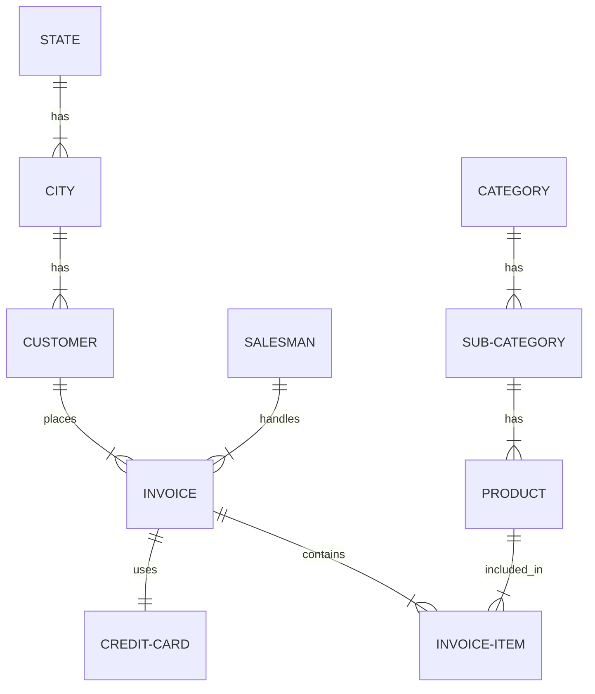

# AdventureWorksENG — Schema Reference

> A recap of the `AdventureWorksENG` database used throughout this course.
> If you already met this schema in an introductory course, treat this as a
> refresher, not new material

`AdventureWorksENG` is a small, Croatian-market variant of Microsoft's
AdventureWorks sample database: a retailer selling products (organized into
subcategories and categories) to customers, who are billed through invoices
with individual line items. It keeps the shape of a real order-entry system
while staying small enough to query and modify freely in a 90-minute lab.

---

## Entity-relationship diagram

---

## Naming conventions

- **Primary keys:** `ID<TableName>` — e.g. `Customer.IDCustomer`, `Invoice.IDInvoice`.
- **Foreign keys:** `<ReferencedTable>ID` — e.g. `Invoice.CustomerID` points at
  `Customer.IDCustomer`. No `ID` prefix on the foreign-key side.

This pair of conventions is used consistently across all ten tables — once you
spot it, you can guess most column names before looking them up.

---

## Tables

### Category
Top-level product grouping.

| Column | Type | Nullable | Notes |
|---|---|---|---|
| `IDCategory` | `int` | no | **PK**, identity |
| `Name` | `nvarchar(50)` | no | |

### Subcategory
Second-level product grouping, one level under `Category`.

| Column | Type | Nullable | Notes |
|---|---|---|---|
| `IDSubcategory` | `int` | no | **PK**, identity |
| `CategoryID` | `int` | no | **FK** → `Category.IDCategory` |
| `Name` | `nvarchar(50)` | no | |

### Product
The item catalog.

| Column | Type | Nullable | Notes |
|---|---|---|---|
| `IDProduct` | `int` | no | **PK**, identity |
| `Name` | `nvarchar(50)` | no | |
| `ProductNumber` | `nvarchar(25)` | no | |
| `Color` | `nvarchar(15)` | yes | |
| `MinimumQuantityInStock` | `smallint` | no | |
| `PriceWithoutVAT` | `money` | no | |
| `SubcategoryID` | `int` | yes | **FK** → `Subcategory.IDSubcategory` — a product can be uncategorized |

### State
Top-level geography.

| Column | Type | Nullable | Notes |
|---|---|---|---|
| `IDState` | `int` | no | **PK**, identity |
| `Name` | `nvarchar(50)` | yes | |

### City
Belongs to a `State`.

| Column | Type | Nullable | Notes |
|---|---|---|---|
| `IDCity` | `int` | no | **PK**, identity |
| `Name` | `nvarchar(50)` | yes | |
| `StateID` | `int` | yes | **FK** → `State.IDState` |

### Customer
The people placing orders.

| Column | Type | Nullable | Notes |
|---|---|---|---|
| `IDCustomer` | `int` | no | **PK**, identity |
| `FirstName` | `nvarchar(50)` | no | |
| `LastName` | `nvarchar(50)` | no | |
| `Email` | `nvarchar(50)` | yes | |
| `PhoneNumber` | `nvarchar(25)` | yes | |
| `CityID` | `int` | yes | **FK** → `City.IDCity` |

### Salesman
The staff who close a sale (referenced from `Invoice`). Some `AdventureWorksENG`
variants name this table `SalesRepresentative` or `SalesPerson` — same shape,
different name.

| Column | Type | Nullable | Notes |
|---|---|---|---|
| `IDSalesman` | `int` | no | **PK**, identity |
| `FirstName` | `nvarchar(50)` | yes | |
| `LastName` | `nvarchar(50)` | yes | |
| `Employee` | `bit` | yes | |

### CreditCard
Payment method, optionally attached to an invoice.

| Column | Type | Nullable | Notes |
|---|---|---|---|
| `IDCreditCard` | `int` | no | **PK**, identity |
| `Type` | `nvarchar(50)` | no | |
| `CardNumber` | `nvarchar(25)` | no | |
| `ExpirationMonth` | `tinyint` | no | |
| `ExpirationYear` | `smallint` | no | |

### Invoice
One order/bill. The hub of the schema — every other table connects to it
directly or through `InvoiceItem`.

| Column | Type | Nullable | Notes |
|---|---|---|---|
| `IDInvoice` | `int` | no | **PK**, identity |
| `InvoiceDate` | `datetime` | no | |
| `InvoiceNumber` | `nvarchar(25)` | no | |
| `CustomerID` | `int` | no | **FK** → `Customer.IDCustomer` |
| `SalesmanID` | `int` | yes | **FK** → `Salesman.IDSalesman` — sale need not have a salesman on record |
| `CreditCardID` | `int` | yes | **FK** → `CreditCard.IDCreditCard` — other payment methods leave this `NULL` |
| `Comment` | `nvarchar(128)` | yes | |

### InvoiceItem
One line item on an invoice — the many-to-many resolution between `Invoice`
and `Product`, carrying quantity and price.

| Column | Type | Nullable | Notes |
|---|---|---|---|
| `IDInvoiceItem` | `int` | no | **PK**, identity |
| `InvoiceID` | `int` | no | **FK** → `Invoice.IDInvoice` |
| `ProductID` | `int` | no | **FK** → `Product.IDProduct` |
| `Quantity` | `smallint` | no | |
| `InitialPrice` | `money` | no | list price at time of sale |
| `Discount` | `money` | no | |
| `TotalPrice` | `numeric(38,6)` | no | line total after discount |

---

## Foreign keys at a glance

| Child table.column | → | Parent table.column | Required? |
|---|---|---|---|
| `City.StateID` | → | `State.IDState` | optional |
| `Customer.CityID` | → | `City.IDCity` | optional |
| `Invoice.CustomerID` | → | `Customer.IDCustomer` | **required** |
| `Invoice.SalesmanID` | → | `Salesman.IDSalesman` | optional |
| `Invoice.CreditCardID` | → | `CreditCard.IDCreditCard` | optional |
| `InvoiceItem.InvoiceID` | → | `Invoice.IDInvoice` | **required** |
| `InvoiceItem.ProductID` | → | `Product.IDProduct` | **required** |
| `Product.SubcategoryID` | → | `Subcategory.IDSubcategory` | optional |
| `Subcategory.CategoryID` | → | `Category.IDCategory` | **required** |

"Optional" foreign keys (nullable) are the ones worth remembering when writing
`JOIN`s: a plain `JOIN` silently drops rows where the FK is `NULL` (an invoice
with no salesman on record, a customer with no city), while a `LEFT JOIN`
keeps them. Labs 1 and 2 build this distinction deliberately.

---

*Generated from the live schema (`sys.tables`, `sys.columns`, `sys.foreign_keys`)
so it stays accurate even if a lab script's inline comments drift from the
actual database.*
