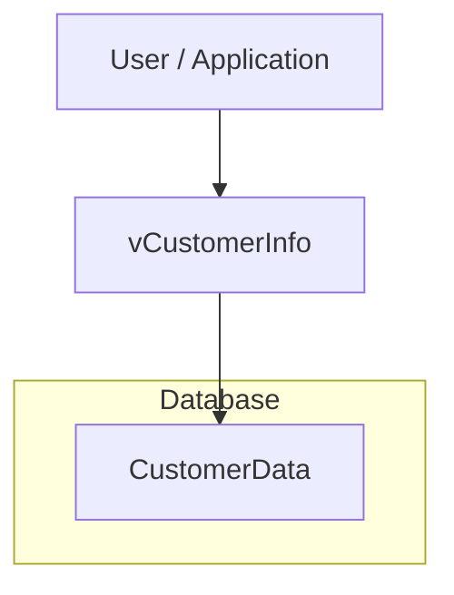
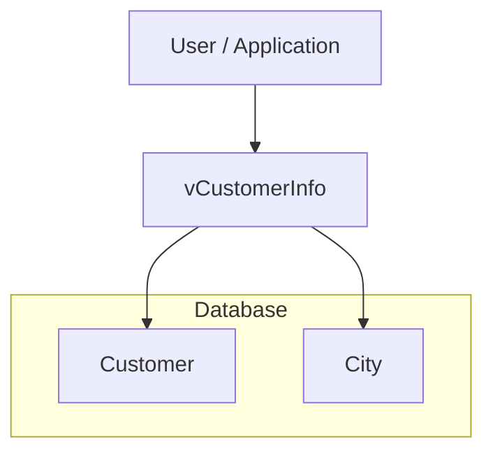
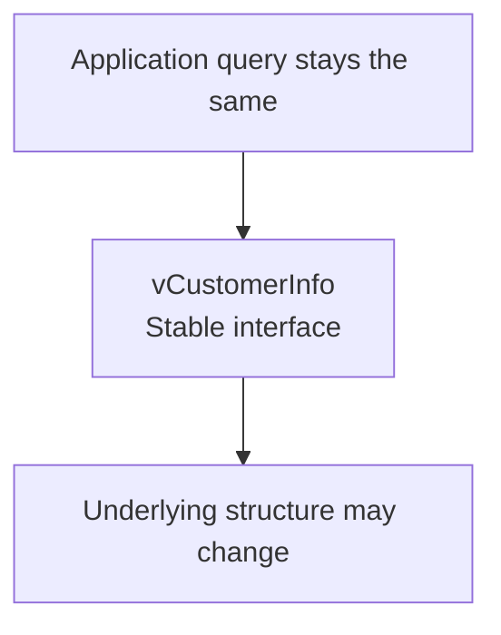

# Lab 1 – Views

Database: `AdventureWorksENG`

Today you will learn:
- What a View is (a saved SELECT statement, not stored data)
- How to create, use, modify, and drop Views
- How to query the database's own metadata using system Views

**Key idea to remember all lesson:**

> Views store SQL. Tables store data.

```sql
USE AdventureWorksENG;
GO
```

## Part 1 – Why Views Exist

A query that grows uncomfortable to read.

```sql
-- Stage 1: a plain SELECT
SELECT
    c.FirstName,
    c.LastName
FROM Customer AS c;
```

```sql
-- Stage 2: join the customer's city
SELECT
    c.FirstName,
    c.LastName,
    ci.Name AS City
FROM Customer AS c
JOIN City AS ci ON ci.IDCity = c.CityID;
```

```sql
-- Stage 3: add the state
SELECT
    c.FirstName,
    c.LastName,
    ci.Name AS City,
    s.Name  AS State
FROM Customer AS c
JOIN City  AS ci ON ci.IDCity  = c.CityID
JOIN State AS s  ON s.IDState = ci.StateID;
```

```sql
-- Stage 4: add purchase history
SELECT
    c.FirstName,
    c.LastName,
    ci.Name AS City,
    s.Name  AS State,
    COUNT(DISTINCT i.IDInvoice) AS InvoiceCount,
    SUM(ii.TotalPrice)          AS TotalSpent
FROM Customer AS c
JOIN City  AS ci ON ci.IDCity  = c.CityID
JOIN State AS s  ON s.IDState = ci.StateID
LEFT JOIN Invoice     AS i  ON i.CustomerID = c.IDCustomer
LEFT JOIN InvoiceItem AS ii ON ii.InvoiceID = i.IDInvoice
GROUP BY
    c.FirstName, c.LastName, ci.Name, s.Name;
```

```sql
-- Stage 5: add filtering, calculated column, ordering
SELECT
    c.FirstName + ' ' + c.LastName AS CustomerName,
    ci.Name AS City,
    s.Name  AS State,
    COUNT(DISTINCT i.IDInvoice) AS InvoiceCount,
    SUM(ii.TotalPrice)          AS TotalSpent,
    MAX(i.InvoiceDate)          AS LastPurchase
FROM Customer AS c
JOIN City  AS ci ON ci.IDCity  = c.CityID
JOIN State AS s  ON s.IDState = ci.StateID
LEFT JOIN Invoice     AS i  ON i.CustomerID = c.IDCustomer
LEFT JOIN InvoiceItem AS ii ON ii.InvoiceID = i.IDInvoice
WHERE i.InvoiceDate >= '2004-01-01'
GROUP BY
    c.FirstName, c.LastName, ci.Name, s.Name
HAVING SUM(ii.TotalPrice) > 1000
ORDER BY TotalSpent DESC;
```

```sql
-- Save this query as a View and call it with a single line
GO

CREATE VIEW dbo.vCustomerOverview
AS
SELECT
    c.FirstName + ' ' + c.LastName AS CustomerName,
    ci.Name AS City,
    s.Name  AS State,
    COUNT(DISTINCT i.IDInvoice) AS InvoiceCount,
    SUM(ii.TotalPrice)          AS TotalSpent,
    MAX(i.InvoiceDate)          AS LastPurchase
FROM Customer AS c
JOIN City  AS ci ON ci.IDCity  = c.CityID
JOIN State AS s  ON s.IDState = ci.StateID
LEFT JOIN Invoice     AS i  ON i.CustomerID = c.IDCustomer
LEFT JOIN InvoiceItem AS ii ON ii.InvoiceID = i.IDInvoice
WHERE i.InvoiceDate >= '2004-01-01'
GROUP BY
    c.FirstName, c.LastName, ci.Name, s.Name
HAVING SUM(ii.TotalPrice) > 1000;
GO
```
> Notice the `ORDER BY` is gone.
> Views cannot guarantee row order — that is the caller's responsibility.

### Naming convention
> We will prefix View names with the letter `v` — for example, `vCustomerOverview`.
> Many teams use `v`, `vw_`, or `view_`. Different companies, different rules.
> The important thing is that a reader sees the name and knows instantly: this is a View, not a table.

```sql
SELECT * FROM dbo.vCustomerOverview;

DROP VIEW dbo.vCustomerOverview;
GO
```

>**Performance note**: 
A regular View does not store query results and does not automatically make a query faster.
SQL Server still executes the underlying query.
Views are mainly used for abstraction, reuse, readability, and controlled access to data.

## Part 2 – The View Owns Nothing

A small, two-column View makes it easy to spot the moment when the underlying table changes and the View reflects it — without being touched.

```sql
GO

CREATE VIEW dbo.vCustomerNames
AS
SELECT
    FirstName,
    LastName
FROM Customer;
GO
```

```sql
SELECT * FROM dbo.vCustomerNames;
```

### Proving the View owns no data

```sql
-- Insert a new customer directly into the base table
INSERT INTO Customer (FirstName, LastName, Email, PhoneNumber, CityID)
VALUES ('Ada', 'Lovelace', 'ada@example.com', '555-0001', 1);
```

```sql
-- The View immediately shows the new row — because it runs its SELECT again
SELECT *
FROM dbo.vCustomerNames
WHERE LastName = 'Lovelace';
```

```sql
-- Same idea with UPDATE — target our own test row (never real data)
UPDATE Customer
SET FirstName = 'Augusta'
WHERE Email = 'ada@example.com';
```

```sql
SELECT *
FROM dbo.vCustomerNames
WHERE LastName = 'Lovelace';
```

## Part 3 – Modifying and Dropping Views

```sql
-- Old-style: ALTER VIEW replaces the definition
GO

ALTER VIEW dbo.vCustomerNames
AS
SELECT
    FirstName,
    LastName,
    Email
FROM Customer;
GO
```

```sql
SELECT * FROM dbo.vCustomerNames;
```

```sql
-- Modern idiom (SQL Server 2016+): CREATE OR ALTER
-- Works whether the View exists or not — perfect for deployment scripts
GO

CREATE OR ALTER VIEW dbo.vCustomerNames
AS
SELECT
    FirstName,
    LastName,
    Email
FROM Customer;
GO
```

>In the rest of the labs, we will normally use `CREATE OR ALTER VIEW`

```sql
-- Remove the View (data is untouched)
DROP VIEW dbo.vCustomerNames;
GO
```

```sql
-- Underlying data still exists
SELECT TOP (5) *
FROM Customer;
```

## Part 4 - Views as a stable interface

A View can act as a **stable interface** between users or applications and the underlying database structure.

This means that the physical structure of the database can change while the query used by the user remains the same.

For this example, we will use a small separate database.

### Step 1 — Create a demo database

```sql
USE master;
GO

DROP DATABASE IF EXISTS DatabaseDesignDemo;
GO

CREATE DATABASE DatabaseDesignDemo;
GO

USE DatabaseDesignDemo;
GO
```

---

### Step 2 — Start with a denormalized table

Suppose our customer data is stored in a single table.

```sql
CREATE TABLE dbo.CustomerData
(
    CustomerID   INT PRIMARY KEY,
    FirstName    NVARCHAR(50) NOT NULL,
    LastName     NVARCHAR(50) NOT NULL,
    CityName     NVARCHAR(100) NOT NULL,
    CountryName  NVARCHAR(100) NOT NULL
);
GO
```

Insert some test data:

```sql
INSERT INTO dbo.CustomerData
(
    CustomerID,
    FirstName,
    LastName,
    CityName,
    CountryName
)
VALUES
    (1, 'Ana',   'Horvat', 'Zagreb', 'Croatia'),
    (2, 'Marko', 'Kovač',  'Split',  'Croatia'),
    (3, 'Ivana', 'Marić',  'Zagreb', 'Croatia'),
    (4, 'John',  'Smith',  'London', 'United Kingdom');
GO
```

Now create a View:

```sql
CREATE VIEW dbo.vCustomerInfo
AS
SELECT
    CustomerID,
    FirstName,
    LastName,
    CityName,
    CountryName
FROM dbo.CustomerData;
GO
```

The user can retrieve customer information using:

```sql
SELECT *
FROM dbo.vCustomerInfo
ORDER BY CustomerID;
```

At this point, the structure looks like this:



---

### Step 3 — Normalize the database

Later, we decide to normalize the database.

Instead of storing city information repeatedly in `CustomerData`, we separate the data into two tables:

- `Customer`
- `City`

Create the normalized tables:

```sql
CREATE TABLE dbo.City
(
    CityID       INT PRIMARY KEY,
    CityName     NVARCHAR(100) NOT NULL,
    CountryName  NVARCHAR(100) NOT NULL
);
GO

CREATE TABLE dbo.Customer
(
    CustomerID  INT PRIMARY KEY,
    FirstName   NVARCHAR(50) NOT NULL,
    LastName    NVARCHAR(50) NOT NULL,
    CityID      INT NOT NULL,

    CONSTRAINT FK_Customer_City
        FOREIGN KEY (CityID)
        REFERENCES dbo.City(CityID)
);
GO
```

Insert the same data into the normalized structure:

```sql
INSERT INTO dbo.City
(
    CityID,
    CityName,
    CountryName
)
VALUES
    (1, 'Zagreb', 'Croatia'),
    (2, 'Split',  'Croatia'),
    (3, 'London', 'United Kingdom');
GO

INSERT INTO dbo.Customer
(
    CustomerID,
    FirstName,
    LastName,
    CityID
)
VALUES
    (1, 'Ana',   'Horvat', 1),
    (2, 'Marko', 'Kovač',  2),
    (3, 'Ivana', 'Marić',  1),
    (4, 'John',  'Smith',  3);
GO
```

The internal database structure has now changed.

---

### Step 4 — Change the View, not the user query

The old View still depends on `CustomerData`.

We can change the View definition so that it reads from the new normalized tables.

```sql
CREATE OR ALTER VIEW dbo.vCustomerInfo
AS
SELECT
    c.CustomerID,
    c.FirstName,
    c.LastName,
    ci.CityName,
    ci.CountryName
FROM dbo.Customer AS c
JOIN dbo.City AS ci
    ON ci.CityID = c.CityID;
GO
```

```sql
--The View now uses the normalized tables, so the original denormalized table is no longer needed and can be removed.
DROP TABLE dbo.CustomerData;
GO
```

Now run exactly the same query as before:

```sql
SELECT *
FROM dbo.vCustomerInfo
```

>The underlying structure has changed completely, but users can continue using the same View without changing their query.

**Before**:

**After:**




> **The database structure changed, but the interface remained the same.**

The user does not need to know whether the data comes from one table or several tables.

This is an important use of Views:

> **A View can provide a stable interface while hiding changes in the underlying database structure.**

This is an example of **abstraction** and **logical data independence**.

---

### Key idea

Without a View, an application that directly queried `CustomerData` would need to be changed after normalization.

With the View, only the View definition needs to change.



This makes Views useful as a stable interface between applications, users, reports, and the underlying database model.

## Part 5 – System Views: The Database Describing Itself

```sql
-- Every row = one table in the current database
SELECT * FROM sys.tables;
```

```sql
-- Every row = one column
SELECT * FROM sys.columns;
```

Two vocabularies for the same idea:

```sql
-- SQL Server-specific:
SELECT name FROM sys.tables ORDER BY name;
```

```sql
-- SQL-standard INFORMATION_SCHEMA interface
-- available in several DBMSs, including SQL Server, PostgreSQL and MySQL
SELECT * FROM INFORMATION_SCHEMA.TABLES ORDER BY TABLE_NAME;
```

```sql
-- List every column of every table
SELECT
    t.name AS TableName,
    c.name AS ColumnName
FROM sys.tables AS t
JOIN sys.columns AS c
    ON c.object_id = t.object_id
ORDER BY
    t.name,
    c.column_id;
```

```sql
-- Objects have IDs, just like business entities
SELECT OBJECT_ID('Customer');
SELECT OBJECT_NAME(OBJECT_ID('Customer'));
```

## Exercises

Try each exercise on your own first. Only look at the solution after you have attempted it.

### Exercise 1 – Create your first View

Task: Create a View named dbo.vCustomers that returns three columns from Customer: FirstName, LastName, Email. Then query the View and confirm rows come back.

<details>
<summary>Show answer</summary>

```sql
GO

CREATE VIEW dbo.vCustomers
AS
SELECT
    FirstName,
    LastName,
    Email
FROM Customer;
GO

SELECT * FROM dbo.vCustomers;
```
</details>

### Exercise 2 – Modify the View

Task: Use CREATE OR ALTER VIEW to modify dbo.vCustomers so it also returns PhoneNumber. Query the View to verify.

<details>
<summary>Show answer</summary>

```sql
GO

CREATE OR ALTER VIEW dbo.vCustomers
AS
SELECT
    FirstName,
    LastName,
    Email,
    PhoneNumber
FROM Customer;
GO

SELECT * FROM dbo.vCustomers;
```
</details>

### Exercise 3 – Hide a JOIN inside a View

Task: Create a View named dbo.vCustomerCities that returns FirstName, LastName, and the city name (aliased as City). The city name comes from the City table. Then query the View WITHOUT writing a JOIN.

**Hints**
- Customer.CityID → City.IDCity (join condition)

<details>
<summary>Show answer</summary>

```sql
GO

CREATE OR ALTER VIEW dbo.vCustomerCities
AS
SELECT
    c.FirstName,
    c.LastName,
    ci.Name AS City
FROM Customer AS c
JOIN City AS ci
    ON ci.IDCity = c.CityID;
GO

SELECT * FROM dbo.vCustomerCities;
```
</details>

### Bonus Exercise

Task: Using sys.tables, count how many tables exist in this database.

<details>
<summary>Show answer</summary>

```sql
SELECT COUNT(*) AS TableCount
FROM sys.tables;
```
</details>

## Cleanup

Drop the Views you created so the training database stays clean.

```sql
GO

DROP VIEW IF EXISTS dbo.vCustomers;
GO

DROP VIEW IF EXISTS dbo.vCustomerCities;
GO

-- Also remove the test customer we inserted (identified by unique email)
DELETE FROM Customer WHERE Email = 'ada@example.com';
GO
```

## Key takeaways

- A View stores a query definition, not a copy of the data.
- Changes in the underlying tables are immediately visible through the View.
- A View can hide joins and other query complexity.
- A View can provide a stable interface even if the underlying database structure changes.
- `CREATE OR ALTER VIEW` is convenient when maintaining View definitions.
- A regular View does not automatically improve query performance.
- SQL Server metadata can itself be queried through system Views.
