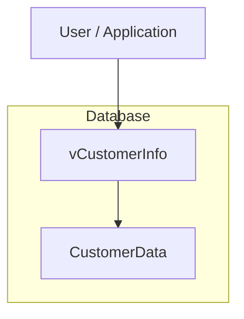
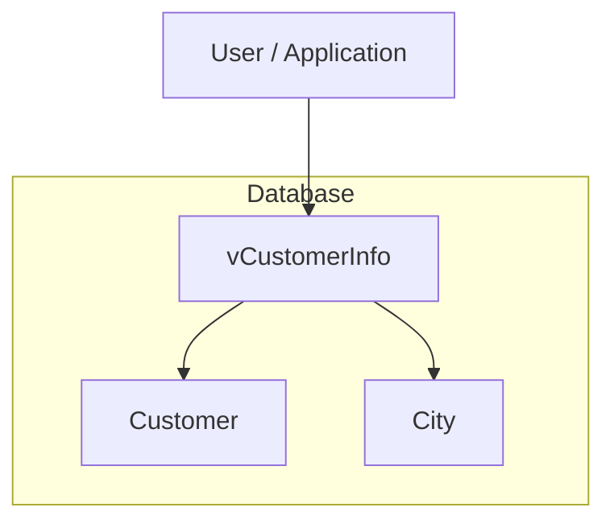
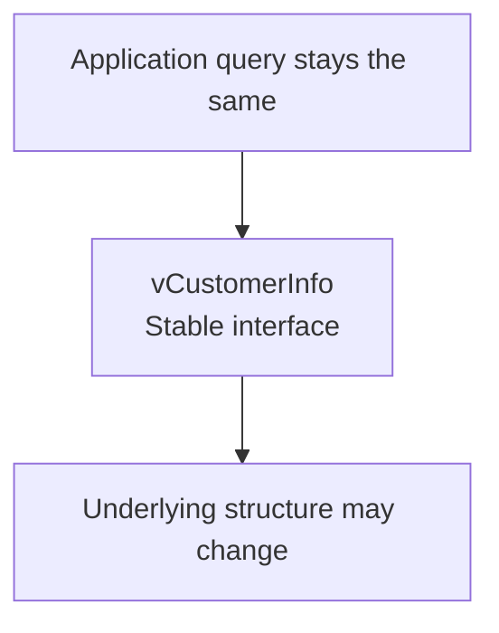

# Lab 1 – Views

**Database:** `AdventureWorksENG`

A View is a named query that behaves like a virtual table.

It does not normally store a separate copy of the data.

> **Core idea:** Views store SQL. Tables store data.

---

## Learning objectives

After completing this lab, you should be able to:

- explain what a View is;
- create and query a View;
- modify a View definition;
- drop a View;
- explain why Views are useful for abstraction and reuse;
- explain how a View can provide a stable interface over changing database structures;
- query SQL Server metadata using system Views.

Start by selecting the training database:

```sql
USE AdventureWorksENG;
GO
```

---

# Section 1 – Why Views exist

Views become useful when queries grow longer, more repetitive, or harder to read.

Let us build one query step by step.

---

## Stage 1 – A simple SELECT

```sql
SELECT
    c.FirstName,
    c.LastName
FROM Customer AS c;
```

---

## Stage 2 – Add the customer's city

```sql
SELECT
    c.FirstName,
    c.LastName,
    ci.Name AS City
FROM Customer AS c
JOIN City AS ci
    ON ci.IDCity = c.CityID;
```

---

## Stage 3 – Add the state

```sql
SELECT
    c.FirstName,
    c.LastName,
    ci.Name AS City,
    s.Name AS State
FROM Customer AS c
JOIN City AS ci
    ON ci.IDCity = c.CityID
JOIN State AS s
    ON s.IDState = ci.StateID;
```

---

## Stage 4 – Add purchase history

```sql
SELECT
    c.FirstName,
    c.LastName,
    ci.Name AS City,
    s.Name AS State,
    COUNT(DISTINCT i.IDInvoice) AS InvoiceCount,
    SUM(ii.TotalPrice) AS TotalSpent
FROM Customer AS c
JOIN City AS ci
    ON ci.IDCity = c.CityID
JOIN State AS s
    ON s.IDState = ci.StateID
JOIN Invoice AS i
    ON i.CustomerID = c.IDCustomer
JOIN InvoiceItem AS ii
    ON ii.InvoiceID = i.IDInvoice
GROUP BY
    c.FirstName,
    c.LastName,
    ci.Name,
    s.Name;
```

---

## Stage 5 – Add filtering and calculations

```sql
SELECT
    CONCAT_WS(' ', c.FirstName, c.LastName) AS CustomerName,
    ci.Name AS City,
    s.Name AS State,
    COUNT(DISTINCT i.IDInvoice) AS InvoiceCount,
    SUM(ii.TotalPrice) AS TotalSpent,
    MAX(i.InvoiceDate) AS LastPurchase
FROM Customer AS c
JOIN City AS ci
    ON ci.IDCity = c.CityID
JOIN State AS s
    ON s.IDState = ci.StateID
JOIN Invoice AS i
    ON i.CustomerID = c.IDCustomer
JOIN InvoiceItem AS ii
    ON ii.InvoiceID = i.IDInvoice
WHERE i.InvoiceDate >= '2004-06-01'
  AND i.InvoiceDate <  '2004-07-01'
GROUP BY
    c.FirstName,
    c.LastName,
    ci.Name,
    s.Name
HAVING SUM(ii.TotalPrice) > 1000
ORDER BY TotalSpent DESC;
```

The query now contains:

- several joins;
- filtering;
- aggregation;
- grouping;
- a calculated column;
- sorting.

If the same logic is needed repeatedly, we can save the query as a View.

---

## Create the View

```sql
CREATE OR ALTER VIEW dbo.vCustomerOverview
AS
SELECT
    CONCAT_WS(' ', c.FirstName, c.LastName) AS CustomerName,
    ci.Name AS City,
    s.Name AS State,
    COUNT(DISTINCT i.IDInvoice) AS InvoiceCount,
    SUM(ii.TotalPrice) AS TotalSpent,
    MAX(i.InvoiceDate) AS LastPurchase
FROM Customer AS c
JOIN City AS ci
    ON ci.IDCity = c.CityID
JOIN State AS s
    ON s.IDState = ci.StateID
JOIN Invoice AS i
    ON i.CustomerID = c.IDCustomer
JOIN InvoiceItem AS ii
    ON ii.InvoiceID = i.IDInvoice
WHERE i.InvoiceDate >= '2004-06-01'
  AND i.InvoiceDate <  '2004-07-01'
GROUP BY
    c.FirstName,
    c.LastName,
    ci.Name,
    s.Name
HAVING SUM(ii.TotalPrice) > 1000;
GO
```

Notice that the `ORDER BY` is no longer part of the View definition.

A View defines which rows and columns are returned, but it does not guarantee the final display order.

The caller decides the order:

```sql
SELECT *
FROM dbo.vCustomerOverview
ORDER BY TotalSpent DESC;
```

The `vCustomerOverview` View summarizes customer purchasing activity for June 2004.

It returns:

- customer name;
- city;
- state;
- number of invoices;
- total spending;
- most recent purchase date.

Only customers who spent more than `1000` during that period are included.

---

## Naming convention

In these labs, View names are prefixed with `v`.

For example:

```text
vCustomerOverview
vCustomerNames
vCustomerCities
```

Other teams may use conventions such as:

```text
vw_
view_
```

The exact convention is less important than using one consistently.

---

## Check your understanding

1. What does a View store?
2. Does a regular View store a separate copy of the query results?
3. Why was `ORDER BY` removed from the View definition?
4. Where should `ORDER BY` normally be used when querying a View?
5. What is one advantage of saving a complex query as a View?

<details>
<summary>Show answers</summary>

1. A query definition.
2. No.
3. Because a View does not define the final display order of its rows.
4. In the query that selects from the View.
5. It can hide complexity, improve reuse, and make repeated queries easier to read.

</details>

---

# Section 2 – A View owns no data

A regular View does not normally contain its own copy of the rows.

It reads data from its underlying tables.

Create a simple View:

```sql
CREATE OR ALTER VIEW dbo.vCustomerNames
AS
SELECT
    FirstName,
    LastName
FROM Customer;
GO
```

Query it:

```sql
SELECT *
FROM dbo.vCustomerNames;
```

---

## Proving that the View owns no data

Insert a test customer directly into the base table:

```sql
INSERT INTO Customer
(
    FirstName,
    LastName,
    Email,
    PhoneNumber,
    CityID
)
VALUES
(
    'Ada',
    'Lovelace',
    'ada@example.com',
    '555-0001',
    1
);
```

Now query the View:

```sql
SELECT *
FROM dbo.vCustomerNames
WHERE LastName = 'Lovelace';
```

The new row appears immediately.

The View itself was not modified.

Now update the base table:

```sql
UPDATE Customer
SET FirstName = 'Augusta'
WHERE Email = 'ada@example.com';
```

Query the View again:

```sql
SELECT *
FROM dbo.vCustomerNames
WHERE LastName = 'Lovelace';
```

The View shows the updated value.

Conceptually:


The View reads the current data from `Customer`.

---

## Performance note

A regular View does not automatically make a query faster.

SQL Server still executes the underlying query.

Views are mainly useful for:

- abstraction;
- reuse;
- readability;
- controlled access to data;
- hiding query complexity.

---

## Check your understanding

1. If a row changes in the base table, does a regular View automatically reflect that change?
2. Does the View need to be recreated after every data change?
3. Does creating a regular View automatically improve performance?

<details>
<summary>Show answers</summary>

1. Yes.
2. No.
3. No.

</details>

---

# Section 3 – Modifying and dropping Views

A View definition can change over time.

---

## ALTER VIEW

An existing View can be changed with `ALTER VIEW`:

```sql
ALTER VIEW dbo.vCustomerNames
AS
SELECT
    FirstName,
    LastName,
    Email
FROM Customer;
GO
```

Query it:

```sql
SELECT *
FROM dbo.vCustomerNames;
```

---

## CREATE OR ALTER VIEW

A more convenient approach is:

```sql
CREATE OR ALTER VIEW dbo.vCustomerNames
AS
SELECT
    FirstName,
    LastName,
    Email
FROM Customer;
GO
```

This works whether the View already exists or not.

For that reason, we will normally use:

```sql
CREATE OR ALTER VIEW
```

in the rest of these labs.

---

## DROP VIEW

Remove the View:

```sql
DROP VIEW dbo.vCustomerNames;
GO
```

Dropping a View does not delete the data from the underlying table.

The data still exists:

```sql
SELECT TOP (5) *
FROM Customer;
```

---

## Check your understanding

1. What is the difference between `ALTER VIEW` and `CREATE OR ALTER VIEW`?
2. Why is `CREATE OR ALTER VIEW` convenient in scripts?
3. Does `DROP VIEW` delete rows from the base table?

<details>
<summary>Show answers</summary>

1. `ALTER VIEW` requires the View to already exist. `CREATE OR ALTER VIEW` works whether it exists or not.
2. The same script can be used for both initial creation and later changes.
3. No.

</details>

---

# Section 4 – Views as a stable interface

A View can act as a stable interface between users or applications and the underlying database structure.

The internal database design may change while the query used by the application remains the same.

To demonstrate this safely, we will use a separate demo database.

---

## Step 1 – Create a demo database

```sql
USE master;
GO

DROP DATABASE IF EXISTS DatabaseDesignDemo;
GO

CREATE DATABASE DatabaseDesignDemo;
GO

USE DatabaseDesignDemo;
GO
```

---

## Step 2 – Start with a denormalized table

Suppose all customer information is stored in one table:

```sql
CREATE TABLE dbo.CustomerData
(
    CustomerID  int PRIMARY KEY,
    FirstName   nvarchar(50) NOT NULL,
    LastName    nvarchar(50) NOT NULL,
    CityName    nvarchar(100) NOT NULL,
    CountryName nvarchar(100) NOT NULL
);
GO
```

Insert sample data:

```sql
INSERT INTO dbo.CustomerData
(
    CustomerID,
    FirstName,
    LastName,
    CityName,
    CountryName
)
VALUES
    (1, 'Ana',   'Horvat', 'Zagreb', 'Croatia'),
    (2, 'Marko', 'Kovač',  'Split',  'Croatia'),
    (3, 'Ivana', 'Marić',  'Zagreb', 'Croatia'),
    (4, 'John',  'Smith',  'London', 'United Kingdom');
GO
```

Create a View:

```sql
CREATE OR ALTER VIEW dbo.vCustomerInfo
AS
SELECT
    CustomerID,
    FirstName,
    LastName,
    CityName,
    CountryName
FROM dbo.CustomerData;
GO
```

The application uses:

```sql
SELECT *
FROM dbo.vCustomerInfo
ORDER BY CustomerID;
```

At this point:



---

## Step 3 – Normalize the database

Later, the database design changes.

Instead of storing city information repeatedly in `CustomerData`, we separate the data into:

- `Customer`
- `City`

Create the new structure:

```sql
CREATE TABLE dbo.City
(
    CityID      int PRIMARY KEY,
    CityName    nvarchar(100) NOT NULL,
    CountryName nvarchar(100) NOT NULL
);
GO

CREATE TABLE dbo.Customer
(
    CustomerID int PRIMARY KEY,
    FirstName  nvarchar(50) NOT NULL,
    LastName   nvarchar(50) NOT NULL,
    CityID     int NOT NULL,

    CONSTRAINT FK_Customer_City
        FOREIGN KEY (CityID)
        REFERENCES dbo.City(CityID)
);
GO
```

Insert the same logical data:

```sql
INSERT INTO dbo.City
(
    CityID,
    CityName,
    CountryName
)
VALUES
    (1, 'Zagreb', 'Croatia'),
    (2, 'Split',  'Croatia'),
    (3, 'London', 'United Kingdom');
GO

INSERT INTO dbo.Customer
(
    CustomerID,
    FirstName,
    LastName,
    CityID
)
VALUES
    (1, 'Ana',   'Horvat', 1),
    (2, 'Marko', 'Kovač',  2),
    (3, 'Ivana', 'Marić',  1),
    (4, 'John',  'Smith',  3);
GO
```

The internal database structure has changed.

---

## Step 4 – Change the View, not the application query

The old View still reads from `CustomerData`.

We can change only the View definition:

```sql
CREATE OR ALTER VIEW dbo.vCustomerInfo
AS
SELECT
    c.CustomerID,
    c.FirstName,
    c.LastName,
    ci.CityName,
    ci.CountryName
FROM dbo.Customer AS c
JOIN dbo.City AS ci
    ON ci.CityID = c.CityID;
GO
```

The original table is no longer needed:

```sql
DROP TABLE dbo.CustomerData;
GO
```

Now run the same application query:

```sql
SELECT *
FROM dbo.vCustomerInfo
ORDER BY CustomerID;
```

The query did not change.

Only the internal implementation changed.

### Before


### After



> **The database structure changed, but the interface remained the same.**

The user does not need to know whether the data comes from one table or several tables.

This is an example of:

- abstraction;
- logical data independence.

---

## Key idea

Without a View:

```text
Application -> CustomerData
```

If the table structure changes, the application query may also need to change.

With a View:

```text
Application -> View -> underlying tables
```

The View can absorb some internal structural changes.



---

## Check your understanding

1. What remained unchanged after the database was normalized?
2. What had to change?
3. Why can a View act as a stable interface?
4. What does abstraction mean in this example?

<details>
<summary>Show answers</summary>

1. The query used by the application.
2. The View definition and the underlying table structure.
3. Because the View can preserve the same columns and interface while reading from a different internal structure.
4. The application does not need to know the details of how the data is stored internally.

</details>

---

## Return to the training database

```sql
USE AdventureWorksENG;
GO
```

---

# Section 5 – System Views

SQL Server stores metadata about database objects such as:

- tables;
- columns;
- indexes;
- constraints;
- Views.

This metadata can itself be queried using system Views.

Examples include:

```text
sys.tables
sys.columns
```

System Views are useful for:

- exploring database structure;
- checking metadata;
- writing administration queries;
- diagnostics;
- generating documentation or dynamic SQL.

---

## List tables

```sql
SELECT *
FROM sys.tables;
```

A more focused query:

```sql
SELECT
    name
FROM sys.tables
ORDER BY name;
```

---

## List columns

```sql
SELECT *
FROM sys.columns;
```

To list columns together with their table names:

```sql
SELECT
    t.name AS TableName,
    c.name AS ColumnName
FROM sys.tables AS t
JOIN sys.columns AS c
    ON c.object_id = t.object_id
ORDER BY
    t.name,
    c.column_id;
```

---

## INFORMATION_SCHEMA

SQL Server also provides standard-style metadata Views:

```sql
SELECT *
FROM INFORMATION_SCHEMA.TABLES
ORDER BY TABLE_NAME;
```

`INFORMATION_SCHEMA` exists in several relational database systems, although available metadata and implementation details differ between DBMSs.

---

## Object IDs

SQL Server objects have internal IDs.

For example:

```sql
SELECT OBJECT_ID('Customer');
```

And:

```sql
SELECT OBJECT_NAME(OBJECT_ID('Customer'));
```

This is useful when working with SQL Server metadata.

---

## Check your understanding

1. What is metadata?
2. Which system View lists tables?
3. Which system View lists columns?
4. What does `OBJECT_ID()` return?
5. Why are system Views useful?

<details>
<summary>Show answers</summary>

1. Data that describes database objects and structure.
2. `sys.tables`.
3. `sys.columns`.
4. The internal object ID for a database object.
5. They allow database structure and metadata to be queried with SQL.

</details>

---

# Exercises

Try each exercise before opening the solution.

---

## Exercise 1 – Create your first View

Create a View named:

```text
dbo.vCustomers
```

It should return:

- `FirstName`
- `LastName`
- `Email`

from `Customer`.

Then query the View.

<details>
<summary>Show solution</summary>

```sql
CREATE OR ALTER VIEW dbo.vCustomers
AS
SELECT
    FirstName,
    LastName,
    Email
FROM Customer;
GO

SELECT *
FROM dbo.vCustomers;
```

</details>

---

## Exercise 2 – Modify the View

Modify `dbo.vCustomers` so that it also returns:

```text
PhoneNumber
```

Use `CREATE OR ALTER VIEW`.

Then query the View again.

<details>
<summary>Show solution</summary>

```sql
CREATE OR ALTER VIEW dbo.vCustomers
AS
SELECT
    FirstName,
    LastName,
    Email,
    PhoneNumber
FROM Customer;
GO

SELECT *
FROM dbo.vCustomers;
```

</details>

---

## Exercise 3 – Hide a JOIN inside a View

Create:

```text
dbo.vCustomerCities
```

The View should return:

- `FirstName`
- `LastName`
- city name as `City`

Use `Customer` and `City`.

Then query the View **without writing a JOIN in the final SELECT**.

Hint:

```text
Customer.CityID -> City.IDCity
```

<details>
<summary>Show solution</summary>

```sql
CREATE OR ALTER VIEW dbo.vCustomerCities
AS
SELECT
    c.FirstName,
    c.LastName,
    ci.Name AS City
FROM Customer AS c
JOIN City AS ci
    ON ci.IDCity = c.CityID;
GO

SELECT *
FROM dbo.vCustomerCities;
```

</details>

---

## Exercise 4 – Explore system Views

Using `sys.tables`, count how many user tables exist in the current database.

<details>
<summary>Show solution</summary>

```sql
SELECT COUNT(*) AS TableCount
FROM sys.tables;
```

</details>

---

## Exercise 5 – List table columns

Using `sys.tables` and `sys.columns`, list all columns belonging to the `Customer` table.

Return:

- table name;
- column name.

<details>
<summary>Show solution</summary>

```sql
SELECT
    t.name AS TableName,
    c.name AS ColumnName
FROM sys.tables AS t
JOIN sys.columns AS c
    ON c.object_id = t.object_id
WHERE t.name = 'Customer'
ORDER BY c.column_id;
```

</details>

---

# Cleanup

Remove the Views created during the exercises:

```sql
DROP VIEW IF EXISTS dbo.vCustomers;
DROP VIEW IF EXISTS dbo.vCustomerCities;
DROP VIEW IF EXISTS dbo.vCustomerOverview;
GO
```

Remove the test customer:

```sql
DELETE FROM Customer
WHERE Email = 'ada@example.com';
GO
```

The separate demo database can also be removed when it is no longer needed:

```sql
USE master;
GO

DROP DATABASE IF EXISTS DatabaseDesignDemo;
GO

USE AdventureWorksENG;
GO
```

---

# What you should know after this lab

The most important ideas are:

```text
View
    -> stores a query definition
    -> behaves like a virtual table
```

```text
Base table changes
    -> immediately visible through a regular View
```

```text
View
    -> hides query complexity
    -> supports reuse
    -> can provide a stable interface
```

```text
CREATE OR ALTER VIEW
    -> create a new View
    -> or replace an existing definition
```

```text
sys.tables / sys.columns
    -> expose SQL Server metadata through system Views
```

And remember:

> **Views store SQL. Tables store data.**

---

# Where to go next

In the next lab, **Views (continued)**, we will look at what happens when data is modified through a View.

You will also learn about:

- `WITH CHECK OPTION`;
- `WITH SCHEMABINDING`;
- `WITH ENCRYPTION`.
