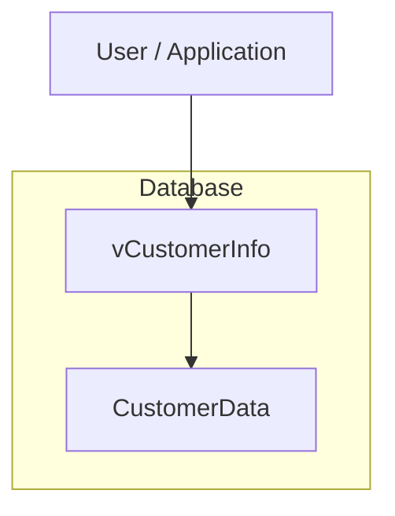
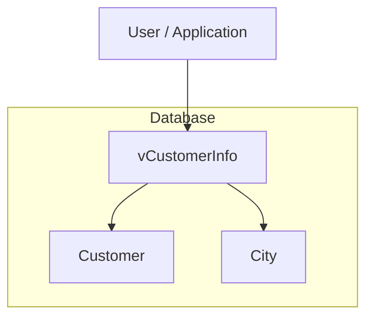
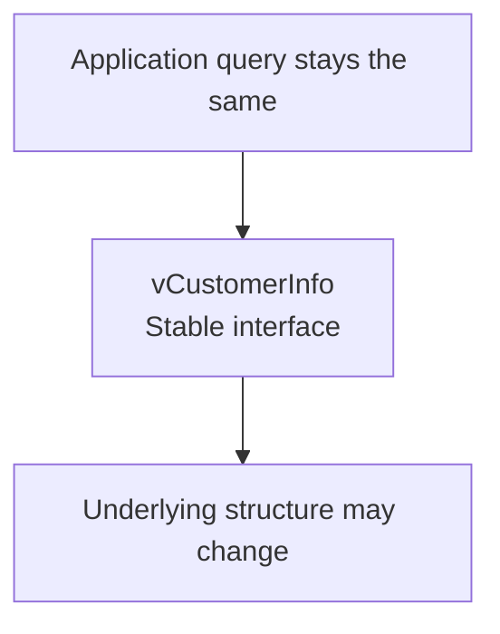
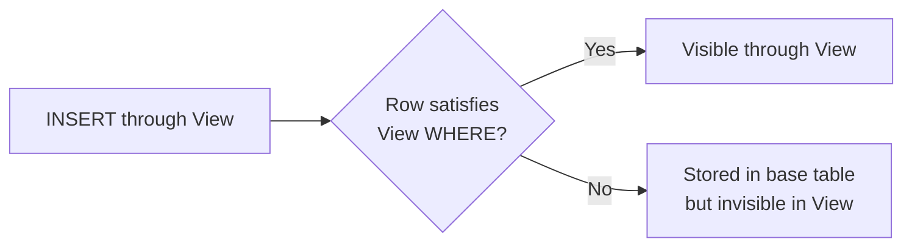
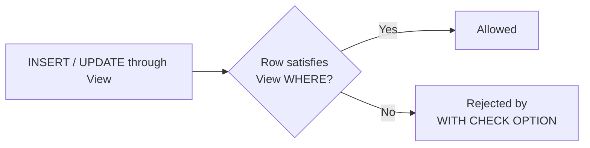

# Lab 1 – Views

**Database:** `AdventureWorksENG`

A View is a named query that behaves like a virtual table.

It does not normally store a separate copy of the data.

> **Core idea:** Views store SQL. Tables store data.

In the first part of this lab, Views are introduced as a way to simplify queries, hide complexity, provide a stable interface, and expose database metadata.

In the second part, we ask a different question:

> **What rules apply when we modify data through a View?**

We will also look at several View options that control how a View behaves.

---

## Learning objectives

After completing this lab, you should be able to:

- explain what a View is;
- create and query a View;
- modify a View definition;
- drop a View;
- explain why Views are useful for abstraction and reuse;
- explain how a View can provide a stable interface over changing database structures;
- query SQL Server metadata using system Views;
- modify data through a simple View;
- explain why some Views are not updatable;
- use `WITH CHECK OPTION` to prevent changes that would make rows disappear from a filtered View;
- use `WITH SCHEMABINDING` to prevent incompatible schema changes;
- explain what `WITH ENCRYPTION` does and does not protect;
- combine View options correctly.

Start by selecting the training database:

```sql
USE AdventureWorksENG;
GO
```

---

# Section 1 – Why Views exist

Views become useful when queries grow longer, more repetitive, or harder to read.

Let us build one query step by step.

---

## Stage 1 – A simple SELECT

```sql
SELECT
    c.FirstName,
    c.LastName
FROM Customer AS c;
```

---

## Stage 2 – Add the customer's city

```sql
SELECT
    c.FirstName,
    c.LastName,
    ci.Name AS City
FROM Customer AS c
JOIN City AS ci
    ON ci.IDCity = c.CityID;
```

---

## Stage 3 – Add the state

```sql
SELECT
    c.FirstName,
    c.LastName,
    ci.Name AS City,
    s.Name AS State
FROM Customer AS c
JOIN City AS ci
    ON ci.IDCity = c.CityID
JOIN State AS s
    ON s.IDState = ci.StateID;
```

---

## Stage 4 – Add purchase history

```sql
SELECT
    c.FirstName,
    c.LastName,
    ci.Name AS City,
    s.Name AS State,
    COUNT(DISTINCT i.IDInvoice) AS InvoiceCount,
    SUM(ii.TotalPrice) AS TotalSpent
FROM Customer AS c
JOIN City AS ci
    ON ci.IDCity = c.CityID
JOIN State AS s
    ON s.IDState = ci.StateID
JOIN Invoice AS i
    ON i.CustomerID = c.IDCustomer
JOIN InvoiceItem AS ii
    ON ii.InvoiceID = i.IDInvoice
GROUP BY
    c.FirstName,
    c.LastName,
    ci.Name,
    s.Name;
```

---

## Stage 5 – Add filtering and calculations

```sql
SELECT
    CONCAT_WS(' ', c.FirstName, c.LastName) AS CustomerName,
    ci.Name AS City,
    s.Name AS State,
    COUNT(DISTINCT i.IDInvoice) AS InvoiceCount,
    SUM(ii.TotalPrice) AS TotalSpent,
    MAX(i.InvoiceDate) AS LastPurchase
FROM Customer AS c
JOIN City AS ci
    ON ci.IDCity = c.CityID
JOIN State AS s
    ON s.IDState = ci.StateID
JOIN Invoice AS i
    ON i.CustomerID = c.IDCustomer
JOIN InvoiceItem AS ii
    ON ii.InvoiceID = i.IDInvoice
WHERE i.InvoiceDate >= '2004-06-01'
  AND i.InvoiceDate <  '2004-07-01'
GROUP BY
    c.FirstName,
    c.LastName,
    ci.Name,
    s.Name
HAVING SUM(ii.TotalPrice) > 1000
ORDER BY TotalSpent DESC;
```

The query now contains:

- several joins;
- filtering;
- aggregation;
- grouping;
- a calculated column;
- sorting.

If the same logic is needed repeatedly, we can save the query as a View.

---

## Create the View

```sql
CREATE OR ALTER VIEW dbo.vCustomerOverview
AS
SELECT
    CONCAT_WS(' ', c.FirstName, c.LastName) AS CustomerName,
    ci.Name AS City,
    s.Name AS State,
    COUNT(DISTINCT i.IDInvoice) AS InvoiceCount,
    SUM(ii.TotalPrice) AS TotalSpent,
    MAX(i.InvoiceDate) AS LastPurchase
FROM Customer AS c
JOIN City AS ci
    ON ci.IDCity = c.CityID
JOIN State AS s
    ON s.IDState = ci.StateID
JOIN Invoice AS i
    ON i.CustomerID = c.IDCustomer
JOIN InvoiceItem AS ii
    ON ii.InvoiceID = i.IDInvoice
WHERE i.InvoiceDate >= '2004-06-01'
  AND i.InvoiceDate <  '2004-07-01'
GROUP BY
    c.FirstName,
    c.LastName,
    ci.Name,
    s.Name
HAVING SUM(ii.TotalPrice) > 1000;
GO
```

Notice that the `ORDER BY` is no longer part of the View definition.

A View defines which rows and columns are returned, but it does not guarantee the final display order.

The caller decides the order:

```sql
SELECT *
FROM dbo.vCustomerOverview
ORDER BY TotalSpent DESC;
```

The `vCustomerOverview` View summarizes customer purchasing activity for June 2004.

It returns:

- customer name;
- city;
- state;
- number of invoices;
- total spending;
- most recent purchase date.

Only customers who spent more than `1000` during that period are included.

---

## Naming convention

In these labs, View names are prefixed with `v`.

For example:

```text
vCustomerOverview
vCustomerNames
vCustomerCities
```

Other teams may use conventions such as:

```text
vw_
view_
```

The exact convention is less important than using one consistently.

---

## Check your understanding

1. What does a View store?
2. Does a regular View store a separate copy of the query results?
3. Why was `ORDER BY` removed from the View definition?
4. Where should `ORDER BY` normally be used when querying a View?
5. What is one advantage of saving a complex query as a View?

<details>
<summary>Show answers</summary>

1. A query definition.
2. No.
3. Because a View does not define the final display order of its rows.
4. In the query that selects from the View.
5. It can hide complexity, improve reuse, and make repeated queries easier to read.

</details>

---

# Section 2 – A View owns no data

A regular View does not normally contain its own copy of the rows.

It reads data from its underlying tables.

Create a simple View:

```sql
CREATE OR ALTER VIEW dbo.vCustomerNames
AS
SELECT
    FirstName,
    LastName
FROM Customer;
GO
```

Query it:

```sql
SELECT *
FROM dbo.vCustomerNames;
```

---

## Proving that the View owns no data

Insert a test customer directly into the base table:

```sql
INSERT INTO Customer
(
    FirstName,
    LastName,
    Email,
    PhoneNumber,
    CityID
)
VALUES
(
    'Ada',
    'Lovelace',
    'ada@example.com',
    '555-0001',
    1
);
```

Now query the View:

```sql
SELECT *
FROM dbo.vCustomerNames
WHERE LastName = 'Lovelace';
```

The new row appears immediately.

The View itself was not modified.

Now update the base table:

```sql
UPDATE Customer
SET FirstName = 'Augusta'
WHERE Email = 'ada@example.com';
```

Query the View again:

```sql
SELECT *
FROM dbo.vCustomerNames
WHERE LastName = 'Lovelace';
```

The View shows the updated value.

Conceptually:


The View reads the current data from `Customer`.

---

## Performance note

A regular View does not automatically make a query faster.

SQL Server still executes the underlying query.

Views are mainly useful for:

- abstraction;
- reuse;
- readability;
- controlled access to data;
- hiding query complexity.

---

## Check your understanding

1. If a row changes in the base table, does a regular View automatically reflect that change?
2. Does the View need to be recreated after every data change?
3. Does creating a regular View automatically improve performance?

<details>
<summary>Show answers</summary>

1. Yes.
2. No.
3. No.

</details>

---

# Section 3 – Modifying and dropping Views

A View definition can change over time.

---

## ALTER VIEW

An existing View can be changed with `ALTER VIEW`:

```sql
ALTER VIEW dbo.vCustomerNames
AS
SELECT
    FirstName,
    LastName,
    Email
FROM Customer;
GO
```

Query it:

```sql
SELECT *
FROM dbo.vCustomerNames;
```

---

## CREATE OR ALTER VIEW

A more convenient approach is:

```sql
CREATE OR ALTER VIEW dbo.vCustomerNames
AS
SELECT
    FirstName,
    LastName,
    Email
FROM Customer;
GO
```

This works whether the View already exists or not.

For that reason, we will normally use:

```sql
CREATE OR ALTER VIEW
```

in the rest of these labs.

---

## DROP VIEW

Remove the View:

```sql
DROP VIEW dbo.vCustomerNames;
GO
```

Dropping a View does not delete the data from the underlying table.

The data still exists:

```sql
SELECT TOP (5) *
FROM Customer;
```

---

## Check your understanding

1. What is the difference between `ALTER VIEW` and `CREATE OR ALTER VIEW`?
2. Why is `CREATE OR ALTER VIEW` convenient in scripts?
3. Does `DROP VIEW` delete rows from the base table?

<details>
<summary>Show answers</summary>

1. `ALTER VIEW` requires the View to already exist. `CREATE OR ALTER VIEW` works whether it exists or not.
2. The same script can be used for both initial creation and later changes.
3. No.

</details>

---

# Section 4 – Views as a stable interface

A View can act as a stable interface between users or applications and the underlying database structure.

The internal database design may change while the query used by the application remains the same.

To demonstrate this safely, we will use a separate demo database.

---

## Step 1 – Create a demo database

```sql
USE master;
GO

DROP DATABASE IF EXISTS DatabaseDesignDemo;
GO

CREATE DATABASE DatabaseDesignDemo;
GO

USE DatabaseDesignDemo;
GO
```

---

## Step 2 – Start with a denormalized table

Suppose all customer information is stored in one table:

```sql
CREATE TABLE dbo.CustomerData
(
    CustomerID  int PRIMARY KEY,
    FirstName   nvarchar(50) NOT NULL,
    LastName    nvarchar(50) NOT NULL,
    CityName    nvarchar(100) NOT NULL,
    CountryName nvarchar(100) NOT NULL
);
GO
```

Insert sample data:

```sql
INSERT INTO dbo.CustomerData
(
    CustomerID,
    FirstName,
    LastName,
    CityName,
    CountryName
)
VALUES
    (1, 'Ana',   'Horvat', 'Zagreb', 'Croatia'),
    (2, 'Marko', 'Kovač',  'Split',  'Croatia'),
    (3, 'Ivana', 'Marić',  'Zagreb', 'Croatia'),
    (4, 'John',  'Smith',  'London', 'United Kingdom');
GO
```

Create a View:

```sql
CREATE OR ALTER VIEW dbo.vCustomerInfo
AS
SELECT
    CustomerID,
    FirstName,
    LastName,
    CityName,
    CountryName
FROM dbo.CustomerData;
GO
```

The application uses:

```sql
SELECT *
FROM dbo.vCustomerInfo
ORDER BY CustomerID;
```

At this point:



---

## Step 3 – Normalize the database

Later, the database design changes.

Instead of storing city information repeatedly in `CustomerData`, we separate the data into:

- `Customer`
- `City`

Create the new structure:

```sql
CREATE TABLE dbo.City
(
    CityID      int PRIMARY KEY,
    CityName    nvarchar(100) NOT NULL,
    CountryName nvarchar(100) NOT NULL
);
GO

CREATE TABLE dbo.Customer
(
    CustomerID int PRIMARY KEY,
    FirstName  nvarchar(50) NOT NULL,
    LastName   nvarchar(50) NOT NULL,
    CityID     int NOT NULL,

    CONSTRAINT FK_Customer_City
        FOREIGN KEY (CityID)
        REFERENCES dbo.City(CityID)
);
GO
```

Insert the same logical data:

```sql
INSERT INTO dbo.City
(
    CityID,
    CityName,
    CountryName
)
VALUES
    (1, 'Zagreb', 'Croatia'),
    (2, 'Split',  'Croatia'),
    (3, 'London', 'United Kingdom');
GO

INSERT INTO dbo.Customer
(
    CustomerID,
    FirstName,
    LastName,
    CityID
)
VALUES
    (1, 'Ana',   'Horvat', 1),
    (2, 'Marko', 'Kovač',  2),
    (3, 'Ivana', 'Marić',  1),
    (4, 'John',  'Smith',  3);
GO
```

The internal database structure has changed.

---

## Step 4 – Change the View, not the application query

The old View still reads from `CustomerData`.

We can change only the View definition:

```sql
CREATE OR ALTER VIEW dbo.vCustomerInfo
AS
SELECT
    c.CustomerID,
    c.FirstName,
    c.LastName,
    ci.CityName,
    ci.CountryName
FROM dbo.Customer AS c
JOIN dbo.City AS ci
    ON ci.CityID = c.CityID;
GO
```

The original table is no longer needed:

```sql
DROP TABLE dbo.CustomerData;
GO
```

Now run the same application query:

```sql
SELECT *
FROM dbo.vCustomerInfo
ORDER BY CustomerID;
```

The query did not change.

Only the internal implementation changed.

### Before


### After



> **The database structure changed, but the interface remained the same.**

The user does not need to know whether the data comes from one table or several tables.

This is an example of:

- abstraction;
- logical data independence.

---

## Key idea

Without a View:

```text
Application -> CustomerData
```

If the table structure changes, the application query may also need to change.

With a View:

```text
Application -> View -> underlying tables
```

The View can absorb some internal structural changes.



---

## Check your understanding

1. What remained unchanged after the database was normalized?
2. What had to change?
3. Why can a View act as a stable interface?
4. What does abstraction mean in this example?

<details>
<summary>Show answers</summary>

1. The query used by the application.
2. The View definition and the underlying table structure.
3. Because the View can preserve the same columns and interface while reading from a different internal structure.
4. The application does not need to know the details of how the data is stored internally.

</details>

---

## Return to the training database

```sql
USE AdventureWorksENG;
GO
```

---

# Section 5 – System Views

SQL Server stores metadata about database objects such as:

- tables;
- columns;
- indexes;
- constraints;
- Views.

This metadata can itself be queried using system Views.

Examples include:

```text
sys.tables
sys.columns
```

System Views are useful for:

- exploring database structure;
- checking metadata;
- writing administration queries;
- diagnostics;
- generating documentation or dynamic SQL.

---

## List tables

```sql
SELECT *
FROM sys.tables;
```

A more focused query:

```sql
SELECT
    name
FROM sys.tables
ORDER BY name;
```

---

## List columns

```sql
SELECT *
FROM sys.columns;
```

To list columns together with their table names:

```sql
SELECT
    t.name AS TableName,
    c.name AS ColumnName
FROM sys.tables AS t
JOIN sys.columns AS c
    ON c.object_id = t.object_id
ORDER BY
    t.name,
    c.column_id;
```

---

## INFORMATION_SCHEMA

SQL Server also provides standard-style metadata Views:

```sql
SELECT *
FROM INFORMATION_SCHEMA.TABLES
ORDER BY TABLE_NAME;
```

`INFORMATION_SCHEMA` exists in several relational database systems, although available metadata and implementation details differ between DBMSs.

---

## Object IDs

SQL Server objects have internal IDs.

For example:

```sql
SELECT OBJECT_ID('Customer');
```

And:

```sql
SELECT OBJECT_NAME(OBJECT_ID('Customer'));
```

This is useful when working with SQL Server metadata.

---

## Check your understanding

1. What is metadata?
2. Which system View lists tables?
3. Which system View lists columns?
4. What does `OBJECT_ID()` return?
5. Why are system Views useful?

<details>
<summary>Show answers</summary>

1. Data that describes database objects and structure.
2. `sys.tables`.
3. `sys.columns`.
4. The internal object ID for a database object.
5. They allow database structure and metadata to be queried with SQL.

</details>

---

# Part II – Modifying data through Views

So far, Views have mainly been used for reading data, simplifying queries, hiding complexity, and providing an interface over the underlying database.

Now we continue with a different question:

> **What happens when we modify data through a View?**

---

# Section 6 – Modifying data through a View

A View is usually used for reading data, but some Views can also be used for:

- `INSERT`
- `UPDATE`
- `DELETE`

The important question is:

> Can SQL Server clearly map the change made through the View back to the underlying table?

A simple View over one table is often updatable.

More complex Views have additional restrictions.

---

## A simple updatable View

Create a simple View over `Customer`:

```sql
CREATE OR ALTER VIEW dbo.vCustomers
AS
SELECT
    FirstName,
    LastName,
    Email,
    PhoneNumber,
    CityID
FROM Customer;
GO
```

Now insert through the View:

```sql
INSERT INTO dbo.vCustomers
(
    FirstName,
    LastName,
    Email,
    PhoneNumber,
    CityID
)
VALUES
(
    'Grace',
    'Hopper',
    'grace@example.com',
    '555-0002',
    1
);
```

The row is inserted into the underlying `Customer` table.

Verify it:

```sql
SELECT *
FROM Customer
WHERE Email = 'grace@example.com';
```

You can also update through the View:

```sql
UPDATE dbo.vCustomers
SET PhoneNumber = '555-9999'
WHERE Email = 'grace@example.com';
```

And delete through the View:

```sql
DELETE FROM dbo.vCustomers
WHERE Email = 'grace@example.com';
```

The View itself does not store a separate copy of the row.

The modification affects the underlying table.

---

## General rules

A View is more likely to be updatable when SQL Server can clearly identify the affected base-table rows.

Typical restrictions include:

- the change should affect columns from one base table;
- calculated columns cannot be modified directly;
- aggregate results cannot be modified directly;
- `GROUP BY`, `HAVING`, and `DISTINCT` make direct modifications more restricted;
- the View must expose the columns required to create a valid row in the underlying table.

The easiest way to understand these rules is to look at examples.

---

## JOIN Views have additional restrictions

Create a View that joins `Customer` and `City`:

```sql
CREATE OR ALTER VIEW dbo.vCustomerCities
AS
SELECT
    c.IDCustomer,
    c.FirstName,
    c.LastName,
    c.Email,
    c.PhoneNumber,
    c.CityID,
    ci.Name AS CityName
FROM Customer AS c
JOIN City AS ci
    ON ci.IDCity = c.CityID;
GO
```

Reading from the View works normally:

```sql
SELECT TOP (10) *
FROM dbo.vCustomerCities;
```

A modification that SQL Server can map to one base table may be allowed.

For example:

```sql
UPDATE dbo.vCustomerCities
SET LastName = 'Updated'
WHERE IDCustomer = 1;
```

Only a column from `Customer` is being modified.

However, one statement cannot use the View to modify columns from multiple base tables at the same time.

For example:

```sql
UPDATE dbo.vCustomerCities
SET
    LastName = 'Updated',
    CityName = 'New City'
WHERE IDCustomer = 1;
```

This attempts to modify both:

- `Customer.LastName`
- `City.Name`

SQL Server rejects the statement because one View modification cannot update multiple base tables.

> **Key idea:** A joined View is not automatically read-only, but modifications are limited to changes SQL Server can map unambiguously to one base table.

---

## Calculated columns are read-only

A View can contain calculated values:

```sql
CREATE OR ALTER VIEW dbo.vInvoiceItems
AS
SELECT
    IDInvoiceItem,
    Quantity,
    InitialPrice,
    Quantity * InitialPrice AS LineTotal
FROM InvoiceItem;
GO
```

Reading the calculated column is fine:

```sql
SELECT TOP (10) *
FROM dbo.vInvoiceItems;
```

Updating a normal base-table column can work:

```sql
UPDATE dbo.vInvoiceItems
SET Quantity = 5
WHERE IDInvoiceItem = 1;
```

But the calculated value itself cannot be directly updated:

```sql
UPDATE dbo.vInvoiceItems
SET LineTotal = 500
WHERE IDInvoiceItem = 1;
```

Why?

`LineTotal` is not a stored value in `InvoiceItem`.

It is calculated from:

```sql
Quantity * InitialPrice
```

---

## Aggregate Views are not directly updatable

Create a View with aggregate functions:

```sql
CREATE OR ALTER VIEW dbo.vInvoiceSummary
AS
SELECT
    InvoiceID,
    COUNT(*) AS NumberOfItems,
    SUM(Quantity) AS TotalQuantity,
    SUM(Quantity * InitialPrice) AS TotalAmount
FROM InvoiceItem
GROUP BY InvoiceID;
GO
```

Querying it works normally:

```sql
SELECT TOP (10) *
FROM dbo.vInvoiceSummary;
```

But this does not work:

```sql
UPDATE dbo.vInvoiceSummary
SET TotalAmount = 1000
WHERE InvoiceID = 1;
```

`TotalAmount` is calculated from several rows in `InvoiceItem`.

It does not represent one stored column in one base-table row.

---

## DISTINCT also restricts modifications

A View may remove duplicate values using `DISTINCT`:

```sql
CREATE OR ALTER VIEW dbo.vCreditCardTypes
AS
SELECT DISTINCT
    Type
FROM CreditCard;
GO
```

Querying it is fine:

```sql
SELECT *
FROM dbo.vCreditCardTypes;
```

But this is not directly updatable:

```sql
UPDATE dbo.vCreditCardTypes
SET Type = 'VISA'
WHERE Type = 'Visa';
```

One row in the View may represent many rows in `CreditCard`.

---

## Check your understanding

1. Why can a simple one-table View often be updated?
2. Can a calculated column be updated directly?
3. Why are aggregate Views usually not directly updatable?
4. Is every JOIN View read-only?
5. Can one View modification change columns from two base tables at the same time?

<details>
<summary>Show answers</summary>

1. Because SQL Server can usually map the View row directly to one row in one base table.
2. No. The value is derived from other columns.
3. Because one View row may represent calculations over several base-table rows.
4. No. Some modifications may be allowed when the change maps to one base table.
5. No. A single modification through such a View cannot update multiple base tables.

</details>

---

## Cleanup

```sql
DROP VIEW IF EXISTS dbo.vCustomers;
DROP VIEW IF EXISTS dbo.vCustomerCities;
DROP VIEW IF EXISTS dbo.vInvoiceItems;
DROP VIEW IF EXISTS dbo.vInvoiceSummary;
DROP VIEW IF EXISTS dbo.vCreditCardTypes;
GO

DELETE FROM Customer
WHERE Email = 'grace@example.com';
GO
```

---

# Section 7 – WITH CHECK OPTION

A filtered View shows only rows that satisfy its `WHERE` condition.

But by default, SQL Server may allow a change through the View that creates a row which does **not** satisfy that condition.

The result can be surprising:

> You insert a row through the View, but the row immediately disappears from the View.

---

## The disappearing row problem

Create a View that shows only Visa cards:

```sql
CREATE OR ALTER VIEW dbo.vVisaCards
AS
SELECT
    IDCreditCard,
    Type,
    CardNumber,
    ExpirationMonth,
    ExpirationYear
FROM CreditCard
WHERE Type = 'Visa';
GO
```

Insert an American Express card through the Visa View:

```sql
INSERT INTO dbo.vVisaCards
(
    Type,
    CardNumber,
    ExpirationMonth,
    ExpirationYear
)
VALUES
(
    'American Express',
    '378282246310005',
    12,
    2030
);
```

The insert succeeds.

But the row is not visible through the View:

```sql
SELECT *
FROM dbo.vVisaCards
WHERE CardNumber = '378282246310005';
```

It does exist in the base table:

```sql
SELECT *
FROM CreditCard
WHERE CardNumber = '378282246310005';
```

Why?

The View filters with:

```sql
WHERE Type = 'Visa'
```

but the inserted row has `Type = 'American Express'`.

---

## Visualizing the problem



---

## The fix – WITH CHECK OPTION

Add `WITH CHECK OPTION` at the end of the View definition:

```sql
CREATE OR ALTER VIEW dbo.vVisaCards
AS
SELECT
    IDCreditCard,
    Type,
    CardNumber,
    ExpirationMonth,
    ExpirationYear
FROM CreditCard
WHERE Type = 'Visa'
WITH CHECK OPTION;
GO
```

Now try to insert an invalid row:

```sql
INSERT INTO dbo.vVisaCards
(
    Type,
    CardNumber,
    ExpirationMonth,
    ExpirationYear
)
VALUES
(
    'Discover',
    '6011000000000000',
    6,
    2029
);
```

SQL Server rejects the change because the new row would not be visible through the View.

A valid row still works:

```sql
INSERT INTO dbo.vVisaCards
(
    Type,
    CardNumber,
    ExpirationMonth,
    ExpirationYear
)
VALUES
(
    'Visa',
    '4111111111111111',
    3,
    2028
);
```



> **WITH CHECK OPTION ensures that rows modified through the View remain visible through that View.**

---

## Check your understanding

1. Without `WITH CHECK OPTION`, can a row inserted through a filtered View become invisible through that View?
2. Where is that row stored?
3. What does `WITH CHECK OPTION` prevent?
4. Does `WITH CHECK OPTION` change which rows the View displays?

<details>
<summary>Show answers</summary>

1. Yes.
2. In the underlying base table.
3. It prevents modifications through the View that would create rows which do not satisfy the View's filter.
4. No. The filter still determines what the View displays.

</details>

---

## Cleanup

```sql
DROP VIEW IF EXISTS dbo.vVisaCards;
GO

DELETE FROM CreditCard
WHERE CardNumber IN
(
    '378282246310005',
    '4111111111111111',
    '6011000000000000'
);
GO
```

---

# Section 8 – WITH SCHEMABINDING

A normal View depends on underlying tables, but SQL Server may allow a schema change that later causes the View to fail.

`WITH SCHEMABINDING` creates a stronger dependency between the View and the objects it references.

> **SCHEMABINDING prevents incompatible schema changes that would break the View.**

For safety, we will use a temporary demonstration table.

---

## Without SCHEMABINDING

```sql
CREATE TABLE dbo.SchemaBindingDemo
(
    ID   int IDENTITY PRIMARY KEY,
    Name nvarchar(50),
    Note nvarchar(200)
);
GO

INSERT INTO dbo.SchemaBindingDemo (Name, Note)
VALUES
    ('Row 1', 'first'),
    ('Row 2', 'second');
GO
```

Create a normal View:

```sql
CREATE OR ALTER VIEW dbo.vDemoContacts
AS
SELECT
    ID,
    Name,
    Note
FROM dbo.SchemaBindingDemo;
GO
```

Now drop a column the View uses:

```sql
ALTER TABLE dbo.SchemaBindingDemo
DROP COLUMN Note;
GO
```

SQL Server allows the change.

But now:

```sql
SELECT *
FROM dbo.vDemoContacts;
```

fails because the View still expects `Note`.

Add the column back:

```sql
ALTER TABLE dbo.SchemaBindingDemo
ADD Note nvarchar(200) NULL;
GO
```

---

## With SCHEMABINDING

Rewrite the View:

```sql
CREATE OR ALTER VIEW dbo.vDemoContacts
WITH SCHEMABINDING
AS
SELECT
    ID,
    Name,
    Note
FROM dbo.SchemaBindingDemo;
GO
```

Now try:

```sql
ALTER TABLE dbo.SchemaBindingDemo
DROP COLUMN Note;
```

SQL Server refuses the change because the schemabound View depends on that column.

### Requirements used here

With `SCHEMABINDING`:

- use two-part object names such as `dbo.SchemaBindingDemo`;
- explicitly list the columns instead of using `SELECT *`.

---

## Check your understanding

1. What problem does `WITH SCHEMABINDING` help prevent?
2. Does it prevent every possible change to the underlying table?
3. Why do we use `dbo.SchemaBindingDemo` instead of only `SchemaBindingDemo`?
4. Can we use `SELECT *` in this schemabound View?

<details>
<summary>Show answers</summary>

1. It prevents incompatible schema changes to referenced objects that would break the View.
2. No. It prevents changes that conflict with the View's dependencies.
3. Schemabound object references use two-part names.
4. No. The referenced columns must be listed explicitly.

</details>

---

## Cleanup

```sql
DROP VIEW IF EXISTS dbo.vDemoContacts;
GO

DROP TABLE IF EXISTS dbo.SchemaBindingDemo;
GO
```

---

# Section 9 – WITH ENCRYPTION

`WITH ENCRYPTION` hides a View definition from normal metadata tools such as `sp_helptext`.

> **Important:** This should not be treated as a security boundary. It hides the definition from normal inspection, but it is not a substitute for permissions or proper security controls.

Create a normal View:

```sql
CREATE OR ALTER VIEW dbo.vActiveCards
AS
SELECT
    IDCreditCard,
    Type,
    CardNumber
FROM CreditCard
WHERE ExpirationYear >= 2026;
GO
```

Its definition can be inspected:

```sql
EXECUTE sp_helptext 'dbo.vActiveCards';
```

Rewrite it:

```sql
CREATE OR ALTER VIEW dbo.vActiveCards
WITH ENCRYPTION
AS
SELECT
    IDCreditCard,
    Type,
    CardNumber
FROM CreditCard
WHERE ExpirationYear >= 2026;
GO
```

Now:

```sql
EXECUTE sp_helptext 'dbo.vActiveCards';
```

does not return the View definition.

The View itself still works:

```sql
SELECT TOP (10) *
FROM dbo.vActiveCards;
```

> Always keep the original View source in version control.

---

## Check your understanding

1. What does `WITH ENCRYPTION` hide?
2. Does the View still work normally?
3. Should `WITH ENCRYPTION` be treated as strong security?
4. Where should the original View source code be stored?

<details>
<summary>Show answers</summary>

1. The View definition from normal metadata inspection tools such as `sp_helptext`.
2. Yes.
3. No.
4. In version control, such as Git.

</details>

---

## Cleanup

```sql
DROP VIEW IF EXISTS dbo.vActiveCards;
GO
```

---

# Section 10 – Combining View options

The View options used in this lab appear in different positions.

| Option | Position |
|---|---|
| `WITH SCHEMABINDING` | before `AS` |
| `WITH ENCRYPTION` | before `AS` |
| `WITH CHECK OPTION` | after the query |

Options before `AS` use one `WITH` clause and are separated by commas.

Example:

```sql
CREATE OR ALTER VIEW dbo.vVisaCards
WITH SCHEMABINDING, ENCRYPTION
AS
SELECT
    IDCreditCard,
    Type,
    CardNumber,
    ExpirationMonth,
    ExpirationYear
FROM dbo.CreditCard
WHERE Type = 'Visa'
WITH CHECK OPTION;
GO
```

Query it:

```sql
SELECT TOP (5) *
FROM dbo.vVisaCards;
```

---

## Check your understanding

1. Where does `WITH SCHEMABINDING` appear?
2. Where does `WITH CHECK OPTION` appear?
3. How are multiple options before `AS` separated?
4. Can `SCHEMABINDING` and `CHECK OPTION` be used together?

<details>
<summary>Show answers</summary>

1. Before `AS`.
2. At the end of the query.
3. With commas inside one `WITH` clause.
4. Yes.

</details>

---

## Cleanup

```sql
DROP VIEW IF EXISTS dbo.vVisaCards;
GO
```

---

# Exercises – Part A: View fundamentals

Try each exercise before opening the solution.

---

## Exercise 1 – Create your first View

Create a View named:

```text
dbo.vCustomers
```

It should return:

- `FirstName`
- `LastName`
- `Email`

from `Customer`.

Then query the View.

<details>
<summary>Show solution</summary>

```sql
CREATE OR ALTER VIEW dbo.vCustomers
AS
SELECT
    FirstName,
    LastName,
    Email
FROM Customer;
GO

SELECT *
FROM dbo.vCustomers;
```

</details>

---

## Exercise 2 – Modify the View

Modify `dbo.vCustomers` so that it also returns:

```text
PhoneNumber
```

Use `CREATE OR ALTER VIEW`.

Then query the View again.

<details>
<summary>Show solution</summary>

```sql
CREATE OR ALTER VIEW dbo.vCustomers
AS
SELECT
    FirstName,
    LastName,
    Email,
    PhoneNumber
FROM Customer;
GO

SELECT *
FROM dbo.vCustomers;
```

</details>

---

## Exercise 3 – Hide a JOIN inside a View

Create:

```text
dbo.vCustomerCities
```

The View should return:

- `FirstName`
- `LastName`
- city name as `City`

Use `Customer` and `City`.

Then query the View **without writing a JOIN in the final SELECT**.

Hint:

```text
Customer.CityID -> City.IDCity
```

<details>
<summary>Show solution</summary>

```sql
CREATE OR ALTER VIEW dbo.vCustomerCities
AS
SELECT
    c.FirstName,
    c.LastName,
    ci.Name AS City
FROM Customer AS c
JOIN City AS ci
    ON ci.IDCity = c.CityID;
GO

SELECT *
FROM dbo.vCustomerCities;
```

</details>

---

## Exercise 4 – Explore system Views

Using `sys.tables`, count how many user tables exist in the current database.

<details>
<summary>Show solution</summary>

```sql
SELECT COUNT(*) AS TableCount
FROM sys.tables;
```

</details>

---

## Exercise 5 – List table columns

Using `sys.tables` and `sys.columns`, list all columns belonging to the `Customer` table.

Return:

- table name;
- column name.

<details>
<summary>Show solution</summary>

```sql
SELECT
    t.name AS TableName,
    c.name AS ColumnName
FROM sys.tables AS t
JOIN sys.columns AS c
    ON c.object_id = t.object_id
WHERE t.name = 'Customer'
ORDER BY c.column_id;
```

</details>

---

# Exercises – Part B: Modifying data and View options

Try each exercise before opening the solution.

---

## Exercise 1 – Modify data through a simple View

Create `dbo.vCategories` that returns all columns from `Category`.

Through the View:

1. insert a category named `'Alarms'`;
2. rename it to `'Active Protection'`;
3. delete it;
4. drop the View.

<details>
<summary>Show solution</summary>

```sql
CREATE OR ALTER VIEW dbo.vCategories
AS
SELECT *
FROM Category;
GO

INSERT INTO dbo.vCategories (Name)
VALUES ('Alarms');

UPDATE dbo.vCategories
SET Name = 'Active Protection'
WHERE Name = 'Alarms';

DELETE FROM dbo.vCategories
WHERE Name = 'Active Protection';

DROP VIEW dbo.vCategories;
GO
```

</details>

---

## Exercise 2 – JOIN View restrictions

Create `dbo.vCustomerLocations` returning:

- `IDCustomer`;
- `FirstName`;
- `LastName`;
- `Email`;
- `PhoneNumber`;
- `CityID`;
- city name as `CityName`;
- state name as `StateName`.

Use `Customer`, `City`, and `State`.

Then test the View:

1. update only `Customer.LastName` through the View;
2. try to update both `Customer.LastName` and `City.Name` in the same statement;
3. explain why the two statements behave differently;
4. drop the View.

<details>
<summary>Show solution</summary>

```sql
CREATE OR ALTER VIEW dbo.vCustomerLocations
AS
SELECT
    c.IDCustomer,
    c.FirstName,
    c.LastName,
    c.Email,
    c.PhoneNumber,
    c.CityID,
    ci.Name AS CityName,
    s.Name  AS StateName
FROM Customer AS c
JOIN City AS ci
    ON ci.IDCity = c.CityID
JOIN State AS s
    ON s.IDState = ci.StateID;
GO
```

This targets only `Customer`:

```sql
UPDATE dbo.vCustomerLocations
SET LastName = LastName
WHERE IDCustomer = 1;
```

Now try to modify two base tables:

```sql
UPDATE dbo.vCustomerLocations
SET
    LastName = 'Test',
    CityName = 'Test City'
WHERE IDCustomer = 1;
```

This fails because the statement attempts to modify both `Customer` and `City`.

```sql
DROP VIEW dbo.vCustomerLocations;
GO
```

</details>

---

## Exercise 3 – WITH CHECK OPTION

Create `dbo.vAcceptedCards` showing cards whose `Type` is `'Visa'` or `'MasterCard'`.

Then:

1. insert an American Express card through the View;
2. query the View for the new card;
3. query the base table for the new card;
4. add `WITH CHECK OPTION`;
5. try another American Express insert;
6. remove `WITH CHECK OPTION`;
7. drop the View.

<details>
<summary>Show solution</summary>

```sql
CREATE OR ALTER VIEW dbo.vAcceptedCards
AS
SELECT
    IDCreditCard,
    Type,
    CardNumber,
    ExpirationMonth,
    ExpirationYear
FROM CreditCard
WHERE Type IN ('Visa', 'MasterCard');
GO
```

```sql
INSERT INTO dbo.vAcceptedCards
(
    Type,
    CardNumber,
    ExpirationMonth,
    ExpirationYear
)
VALUES
(
    'American Express',
    '378282246310005',
    12,
    2030
);
```

```sql
SELECT *
FROM dbo.vAcceptedCards
WHERE CardNumber = '378282246310005';

SELECT *
FROM CreditCard
WHERE CardNumber = '378282246310005';
```

Add `WITH CHECK OPTION`:

```sql
CREATE OR ALTER VIEW dbo.vAcceptedCards
AS
SELECT
    IDCreditCard,
    Type,
    CardNumber,
    ExpirationMonth,
    ExpirationYear
FROM CreditCard
WHERE Type IN ('Visa', 'MasterCard')
WITH CHECK OPTION;
GO
```

This insert is rejected:

```sql
INSERT INTO dbo.vAcceptedCards
(
    Type,
    CardNumber,
    ExpirationMonth,
    ExpirationYear
)
VALUES
(
    'American Express',
    '371449635398431',
    12,
    2030
);
```

Remove the option:

```sql
CREATE OR ALTER VIEW dbo.vAcceptedCards
AS
SELECT
    IDCreditCard,
    Type,
    CardNumber,
    ExpirationMonth,
    ExpirationYear
FROM CreditCard
WHERE Type IN ('Visa', 'MasterCard');
GO

DROP VIEW dbo.vAcceptedCards;
GO
```

</details>

---

## Exercise 4 – SCHEMABINDING

Create a temporary table with:

- `ID`
- `Name`
- `Description`

Create a normal View over the table.

1. Drop `Description`.
2. Observe what happens when you query the View.
3. Add the column back.
4. Recreate the View using `WITH SCHEMABINDING`.
5. Try to drop `Description` again.
6. Explain the difference.

<details>
<summary>Show solution</summary>

```sql
CREATE TABLE dbo.SchemaExercise
(
    ID          int IDENTITY PRIMARY KEY,
    Name        nvarchar(50),
    Description nvarchar(200)
);
GO

CREATE OR ALTER VIEW dbo.vSchemaExercise
AS
SELECT
    ID,
    Name,
    Description
FROM dbo.SchemaExercise;
GO

ALTER TABLE dbo.SchemaExercise
DROP COLUMN Description;
GO
```

Restore the column:

```sql
ALTER TABLE dbo.SchemaExercise
ADD Description nvarchar(200) NULL;
GO
```

Recreate the View:

```sql
CREATE OR ALTER VIEW dbo.vSchemaExercise
WITH SCHEMABINDING
AS
SELECT
    ID,
    Name,
    Description
FROM dbo.SchemaExercise;
GO
```

This is rejected:

```sql
ALTER TABLE dbo.SchemaExercise
DROP COLUMN Description;
```

Cleanup:

```sql
DROP VIEW IF EXISTS dbo.vSchemaExercise;
GO

DROP TABLE IF EXISTS dbo.SchemaExercise;
GO
```

</details>

---

# Cleanup

The lab contains smaller cleanup steps after some demonstrations. If you completed those steps, most temporary objects are already gone.

The following blocks can be used as a final safety cleanup.

## Cleanup – View fundamentals

Remove the Views created during the exercises:

```sql
DROP VIEW IF EXISTS dbo.vCustomers;
DROP VIEW IF EXISTS dbo.vCustomerCities;
DROP VIEW IF EXISTS dbo.vCustomerOverview;
GO
```

Remove the test customer:

```sql
DELETE FROM Customer
WHERE Email = 'ada@example.com';
GO
```

The separate demo database can also be removed when it is no longer needed:

```sql
USE master;
GO

DROP DATABASE IF EXISTS DatabaseDesignDemo;
GO

USE AdventureWorksENG;
GO
```

---

## Cleanup – Modifying data and View options

Run this if you stopped the lab before completing all individual cleanup steps:

```sql
DROP VIEW IF EXISTS dbo.vCustomers;
DROP VIEW IF EXISTS dbo.vCustomerCities;
DROP VIEW IF EXISTS dbo.vInvoiceItems;
DROP VIEW IF EXISTS dbo.vInvoiceSummary;
DROP VIEW IF EXISTS dbo.vCreditCardTypes;
DROP VIEW IF EXISTS dbo.vVisaCards;
DROP VIEW IF EXISTS dbo.vDemoContacts;
DROP VIEW IF EXISTS dbo.vActiveCards;
DROP VIEW IF EXISTS dbo.vCategories;
DROP VIEW IF EXISTS dbo.vCustomerLocations;
DROP VIEW IF EXISTS dbo.vAcceptedCards;
DROP VIEW IF EXISTS dbo.vSchemaExercise;
GO

DELETE FROM CreditCard
WHERE CardNumber IN
(
    '378282246310005',
    '4111111111111111',
    '6011000000000000',
    '371449635398431'
);

DELETE FROM Customer
WHERE Email = 'grace@example.com';

DROP TABLE IF EXISTS dbo.SchemaBindingDemo;
DROP TABLE IF EXISTS dbo.SchemaExercise;
GO
```

---

# What you should know after this lab

The most important ideas are:

```text
View
    -> stores a query definition
    -> behaves like a virtual table
```

```text
Base table changes
    -> immediately visible through a regular View
```

```text
View
    -> hides query complexity
    -> supports reuse
    -> can provide a stable interface
```

```text
CREATE OR ALTER VIEW
    -> create a new View
    -> or replace an existing definition
```

```text
sys.tables / sys.columns
    -> expose SQL Server metadata through system Views
```

The important ideas are:

```text
Simple View
    -> may allow INSERT / UPDATE / DELETE

Complex View
    -> additional modification restrictions
```

```text
WITH CHECK OPTION
    -> modified rows must remain visible through the View
```

```text
WITH SCHEMABINDING
    -> prevents incompatible schema changes to referenced objects
```

```text
WITH ENCRYPTION
    -> hides the View definition from normal metadata inspection
    -> not a security boundary
```

And remember:

> **Views store SQL. Tables store data.**

> **A View is not just a saved SELECT. Its definition also determines what can be modified through it and which rules apply.**

---

# Where to go next

In the next lab, **Triggers**, the database becomes active.

A View responds when you query or modify it.

A Trigger reacts automatically when data changes.
