# Lab 3 – Triggers

**Database:** `AdventureWorksENG`

A trigger is database code that runs automatically when a specified event occurs.

In this lab, we focus on **DML AFTER triggers** that react to:

- `INSERT`
- `UPDATE`
- `DELETE`

> **Core idea:** A trigger fires automatically. You do not call it.

---

## Learning objectives

After completing this lab, you should be able to:

- explain what a DML trigger is;
- create an `AFTER INSERT`, `AFTER UPDATE`, or `AFTER DELETE` trigger;
- use the `inserted` and `deleted` special tables;
- explain why triggers must be written to handle multiple rows;
- compare old and new values during an `UPDATE`;
- temporarily disable and re-enable a trigger;
- recognize situations where triggers are useful and where they can make a design harder to understand.

This lab assumes you already know:

- batches and `GO`;
- T-SQL variables;
- `IF / ELSE`;
- `CAST`.

---

# Section 1 – What is a trigger?

A **trigger** is code attached to a table or view that runs automatically when a specified event occurs.

For the triggers in this lab, the events are data changes:

```text
INSERT
UPDATE
DELETE
```

Conceptually:

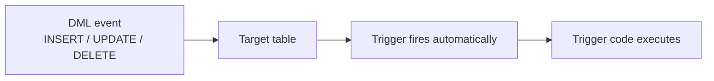

A trigger is different from a stored procedure:

- you do **not** call a trigger with `EXEC`;
- a trigger has no input parameters;
- a trigger fires because an event occurred on its parent table or view;
- an `AFTER` trigger executes as part of the same transaction as the statement that fired it.

### DML and DDL triggers

SQL Server supports several kinds of triggers.

In this course we focus on **DML triggers**, which react to changes in table data:

- `INSERT`
- `UPDATE`
- `DELETE`

SQL Server also supports **DDL triggers**, which react to schema changes such as `CREATE TABLE` or `DROP TABLE`. They are outside the scope of this lab.

### AFTER and INSTEAD OF

Two common trigger types are:

- `AFTER` – runs after the DML operation has been applied;
- `INSTEAD OF` – runs instead of the original DML operation.

This lab uses **AFTER triggers**.

---

## When are triggers useful?

Typical uses include:

* **audit logging** – for example, recording who changed a customer's address and when;
* **recording important data changes** – for example, storing the old and new salary whenever an employee's salary is updated;
* **enforcing rules that are difficult to express with normal constraints** – for example, preventing an update when it would violate a business rule involving multiple tables;
* **maintaining related data that must always remain consistent** – for example, updating a summary or status table automatically when the underlying data changes.


However, triggers also introduce **hidden behavior**.

A developer can run a simple `INSERT` without immediately seeing that additional code will execute automatically.

> **Use triggers deliberately.** They are useful when automatic database-level behavior is required, but overusing them can make systems harder to understand and debug.

---

## Check your understanding

1. What causes a trigger to execute?
2. Do you call a trigger with `EXEC`?
3. What three DML events can a trigger react to?
4. What is the difference between `AFTER` and `INSTEAD OF`?

<details>
<summary>Show answers</summary>

1. A configured event on the trigger's parent table or view.
2. No. A trigger fires automatically.
3. `INSERT`, `UPDATE`, and `DELETE`.
4. An `AFTER` trigger runs after the DML operation has been applied. An `INSTEAD OF` trigger replaces the original operation.

</details>

---

# Section 2 – Your first trigger

We will first create a simple table that triggers can write to:

```sql
CREATE TABLE ActivityLog
(
    IDActivityLog int IDENTITY(1,1) PRIMARY KEY,
    Message       nvarchar(500) NOT NULL,
    LoggedAt      datetime2 NOT NULL DEFAULT SYSDATETIME()
);
GO
```

Now create a trigger on `City`:

```sql
CREATE OR ALTER TRIGGER dbo.trg_City_Insert
ON dbo.City
AFTER INSERT
AS
BEGIN
    INSERT INTO ActivityLog (Message)
    VALUES ('A row was inserted into City.');
END
GO
```

Breakdown:

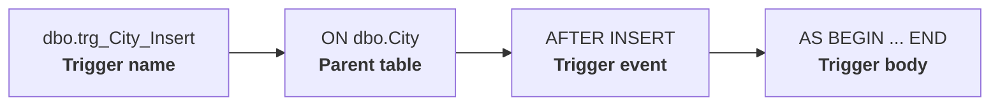

The trigger now exists in the database.

We do not call it.

We fire it by inserting into `City`:

```sql
INSERT INTO City (Name, StateID)
VALUES ('Zadar', 1);
```

Check the log:

```sql
SELECT *
FROM ActivityLog
ORDER BY LoggedAt DESC;
```

One statement was executed explicitly:

```sql
INSERT INTO City ...
```

But another action happened automatically:

```sql
INSERT INTO ActivityLog ...
```

That second action came from the trigger.

### Can we call the trigger directly?

Try:

```sql
EXEC dbo.trg_City_Insert;
```

SQL Server returns an error.

`EXEC` is used to run a stored procedure explicitly. Stored procedures are covered in Lab 4.

A trigger works differently:

- a stored procedure runs only when you call it;
- a trigger runs automatically when its event occurs;
- therefore, a trigger cannot be started with `EXEC`.

For `trg_City_Insert`, the event is an `INSERT` on `dbo.City`.

So the only way to make this trigger run is to perform an `INSERT` on that table.

---

## Check your understanding

1. Which table is `trg_City_Insert` attached to?
2. What event fires it?
3. What caused the row to appear in `ActivityLog`?
4. Why does `EXEC dbo.trg_City_Insert` fail?

<details>
<summary>Show answers</summary>

1. `dbo.City`.
2. `INSERT`.
3. The `INSERT` into `City` fired the trigger automatically.
4. Triggers are not invoked like stored procedures. They execute because their configured event occurred.

</details>

---

# Section 3 – The inserted and deleted tables

A useful trigger needs access to the rows affected by the DML statement.

SQL Server provides two special tables inside a DML trigger:

- `inserted`
- `deleted`

There is no `updated` table.

Their contents depend on the event:

| Event | `inserted` | `deleted` |
|---|---|---|
| `INSERT` | new rows | empty |
| `DELETE` | empty | old rows |
| `UPDATE` | new versions | old versions |

For an `UPDATE`, both versions are available:

```text
deleted  -> value before UPDATE
inserted -> value after UPDATE
```

These tables exist only while the trigger is running.

You can read from them inside the trigger:

```sql
SELECT *
FROM inserted;
```

but you cannot query them as normal tables outside a trigger.

---

## Improving the INSERT trigger

The first trigger only recorded that *something* was inserted.

We can now log the actual inserted data:

```sql
CREATE OR ALTER TRIGGER dbo.trg_City_Insert
ON dbo.City
AFTER INSERT
AS
BEGIN
    INSERT INTO ActivityLog (Message)
    SELECT
        'City inserted: ID='
        + CAST(IDCity AS nvarchar(10))
        + ', Name='
        + Name
    FROM inserted;
END
GO
```

Test it:

```sql
INSERT INTO City (Name, StateID)
VALUES ('Karlovac', 1);

SELECT *
FROM ActivityLog
ORDER BY LoggedAt DESC;
```

The trigger reads the inserted row from `inserted`.

---

# Section 4 – Triggers fire once per statement

This is one of the most important trigger rules.

> **A trigger fires once per statement, not once per row.**

Consider:

```sql
INSERT INTO City (Name, StateID)
VALUES
    ('Pula',    1),
    ('Sisak',    1),
    ('Bjelovar', 1);
```

This is:

- one `INSERT` statement;
- three inserted rows;
- one trigger execution;
- three rows inside `inserted`.

Because our trigger uses:

```sql
INSERT INTO ActivityLog (Message)
SELECT ...
FROM inserted;
```

it correctly writes three log rows.

This is a **set-based trigger**.

### The dangerous pattern

Avoid trigger code that assumes `inserted` contains exactly one row.

For example:

```sql
DECLARE @CityID int;

SELECT @CityID = IDCity
FROM inserted;
```

If several rows are present, the variable is assigned multiple times and only one value remains.
Which row supplies the final value is not something the trigger should rely on.

Even worse:

```sql
SET @CityID = (
    SELECT IDCity
    FROM inserted
);
```

fails when `inserted` contains more than one row.

> **Rule:** Always design triggers as if `inserted` and `deleted` may contain many rows.

---

## Check your understanding

1. If one `INSERT` statement inserts 100 rows, how many times does the trigger fire?
2. How many rows can `inserted` contain?
3. Why is `INSERT INTO log SELECT ... FROM inserted` a good trigger pattern?
4. Why is loading one value from `inserted` into a scalar variable dangerous?

<details>
<summary>Show answers</summary>

1. Once.
2. 100 rows in this example.
3. It is set-based and naturally handles one row or many rows.
4. Because a trigger statement may affect multiple rows, so `inserted` is not guaranteed to contain only one row.

</details>

---

# Section 5 – UPDATE: old and new values

An `UPDATE` is the most interesting trigger event because SQL Server gives us access to **both versions of every affected row**.

For an `UPDATE`:

```text
deleted  = old values
inserted = new values
```

There is no `updated` table.

The old version of the row is available in `deleted`, and the new version is available in `inserted`.

---

## First demonstration – both tables contain rows

Create a temporary trigger that counts the rows in `inserted` and `deleted`:

```sql
CREATE OR ALTER TRIGGER dbo.trg_City_UpdateDemo
ON dbo.City
AFTER UPDATE
AS
BEGIN
    INSERT INTO ActivityLog (Message)
    VALUES (
        'inserted rows: '
        + CAST((SELECT COUNT(*) FROM inserted) AS nvarchar(10))
        + ' | deleted rows: '
        + CAST((SELECT COUNT(*) FROM deleted) AS nvarchar(10))
    );
END
GO
```

Now update one city:

```sql
UPDATE City
SET Name = 'Zagreb Updated'
WHERE Name = 'Zagreb';
```

Check the log:

```sql
SELECT *
FROM ActivityLog
ORDER BY LoggedAt DESC;
```

The log should contain:

```text
inserted rows: 1 | deleted rows: 1
```

Why are both tables populated?

Because SQL Server keeps both versions of the updated row:

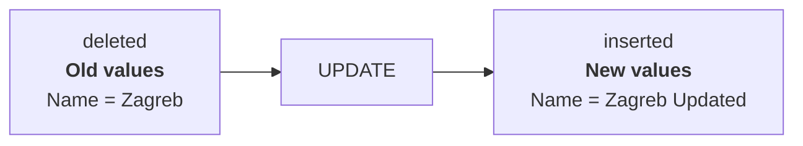

So for an `UPDATE`:

* `deleted` contains the row **before** the change;
* `inserted` contains the row **after** the change.

Now remove the temporary demonstration trigger:

```sql
DROP TRIGGER dbo.trg_City_UpdateDemo;
GO
```

---

## Comparing the old and new values

Knowing that both versions exist is useful because we can compare them.

To match the old version of a row with its new version, join `deleted` and `inserted` using the primary key:

```sql
FROM inserted AS i
JOIN deleted AS d
    ON d.IDCity = i.IDCity
```

Now we can create a trigger that records actual city name changes:

```sql
CREATE OR ALTER TRIGGER dbo.trg_City_LogRename
ON dbo.City
AFTER UPDATE
AS
BEGIN
    INSERT INTO ActivityLog (Message)
    SELECT
        'City renamed from "'
        + d.Name
        + '" to "'
        + i.Name
        + '"'
    FROM inserted AS i
    JOIN deleted AS d
        ON d.IDCity = i.IDCity
    WHERE d.Name <> i.Name;
END
GO
```

The important parts are:

```sql
d.Name
```

the old value from `deleted`, and:

```sql
i.Name
```

the new value from `inserted`.

The condition:

```sql
WHERE d.Name <> i.Name
```

ensures that we log only rows where the name actually changed.

---

## Test the trigger

Run an update:

```sql
UPDATE City
SET Name = 'Zagreb'
WHERE Name = 'Zagreb Updated';
```

Then check the log:

```sql
SELECT *
FROM ActivityLog
ORDER BY LoggedAt DESC;
```

You should see a message similar to:

```text
City renamed from "Zagreb Updated" to "Zagreb"
```

The trigger did not need the application to send the old value.

SQL Server already provided both versions through `deleted` and `inserted`.

---

## Multi-row UPDATE

The same trigger also works when one statement updates several rows.

For example:

```sql
INSERT INTO City (Name, StateID)
VALUES
    ('Update Test 1', 1),
    ('Update Test 2', 1);

UPDATE City
SET Name = Name + ' Updated'
WHERE Name IN ('Update Test 1', 'Update Test 2');
```

The trigger still fires only **once**, but:

* `deleted` contains all old versions of the affected rows;
* `inserted` contains all new versions;
* the join matches each old row with its corresponding new row.

This is why trigger logic should be written as a **set-based operation** rather than assuming that only one row was updated.

---

## NULL-safe comparison

A simple comparison such as:

```sql
WHERE d.Name <> i.Name
```

works when `Name` cannot contain `NULL`.

If a column allows `NULL`, remember that comparisons with `NULL` do not return `TRUE` in the usual way.

For a nullable column, a more complete comparison is:

```sql
WHERE
       d.Name <> i.Name
    OR (d.Name IS NULL AND i.Name IS NOT NULL)
    OR (d.Name IS NOT NULL AND i.Name IS NULL);
```

For the examples in this lab, the simpler form is enough when the column is known to be non-nullable.

---

## Check your understanding

1. What does `deleted` contain during an `UPDATE`?
2. What does `inserted` contain during an `UPDATE`?
3. Why do we join `inserted` and `deleted` using the primary key?
4. Why do we use `WHERE d.Name <> i.Name`?
5. If one `UPDATE` changes 20 rows, how many times does the trigger fire?

<details>
<summary>Show answers</summary>

1. The old versions of the affected rows.
2. The new versions of the affected rows.
3. To match each row before the update with the same row after the update.
4. To keep only rows where the value actually changed.
5. Once. `inserted` and `deleted` can each contain 20 rows.

</details>

---

# Section 6 – DELETE: old values only

For a `DELETE`, SQL Server gives us access to the rows that are being removed through the `deleted` special table.

For a `DELETE`:

```text
deleted  = deleted rows
inserted = empty
```

Conceptually:

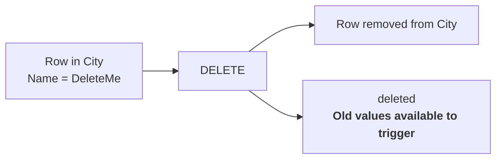

The important idea is that the row may be gone from the table, but its old values are still available inside the trigger through `deleted`.

---

## First DELETE trigger

Create a trigger that logs deleted cities:

```sql
CREATE OR ALTER TRIGGER dbo.trg_City_Delete
ON dbo.City
AFTER DELETE
AS
BEGIN
    INSERT INTO ActivityLog (Message)
    SELECT
        'City deleted: ID='
        + CAST(IDCity AS nvarchar(10))
        + ', Name='
        + Name
    FROM deleted;
END
GO
```

Now delete a city:

```sql
INSERT INTO City (Name, StateID)
VALUES ('DeleteMe', 1);

DELETE FROM City
WHERE Name = 'DeleteMe';
```

Check the log:

```sql
SELECT *
FROM ActivityLog
ORDER BY LoggedAt DESC;
```

The row no longer exists in `City`, but the trigger was still able to read its old values from `deleted`.

---

## Multi-row DELETE

The same trigger also works when one statement deletes several rows:

```sql
INSERT INTO City (Name, StateID)
VALUES
    ('Delete Test 1', 1),
    ('Delete Test 2', 1),
    ('Delete Test 3', 1);

DELETE FROM City
WHERE Name IN ('Delete Test 1', 'Delete Test 2', 'Delete Test 3');
```

The trigger fires only **once**, but `deleted` contains every row removed by that statement.

Because the trigger uses:

```sql
INSERT INTO ActivityLog (Message)
SELECT ...
FROM deleted;
```

it correctly handles one row or many rows.

---

## INSERT, UPDATE, DELETE compared

| Event    | `inserted`   | `deleted`    |
| -------- | ------------ | ------------ |
| `INSERT` | new rows     | empty        |
| `UPDATE` | new versions | old versions |
| `DELETE` | empty        | deleted rows |

This table is one of the most important things to remember when working with DML triggers.

---

## Check your understanding

1. Which special table contains rows during a `DELETE`?
2. What does `inserted` contain during a `DELETE`?
3. Can a DELETE trigger still read the values of a row after it has been deleted?
4. If one `DELETE` statement removes 20 rows, how many times does the trigger fire?

<details>
<summary>Show answers</summary>

1. `deleted`.
2. It is empty.
3. Yes. The old values are available through `deleted` while the trigger is executing.
4. Once. `deleted` can contain all 20 rows.

</details>

---

# Section 7 – The UPDATE() function

Inside an `INSERT` or `UPDATE` trigger, SQL Server provides:

```sql
UPDATE(ColumnName)
```

It returns true when the column was part of the triggering statement.

Example:

```sql
CREATE OR ALTER TRIGGER dbo.trg_City_StateChange
ON dbo.City
AFTER UPDATE
AS
BEGIN
    IF UPDATE(StateID)
    BEGIN
        INSERT INTO ActivityLog (Message)
        VALUES ('StateID was included in the UPDATE statement.');
    END
END
GO
```

Test it:

```sql
UPDATE City
SET Name = 'Test'
WHERE IDCity = 1;
```

No `StateID` was mentioned.

Now:

```sql
UPDATE City
SET StateID = 1
WHERE IDCity = 1;
```

`UPDATE(StateID)` returns true.

### Important distinction

`UPDATE(StateID)` answers:

> Was `StateID` included in the `SET` clause?

It does **not** answer:

> Did the value actually change?

For example:

```sql
UPDATE City
SET StateID = StateID
WHERE IDCity = 1;
```

still makes:

```sql
UPDATE(StateID)
```

return true.

To detect a real value change, compare `inserted` and `deleted`.

> **Note:** SQL Server does not provide matching `INSERT()` or `DELETE()` functions.
>
> `UPDATE(column)` is a special trigger function used to check whether a column was targeted by an `INSERT` or `UPDATE` statement.


---

## Check your understanding

1. What does `inserted` contain after an `UPDATE`?
2. What does `deleted` contain after an `UPDATE`?
3. What does `UPDATE(StateID)` tell us?
4. Does `UPDATE(StateID)` prove that the value changed?

<details>
<summary>Show answers</summary>

1. The new versions of the affected rows.
2. The old versions of the affected rows.
3. That `StateID` was included in the triggering `INSERT` or `UPDATE` statement.
4. No. The column may have been assigned the same value it already had.

</details>

---

# Section 8 – One trigger for multiple events

A single trigger can react to more than one DML event.

For example:

```sql
CREATE OR ALTER TRIGGER dbo.trg_City_All
ON dbo.City
AFTER INSERT, UPDATE, DELETE
AS
BEGIN
    -- trigger body
END
GO
```

This trigger fires when an `INSERT`, `UPDATE`, or `DELETE` occurs on `dbo.City`.

---

## How do we know which event occurred?

We can use the contents of `inserted` and `deleted`.

| Event | `inserted` | `deleted` |
|---|---|---|
| `INSERT` | contains rows | empty |
| `UPDATE` | contains rows | contains rows |
| `DELETE` | empty | contains rows |

This gives us a simple pattern for detecting the event.

---

## Example

```sql
CREATE OR ALTER TRIGGER dbo.trg_City_All
ON dbo.City
AFTER INSERT, UPDATE, DELETE
AS
BEGIN
    IF EXISTS (SELECT 1 FROM inserted)
       AND NOT EXISTS (SELECT 1 FROM deleted)
    BEGIN
        PRINT 'INSERT';
    END
    ELSE IF EXISTS (SELECT 1 FROM inserted)
        AND EXISTS (SELECT 1 FROM deleted)
    BEGIN
        PRINT 'UPDATE';
    END
    ELSE IF NOT EXISTS (SELECT 1 FROM inserted)
        AND EXISTS (SELECT 1 FROM deleted)
    BEGIN
        PRINT 'DELETE';
    END
END
GO
```

Now test all three events:

```sql
-- INSERT
INSERT INTO City (Name, StateID)
VALUES ('Test City', 1);

-- UPDATE
UPDATE City
SET Name = 'Updated Test City'
WHERE Name = 'Test City';

-- DELETE
DELETE FROM City
WHERE Name = 'Updated Test City';
```

The same trigger fires for all three statements.

The trigger determines which event occurred by checking whether `inserted` and `deleted` contain rows.

---

## How the detection works

```text
INSERT
inserted = rows
deleted  = empty

UPDATE
inserted = rows
deleted  = rows

DELETE
inserted = empty
deleted  = rows
```

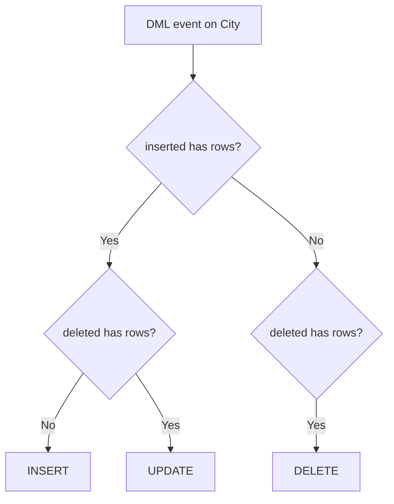

---

## Important note

This technique works when the DML statement actually affects rows.

For example:

```sql
UPDATE City
SET Name = 'Something'
WHERE IDCity = -1;
```

If no row matches the `WHERE` condition, both `inserted` and `deleted` are empty.

Therefore, the special tables alone do not always tell us which statement was attempted when zero rows were affected.

For the examples in this lab, we will use statements that actually affect rows.

---

## Should one trigger always handle all events?

Not necessarily.

A multi-event trigger can be useful when several events share similar logic.

However, separate triggers can sometimes be easier to read and maintain.

For example:

```text
trg_City_Insert
trg_City_Update
trg_City_Delete
```

may be clearer than putting three unrelated responsibilities into one large trigger.

> Use a multi-event trigger when the logic belongs together.  
> Do not combine events only because SQL Server allows it.

---

## Check your understanding

1. Can one trigger react to `INSERT`, `UPDATE`, and `DELETE`?
2. Which special tables contain rows during an `UPDATE`?
3. How can we detect an `INSERT` using `inserted` and `deleted`?
4. What happens if the DML statement affects zero rows?
5. Is one multi-event trigger always better than separate triggers?

<details>
<summary>Show answers</summary>

1. Yes. A trigger can list multiple events, for example `AFTER INSERT, UPDATE, DELETE`.
2. Both `inserted` and `deleted`.
3. `inserted` contains rows and `deleted` is empty.
4. Both special tables can be empty, so their contents alone may not identify which statement was attempted.
5. No. A multi-event trigger is useful when the logic is related. Separate triggers can be clearer when each event has a different responsibility.

</details>

---

# Section 9 – Managing triggers

## Disable a trigger

```sql
DISABLE TRIGGER dbo.trg_City_Insert
ON dbo.City;
```

Re-enable it with:

```sql
ENABLE TRIGGER dbo.trg_City_Insert
ON dbo.City;
```

This can be useful during carefully controlled maintenance or bulk loading.

However:

> Anything the trigger normally enforces or records is also disabled.

Never disable a trigger casually, and do not forget to re-enable it.

### Multiple triggers on the same event

SQL Server allows multiple triggers for the same event on the same table.

Do **not** assume that they will run in creation order.

SQL Server allows one trigger to be marked `FIRST` and one `LAST` for an event using `sp_settriggerorder`, but the order of the remaining triggers is not guaranteed.

If your design depends heavily on trigger order, reconsider the design.

### Nested triggers

A trigger can execute a statement that fires another trigger.

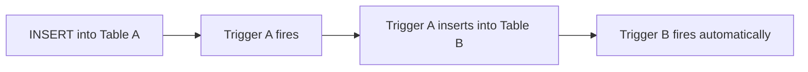

This is called **trigger nesting**.

SQL Server supports up to 32 levels of nesting.

Deep trigger chains are difficult to reason about and are usually a sign that the design should be simplified.

---

# Section 10 – Real-world example: checking a business rule

## Example – Checking a business rule with a trigger

Suppose each employee belongs to an area, and each area has an allowed salary range.

First, create a table with the allowed ranges:

```sql
CREATE TABLE SalaryRange
(
    Area      nvarchar(50) PRIMARY KEY,
    MinSalary decimal(10,2) NOT NULL,
    MaxSalary decimal(10,2) NOT NULL
);
GO

INSERT INTO SalaryRange (Area, MinSalary, MaxSalary)
VALUES
    ('Electronics', 2000.00, 3000.00),
    ('Physics',     1200.00, 8500.00),
    ('Acting',      2000.00, 3000.00),
    ('IT',           500.00, 6000.00),
    ('Chemistry',   3500.00, 5000.00),
    ('Mathematics', 1000.00, 10000.00);
GO
```

Now create a simple employee table:

```sql
CREATE TABLE Employee
(
    IDEmployee int IDENTITY(1,1) PRIMARY KEY,
    Name       nvarchar(100) NOT NULL,
    Area       nvarchar(50) NOT NULL,
    Salary     decimal(10,2) NOT NULL
);
GO
```

The trigger checks every inserted or updated row against `SalaryRange`.

```sql
CREATE OR ALTER TRIGGER dbo.trg_Employee_CheckSalary
ON dbo.Employee
AFTER INSERT, UPDATE
AS
BEGIN
    IF EXISTS
    (
        SELECT 1
        FROM inserted AS i
        JOIN SalaryRange AS sr
            ON sr.Area = i.Area
        WHERE i.Salary < sr.MinSalary
           OR i.Salary > sr.MaxSalary
    )
    BEGIN
        PRINT 'Warning: salary is outside the allowed range.';
    END
END
GO
```

The important part is that the trigger checks the rows from `inserted` against another table:

```sql
FROM inserted AS i
JOIN SalaryRange AS sr
    ON sr.Area = i.Area
```

This allows the database to check a business rule that depends on data stored in another table.

### Test with a valid salary

```sql
INSERT INTO Employee (Name, Area, Salary)
VALUES ('Anna', 'IT', 2500.00);
```

For `IT`, the allowed range is:

```text
500.00 – 6000.00
```

so no warning is printed.

### Test with an invalid salary

```sql
INSERT INTO Employee (Name, Area, Salary)
VALUES ('John', 'IT', 9000.00);
```

The salary is above the allowed maximum, so the trigger prints:

```text
Warning: salary is outside the allowed range.
```
>In a real system, we would usually reject the invalid change or record it properly. Here we only print a warning because the goal is to understand the trigger logic

### The same trigger also works for UPDATE

```sql
UPDATE Employee
SET Salary = 7000.00
WHERE Name = 'Anna';
```

The trigger fires again because it is defined for both:

```sql
AFTER INSERT, UPDATE
```

### It also works with multiple rows

```sql
INSERT INTO Employee (Name, Area, Salary)
VALUES
    ('Alice', 'IT',          3000.00),
    ('Bob',   'Chemistry',   9000.00),
    ('Carol', 'Mathematics', 2500.00);
```

The trigger still fires only **once**, but `inserted` contains all three rows.

The `EXISTS` condition finds that at least one row has a salary outside the allowed range.

> This is another example of why trigger logic should be written to work with **sets of rows**, not with a single row.

# Section 11 - Real-world example: Maintaining inventory

Triggers are often useful when a change in one table must automatically cause a related change in another table.

A common real-world example is **inventory management**.

Suppose we have products in stock and we create invoices when those products are sold.

We will use two simple tables:

- `Product` — stores products and the quantity currently available
- `InvoiceItem` — stores products sold on invoices

But maintaining inventory involves more than just selling a product.

Think about the following questions:

- What should happen to the stock when a new `InvoiceItem` is **inserted**?
- What should happen if an `InvoiceItem` is **deleted**?
- What should happen if the quantity of an existing `InvoiceItem` is **updated**?

The expected behavior is:

| Operation | Example | Inventory change |
|---|---|---|
| `INSERT` | Sell 3 keyboards | Stock decreases by 3 |
| `DELETE` | Remove a sale of 3 keyboards | Stock increases by 3 |
| `UPDATE` | Change quantity from 3 to 5 | Stock decreases by another 2 |

This is a good scenario for triggers because every change to `InvoiceItem` should automatically produce the corresponding change in inventory.

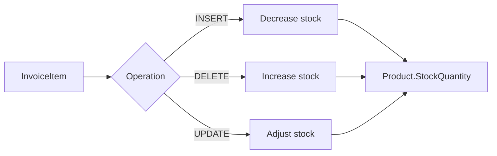

We can now create the tables needed for our inventory example.

---

## 11.1. Creating the tables

For this example, we will create a separate test database. The AdventureWorks database already contains a `Product` table, so using a separate database allows us to keep this example simple and independent from the existing database structure.

```sql
CREATE DATABASE InventoryDemo;
GO

USE InventoryDemo;
GO
```

First, create the `Product` table:

```sql
CREATE TABLE Product
(
    IDProduct int PRIMARY KEY,
    Name varchar(100) NOT NULL,
    StockQuantity int NOT NULL
);
GO
```

Now create the `InvoiceItem` table:

```sql
CREATE TABLE InvoiceItem
(
    IDInvoiceItem int IDENTITY(1,1) PRIMARY KEY,
    IDInvoice int NOT NULL,
    IDProduct int NOT NULL,
    Quantity int NOT NULL,
    UnitPrice decimal(10,2) NOT NULL,

    CONSTRAINT FK_InvoiceItem_Product
        FOREIGN KEY (IDProduct)
        REFERENCES Product(IDProduct)
);
GO
```

For this example, we do not need a complete `Invoice` table. `IDInvoice` is simply used to identify which invoice an item belongs to.

Insert several products:

```sql
INSERT INTO Product
    (IDProduct, Name, StockQuantity)
VALUES
    (10, 'Keyboard', 20),
    (20, 'Mouse', 35),
    (30, 'Monitor', 12),
    (40, 'USB-C Cable', 50);
GO
```

Check the initial inventory:

```sql
SELECT *
FROM Product
ORDER BY IDProduct;
```

The result should be:

| IDProduct | Name | StockQuantity |
|---:|---|---:|
| 10 | Keyboard | 20 |
| 20 | Mouse | 35 |
| 30 | Monitor | 12 |
| 40 | USB-C Cable | 50 |

We are now ready to implement the inventory rules.

---

## 11.2. INSERT — selling a product

Suppose a customer buys **3 keyboards**.

The application creates an invoice item:

```sql
INSERT INTO InvoiceItem
    (IDInvoice, IDProduct, Quantity, UnitPrice)
VALUES
    (1001, 10, 3, 25.00);
```

The inventory should automatically change from:

```text
20 keyboards
```

to:

```text
20 - 3 = 17 keyboards
```

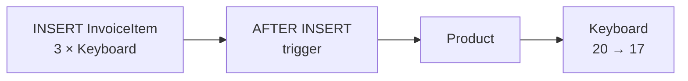

However, we have not created the trigger yet.

Remove the test row before continuing:

```sql
DELETE FROM InvoiceItem
WHERE IDInvoice = 1001;
```

---

## 11.3. Creating the INSERT trigger

We can use an `AFTER INSERT` trigger to automatically decrease the inventory:

```sql
CREATE OR ALTER TRIGGER trg_InvoiceItem_Insert
ON InvoiceItem
AFTER INSERT
AS
BEGIN
    SET NOCOUNT ON;

    UPDATE Product
    SET StockQuantity = StockQuantity - (
        SELECT SUM(Quantity)
        FROM inserted
        WHERE inserted.IDProduct = Product.IDProduct
    )
    WHERE IDProduct IN (
        SELECT IDProduct
        FROM inserted
    );
END;
GO
```

Let's examine the important part:

```sql
SELECT SUM(Quantity)
FROM inserted
WHERE inserted.IDProduct = Product.IDProduct
```

For each affected product, the subquery calculates the total quantity sold.

The `WHERE` condition limits the update to products that appear in `inserted`:

```sql
WHERE IDProduct IN (
    SELECT IDProduct
    FROM inserted
);
```

The process is:

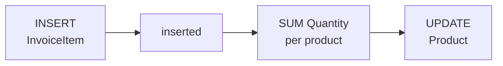

---

## 11.4. Testing the INSERT trigger

Check the inventory before the sale:

```sql
SELECT *
FROM Product
ORDER BY IDProduct;
```

Now sell 3 keyboards:

```sql
INSERT INTO InvoiceItem
    (IDInvoice, IDProduct, Quantity, UnitPrice)
VALUES
    (1001, 10, 3, 25.00);
```

Check the inventory again:

```sql
SELECT *
FROM Product
ORDER BY IDProduct;
```

The result should now be:

| IDProduct | Name | StockQuantity |
|---:|---|---:|
| 10 | Keyboard | **17** |
| 20 | Mouse | 35 |
| 30 | Monitor | 12 |
| 40 | USB-C Cable | 50 |

The application did not explicitly update `Product`.

It only inserted an `InvoiceItem`.

The trigger automatically updated the inventory.

---

## 11.5. Remember: `inserted` is a table

Our trigger must also work when one SQL statement inserts multiple invoice items.

For example:

```sql
INSERT INTO InvoiceItem
    (IDInvoice, IDProduct, Quantity, UnitPrice)
VALUES
    (1002, 10, 2, 25.00),
    (1002, 10, 4, 25.00),
    (1002, 20, 1, 15.00),
    (1002, 40, 5, 8.00);
```

The `inserted` table conceptually contains:

| IDProduct | Quantity |
|---:|---:|
| 10 | 2 |
| 10 | 4 |
| 20 | 1 |
| 40 | 5 |

Remember:

> **A trigger executes once per statement, not once per row.**

Therefore, the trigger executes **once**, and `inserted` contains all four rows.

For product `10`, there are even two rows:

```text
Keyboard: 2 + 4 = 6
```

This is why the trigger uses:

```sql
SUM(Quantity)
```

The inventory changes are:

| Product | Quantity sold | Inventory change |
|---|---:|---:|
| Keyboard | 2 + 4 = 6 | -6 |
| Mouse | 1 | -1 |
| USB-C Cable | 5 | -5 |

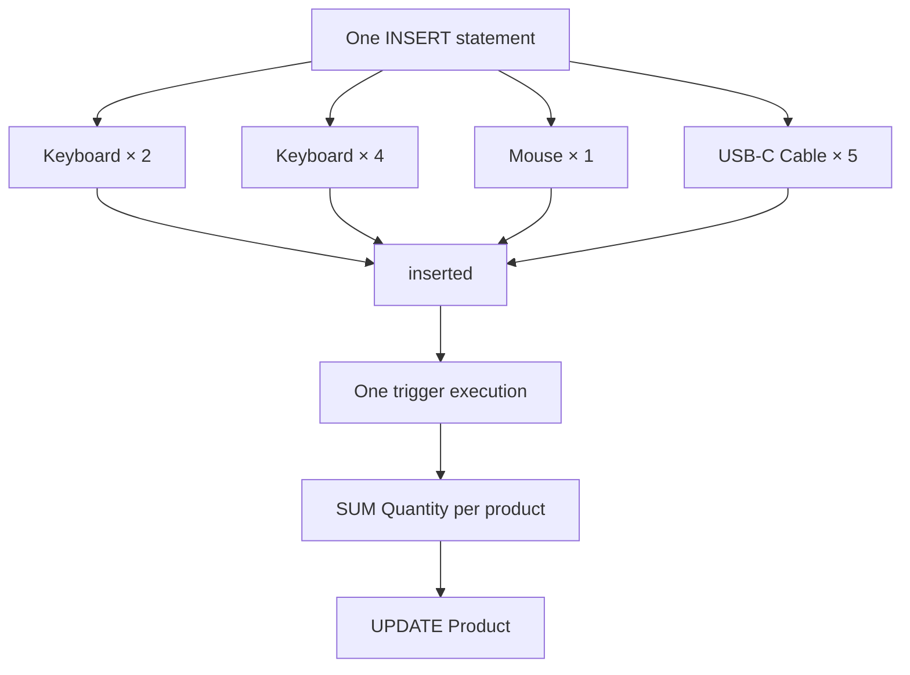

Check the inventory:

```sql
SELECT *
FROM Product
ORDER BY IDProduct;
```

The trigger correctly handles both single-row and multi-row inserts.

---

## 11.6. DELETE — returning products to stock

Now consider what happens when an invoice item is deleted.

When an `InvoiceItem` is inserted, its quantity is removed from stock.

Therefore, if the invoice item is deleted, that quantity should be **returned to stock**.

For a `DELETE` operation, SQL Server provides the deleted rows through the `deleted` table.

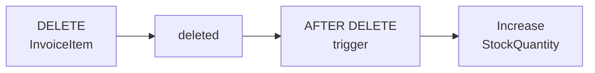

The rule is the opposite of `INSERT`:

| Operation | Inventory calculation |
|---|---|
| `INSERT` | `StockQuantity - Quantity` |
| `DELETE` | `StockQuantity + Quantity` |

Create the trigger:

```sql
CREATE OR ALTER TRIGGER trg_InvoiceItem_Delete
ON InvoiceItem
AFTER DELETE
AS
BEGIN
    SET NOCOUNT ON;

    UPDATE Product
    SET StockQuantity = StockQuantity + (
        SELECT SUM(Quantity)
        FROM deleted
        WHERE deleted.IDProduct = Product.IDProduct
    )
    WHERE IDProduct IN (
        SELECT IDProduct
        FROM deleted
    );
END;
GO
```

Notice how similar this trigger is to the `INSERT` trigger.

The main differences are:

```text
inserted  → deleted
-         → +
```

### Testing the DELETE trigger

Check the invoice items:

```sql
SELECT *
FROM InvoiceItem
ORDER BY IDInvoiceItem;
```

Now delete all items belonging to invoice `1002`:

```sql
DELETE FROM InvoiceItem
WHERE IDInvoice = 1002;
```

This may delete several rows with a single statement.

The trigger executes once, `deleted` contains all deleted rows, and the corresponding quantities are returned to stock.

Check the inventory:

```sql
SELECT *
FROM Product
ORDER BY IDProduct;
```

---

## 11.7. UPDATE — changing the sold quantity

An `UPDATE` is particularly interesting because SQL Server provides **both versions** of each affected row:

- `deleted` contains the **old values**
- `inserted` contains the **new values**

Suppose our invoice contains:

| IDInvoice | Product | Quantity |
|---:|---|---:|
| 1001 | Keyboard | 3 |

The customer actually bought 5 keyboards, so we correct the quantity:

```sql
UPDATE InvoiceItem
SET Quantity = 5
WHERE IDInvoice = 1001
  AND IDProduct = 10;
```

During the trigger execution:

| Table | Product | Quantity |
|---|---|---:|
| `deleted` | Keyboard | **3** |
| `inserted` | Keyboard | **5** |

The stock should **not** be reduced by another 5.

The original 3 keyboards were already removed from stock.

We need to account only for the difference:

```text
5 - 3 = 2
```

Another simple way to think about it is:

```text
current stock
+ old quantity
- new quantity
= new stock
```

If the current stock is 17:

```text
17 + 3 - 5 = 15
```

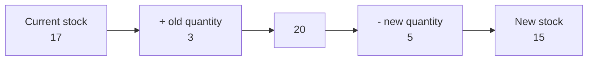

For simplicity, we assume that an update can change the **quantity**, but not the product itself.

---

## 11.8. Creating the UPDATE trigger

We can apply the same approach that we used for `INSERT` and `DELETE`.

First, return the old quantity from `deleted`, and then subtract the new quantity from `inserted`:

```sql
CREATE OR ALTER TRIGGER trg_InvoiceItem_Update
ON InvoiceItem
AFTER UPDATE
AS
BEGIN
    SET NOCOUNT ON;

    UPDATE Product
    SET StockQuantity =
        StockQuantity
        + (
            SELECT SUM(Quantity)
            FROM deleted
            WHERE deleted.IDProduct = Product.IDProduct
        )
        - (
            SELECT SUM(Quantity)
            FROM inserted
            WHERE inserted.IDProduct = Product.IDProduct
        )
    WHERE IDProduct IN (
        SELECT IDProduct
        FROM inserted
    );
END;
GO
```

The calculation is:

```text
StockQuantity + old quantity - new quantity
```

For our example:

```text
17 + 3 - 5 = 15
```

The relationship between `deleted` and `inserted` is:

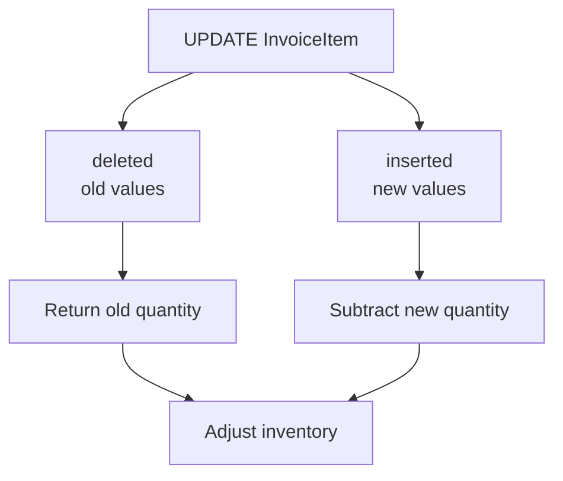

### Testing the UPDATE trigger

Check the current invoice item:

```sql
SELECT *
FROM InvoiceItem
WHERE IDInvoice = 1001;
```

Change the quantity:

```sql
UPDATE InvoiceItem
SET Quantity = 5
WHERE IDInvoice = 1001
  AND IDProduct = 10;
```

Now check both the invoice item and the product:

```sql
SELECT *
FROM InvoiceItem
WHERE IDInvoice = 1001;

SELECT *
FROM Product
WHERE IDProduct = 10;
```

The invoice quantity should now be `5`, and the inventory should have been reduced by only the additional `2` keyboards.

---

## 11.9. Putting it all together

We now have three triggers maintaining the inventory:

| Operation on `InvoiceItem` | Data available | Inventory action |
|---|---|---|
| `INSERT` | `inserted` | Subtract new quantity |
| `DELETE` | `deleted` | Add old quantity |
| `UPDATE` | `deleted` + `inserted` | Add old quantity, subtract new quantity |

The complete process is:

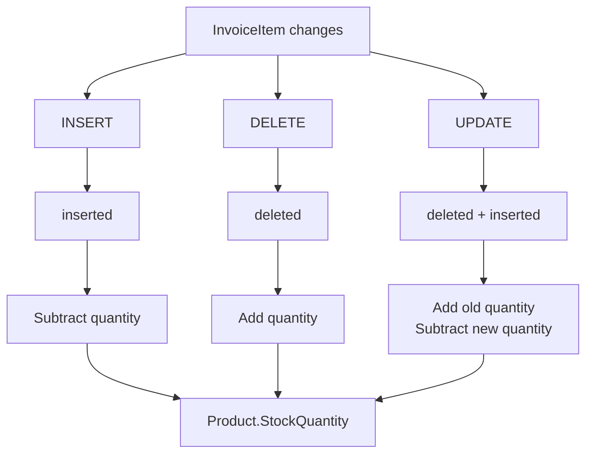

The application modifies `InvoiceItem`.

The database automatically keeps `Product.StockQuantity` synchronized.

---

## 11.10. Why use a trigger here?

Without triggers, every application that sells a product would have to remember to perform two operations:

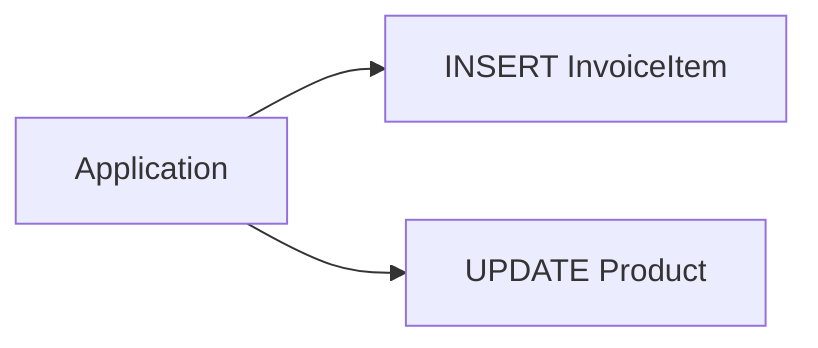

If another application, script, import process, or developer inserts an invoice item but forgets to update the inventory, the data becomes inconsistent.

With a trigger:

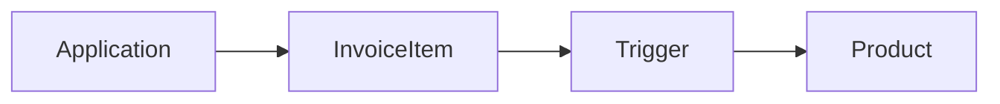

The inventory rule is implemented inside the database.

The same rule is applied regardless of whether the change comes from:

- an application,
- a stored procedure,
- an import process,
- or a manually executed SQL statement.

> **Key idea:** A trigger can be useful when a data change must always cause another related data change.

---

## 11.11. A note about real inventory systems

This example is intentionally simplified.

A real inventory system would usually require additional rules and mechanisms, such as:

- preventing stock from becoming negative,
- handling cancelled invoices,
- handling product returns,
- supporting multiple warehouses,
- keeping a history of inventory movements,
- handling concurrent transactions.

For this lab, the important concept is simpler:

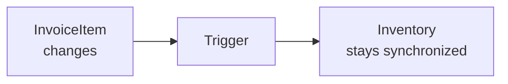

This example also demonstrates why `inserted` and `deleted` must always be treated as **tables**, not as individual rows.

### Key takeaways

- Triggers can automatically maintain related data.
- `AFTER INSERT` can reduce inventory when products are sold.
- `AFTER DELETE` can restore inventory when an invoice item is removed.
- `AFTER UPDATE` can use both `deleted` and `inserted` to adjust inventory.
- `inserted` and `deleted` may contain multiple rows.
- Aggregate functions such as `SUM()` can be used when several affected rows belong to the same product.
- Triggers should be written to handle the complete set of affected rows.
- A trigger can enforce the same rule regardless of which application or SQL statement changes the data.
```

## Preparation

Remove the demonstration triggers before starting the exercises:

```sql
DROP TRIGGER IF EXISTS dbo.trg_City_Insert;
DROP TRIGGER IF EXISTS dbo.trg_City_LogRename;
DROP TRIGGER IF EXISTS dbo.trg_City_Delete;
DROP TRIGGER IF EXISTS dbo.trg_City_StateChange;
DROP TRIGGER IF EXISTS dbo.trg_City_All;
DROP TRIGGER IF EXISTS dbo.trg_Employee_CheckSalary;
GO
```

---

# Exercises

Try each exercise before opening the solution.

## Exercise 1 – First logging trigger

Create an `AFTER INSERT` trigger named `dbo.trg_City_LogInsert` on `dbo.City`.

Whenever a row is inserted into `City`, write:

```text
A city was inserted.
```

to `ActivityLog`.

Then insert one test city and check the log.

<details>
<summary>Show solution</summary>

```sql
CREATE OR ALTER TRIGGER dbo.trg_City_LogInsert
ON dbo.City
AFTER INSERT
AS
BEGIN
    INSERT INTO ActivityLog (Message)
    VALUES ('A city was inserted.');
END
GO

INSERT INTO City (Name, StateID)
VALUES ('Pula', 1);

SELECT *
FROM ActivityLog
ORDER BY LoggedAt DESC;
```

</details>

---

## Exercise 2 – Log inserted rows

Modify `trg_City_LogInsert`.

Instead of a fixed message, write one log entry for every inserted city containing:

- `IDCity`;
- `Name`.

Then test it with a two-row `INSERT`.

<details>
<summary>Show solution</summary>

```sql
CREATE OR ALTER TRIGGER dbo.trg_City_LogInsert
ON dbo.City
AFTER INSERT
AS
BEGIN
    INSERT INTO ActivityLog (Message)
    SELECT
        'City inserted: ID='
        + CAST(IDCity AS nvarchar(10))
        + ', Name='
        + Name
    FROM inserted;
END
GO

INSERT INTO City (Name, StateID)
VALUES
    ('Sisak',    1),
    ('Knin', 1);

SELECT *
FROM ActivityLog
ORDER BY LoggedAt DESC;
```

</details>

---

## Exercise 3 – Log renamed cities

Create an `AFTER UPDATE` trigger that logs every actual change to `City.Name`.

The message should contain the old and new names.

<details>
<summary>Show solution</summary>

```sql
CREATE OR ALTER TRIGGER dbo.trg_City_LogRename
ON dbo.City
AFTER UPDATE
AS
BEGIN
    INSERT INTO ActivityLog (Message)
    SELECT
        'City renamed from "'
        + d.Name
        + '" to "'
        + i.Name
        + '"'
    FROM inserted AS i
    JOIN deleted AS d
        ON d.IDCity = i.IDCity
    WHERE d.Name <> i.Name;
END
GO
```

</details>

---

## Exercise 4 – Multi-row safety

Look at this trigger:

```sql
CREATE OR ALTER TRIGGER dbo.trg_BadExample
ON dbo.City
AFTER INSERT
AS
BEGIN
    DECLARE @CityID int;

    SELECT @CityID = IDCity
    FROM inserted;

    INSERT INTO ActivityLog (Message)
    VALUES (
        'Inserted city ID='
        + CAST(@CityID AS nvarchar(10))
    );
END
GO
```

Now imagine:

```sql
INSERT INTO City (Name, StateID)
VALUES
    ('City A', 1),
    ('City B', 1),
    ('City C', 1);
```

Questions:

1. How many times does the trigger fire?
2. How many rows are in `inserted`?
3. How many log rows does the trigger create?
4. What is wrong with this design?
5. Rewrite it correctly.

<details>
<summary>Show solution</summary>

The trigger fires **once**.

`inserted` contains **three rows**.

The trigger creates only **one** log row because the scalar variable can hold only one `IDCity`.

A correct set-based version is:

```sql
CREATE OR ALTER TRIGGER dbo.trg_BadExample
ON dbo.City
AFTER INSERT
AS
BEGIN
    INSERT INTO ActivityLog (Message)
    SELECT
        'Inserted city ID='
        + CAST(IDCity AS nvarchar(10))
    FROM inserted;
END
GO
```

</details>

---

# Cleanup

```sql
DROP TRIGGER IF EXISTS dbo.trg_City_Insert;
DROP TRIGGER IF EXISTS dbo.trg_City_LogInsert;
DROP TRIGGER IF EXISTS dbo.trg_City_LogRename;
DROP TRIGGER IF EXISTS dbo.trg_City_StateChange;
DROP TRIGGER IF EXISTS dbo.trg_BadExample;
DROP TRIGGER IF EXISTS dbo.trg_City_Delete;
DROP TRIGGER IF EXISTS dbo.trg_City_All;
GO
```

If `ActivityLog` was created only for this lab:

```sql
DROP TABLE IF EXISTS ActivityLog;
DROP TABLE IF EXISTS SalaryRange;
DROP TABLE IF EXISTS Employee;

GO
```

---

# What you should know after this lab

The most important patterns are:

```sql
CREATE OR ALTER TRIGGER dbo.trg_Name
ON dbo.TableName
AFTER INSERT
AS
BEGIN
    ...
END
GO
```

```sql
SELECT *
FROM inserted;
```

```sql
SELECT *
FROM deleted;
```

```sql
SELECT ...
FROM inserted AS i
JOIN deleted AS d
    ON d.PrimaryKey = i.PrimaryKey;
```

And the most important rule:

> **A trigger fires once per statement, not once per row.**

Therefore:

> **Always write trigger logic to handle sets of rows.**

---

# Where to go next

Triggers execute automatically.

In the next lab, **Stored Procedures**, the model changes:

- a stored procedure is called explicitly;
- it can accept parameters;
- it can contain procedural logic;
- it can return data to the caller.

Triggers react to events.

Stored procedures are invoked on demand.
