# Lab 04 – Stored Procedures

**Database:** `AdventureWorksENG`

A stored procedure is a named program stored in the database. Unlike a view, which represents a query, a stored procedure can accept parameters, execute multiple SQL statements, modify data, and return information to the caller.

Stored procedures are especially useful when several SQL statements together represent a single database operation.

> **Core idea:** A stored procedure packages a database operation behind a name and parameters.

---

## Learning objectives

After completing this lab, you should be able to:

- explain when stored procedures are useful;
- create, execute, modify, and remove stored procedures;
- define and use input parameters;
- return values using result sets, output parameters, and `RETURN`;
- use several SQL statements to implement one logical database operation.

Start by selecting the training database:

```sql
USE AdventureWorksENG;
GO
```

> **Prerequisites:** This lab assumes that you are already familiar with batches and `GO`, variables, `IF / ELSE`, `SCOPE_IDENTITY()`, and basic `CAST` expressions from Lab 00.

---

# Section 1 – What is a Stored Procedure?

A **stored procedure** is a named block of T-SQL code stored inside the database and executed explicitly by a user or an application.

A useful way to compare the database objects introduced so far is:

| Object | Main idea | How it is used |
|---|---|---|
| View | reusable query | queried with `SELECT` |
| Trigger | automatic reaction | executed automatically after an event |
| Stored procedure | callable database operation | executed with `EXEC` |

A procedure can contain multiple statements and can use variables, conditions, `SELECT`, `INSERT`, `UPDATE`, `DELETE`, and other T-SQL constructs.

```text
Views answer.
Triggers react.
Procedures do.
```

## Why use stored procedures?

Imagine that an application needs to transfer money from one account to another.

The operation may require several steps:

```text
Transfer money
    |
    +-- check the source account
    +-- check the destination account
    +-- validate the amount
    +-- subtract money from the source account
    +-- add money to the destination account
```

Without a stored procedure, some or all of these SQL statements may be issued separately by the application.

With a stored procedure, the application can request the complete operation with one call:

```sql
EXEC dbo.usp_TransferMoney
    @FromAccount = 100,
    @ToAccount   = 101,
    @Amount      = 3000;
```

The implementation remains inside the database.

This gives us several practical benefits.

### Encapsulation

The caller asks the database to perform an operation without having to know every SQL statement used to implement it.

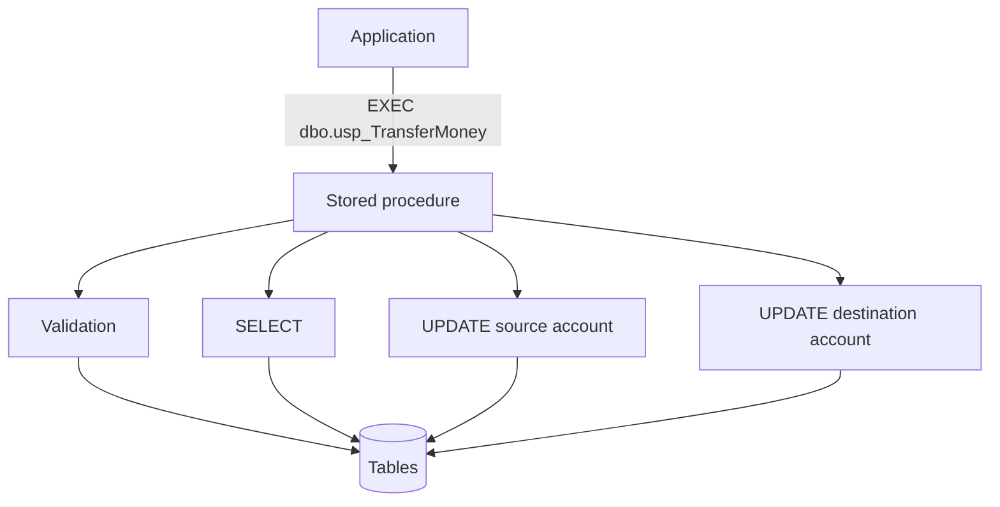

### Reusability

The same operation can be called repeatedly with different parameter values and from different applications.

### Fewer network round-trips

If an application sends several SQL statements one after another, each request and response may require communication between the application and SQL Server.

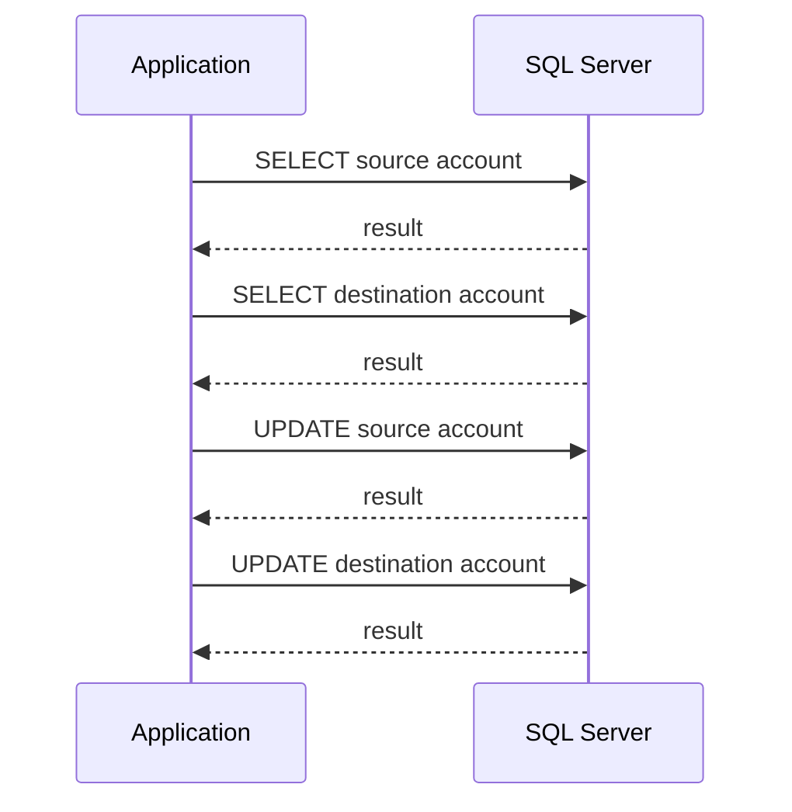

A procedure can execute those statements on the database server after a single call:

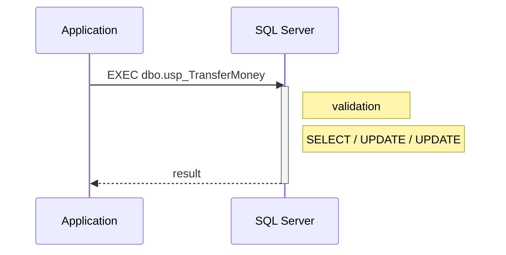

This can reduce network round-trips.

> **Important:** A stored procedure is not automatically faster than equivalent SQL. The performance benefit here comes from reducing communication between the application and the database when one operation requires several statements.

### A database interface

Applications can call a well-defined database operation instead of directly implementing all of its SQL logic.

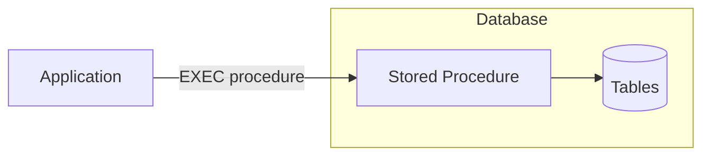

This can also be useful for controlling how applications interact with data.

> **Key idea:** Think of a stored procedure as a **callable database operation**.

---

## Check your understanding

1. What is the main difference between a trigger and a stored procedure?
2. Why can a stored procedure reduce network round-trips?
3. Does putting a query inside a stored procedure automatically make the query faster?

<details>
<summary>Show answers</summary>

1. A trigger runs automatically in response to an event, while a stored procedure is explicitly called.
2. One procedure call can execute several SQL statements on the database server instead of requiring a separate application request for every statement.
3. No. A stored procedure does not automatically make equivalent SQL faster.

</details>

---

# Section 2 – Creating and Executing Procedures

The simplest stored procedure does not have any parameters.

## Example

```sql
CREATE OR ALTER PROCEDURE dbo.usp_ListStates
AS
BEGIN
    SELECT *
    FROM State;
END
GO
```

Execute the procedure with `EXEC`:

```sql
EXEC dbo.usp_ListStates;
```

`EXECUTE` is the full form of the same command:

```sql
EXECUTE dbo.usp_ListStates;
```

The result appears as a normal result set.

Notice that the procedure is **not** queried like a view:

```sql
-- This is not valid:
SELECT *
FROM dbo.usp_ListStates;
```

A view is queried. A procedure is executed.

## Modifying a procedure

`CREATE OR ALTER` is convenient because the same statement works whether the procedure already exists or not.

```sql
CREATE OR ALTER PROCEDURE dbo.usp_ListStates
AS
BEGIN
    SELECT *
    FROM State
    ORDER BY Name;
END
GO
```

Run it again:

```sql
EXEC dbo.usp_ListStates;
```

## Removing a procedure

```sql
DROP PROCEDURE IF EXISTS dbo.usp_ListStates;
GO
```

Dropping the procedure removes the procedure itself. It does not remove the underlying tables or data.

> **Key idea:** Use `EXEC` to call a procedure. In this lab, use `CREATE OR ALTER` so that your procedure can easily be executed again while you are developing it.

---

## Check your understanding

1. Which statement executes a stored procedure?
2. Why is `CREATE OR ALTER` useful while developing a procedure?
3. Does dropping a procedure delete data from the tables it uses?

<details>
<summary>Show answers</summary>

1. `EXEC` or `EXECUTE`.
2. The same script can create a new procedure or modify an existing one.
3. No. It removes only the stored procedure.

</details>

---

# Section 3 – Input Parameters

A procedure becomes much more reusable when the caller can provide input values.

Parameters are declared after the procedure name and before `AS`.

## One input parameter

```sql
CREATE OR ALTER PROCEDURE dbo.usp_GetProduct
    @IDProduct int
AS
BEGIN
    SELECT *
    FROM Product
    WHERE IDProduct = @IDProduct;
END
GO
```

The parameter behaves like a variable inside the procedure.

Call the procedure:

```sql
EXEC dbo.usp_GetProduct @IDProduct = 1;
```

The value `1` is the **argument** supplied to the `@IDProduct` parameter.

You can also pass it positionally:

```sql
EXEC dbo.usp_GetProduct 1;
```

For procedures with several parameters, named arguments are usually easier to read and less error-prone.

## Multiple input parameters

```sql
CREATE OR ALTER PROCEDURE dbo.usp_ProductsByPrice
    @MinPrice money,
    @MaxPrice money
AS
BEGIN
    SELECT Name, PriceWithoutVAT
    FROM Product
    WHERE PriceWithoutVAT BETWEEN @MinPrice AND @MaxPrice
    ORDER BY PriceWithoutVAT;
END
GO
```

Call it using named arguments:

```sql
EXEC dbo.usp_ProductsByPrice
    @MinPrice = 100,
    @MaxPrice = 500;
```

When arguments are named, their order does not have to match the declaration:

```sql
EXEC dbo.usp_ProductsByPrice
    @MaxPrice = 500,
    @MinPrice = 100;
```

### Common mistake

Do not call a stored procedure like a function:

```sql
-- Incorrect:
EXEC dbo.usp_GetProduct(1);
```

Use:

```sql
EXEC dbo.usp_GetProduct @IDProduct = 1;
```

> **Key idea:** Input parameters make one procedure reusable for many different inputs.

---

## Check your understanding

1. Where are procedure parameters declared?
2. What is the difference between a parameter and an argument?
3. Why are named arguments useful when a procedure has several parameters?

<details>
<summary>Show answers</summary>

1. After the procedure name and before `AS`.
2. A parameter is declared by the procedure; an argument is the value supplied by the caller.
3. They make calls easier to read and make it clear which value belongs to which parameter.

</details>

---

# Section 4 – Returning Data

A stored procedure can send information back to its caller in several ways.

The three mechanisms used in this lab are:

| Need | Mechanism |
|---|---|
| Return rows | result set |
| Return one or more individual values | `OUTPUT` parameters |
| Return an integer status code | `RETURN` |

Understanding the difference between these mechanisms is important.

## Result sets

You have already used the simplest form:

```sql
CREATE OR ALTER PROCEDURE dbo.usp_GetProduct
    @IDProduct int
AS
BEGIN
    SELECT *
    FROM Product
    WHERE IDProduct = @IDProduct;
END
GO
```

The `SELECT` produces a result set for the caller.

```sql
EXEC dbo.usp_GetProduct @IDProduct = 1;
```

Use a result set when the caller needs rows.

---

## Output parameters

An output parameter sends an individual value back to the caller.

```sql
CREATE OR ALTER PROCEDURE dbo.usp_GetProductColor
    @IDProduct int,
    @Color     nvarchar(15) OUTPUT
AS
BEGIN
    SELECT @Color = Color
    FROM Product
    WHERE IDProduct = @IDProduct;
END
GO
```

The caller must first declare a variable:

```sql
DECLARE @MyColor nvarchar(15);

EXEC dbo.usp_GetProductColor
    @IDProduct = 1,
    @Color     = @MyColor OUTPUT;

SELECT @MyColor AS ProductColor;
```

Notice that `OUTPUT` appears in **two places**:

```text
Procedure declaration  -> @Color nvarchar(15) OUTPUT
Procedure call         -> @Color = @MyColor OUTPUT
```

The caller needs a variable because the procedure needs somewhere to store the returned value.

### Common mistake

```sql
DECLARE @MyColor nvarchar(15);

-- The procedure executes, but the value is not returned
-- to @MyColor because OUTPUT is missing in the call.
EXEC dbo.usp_GetProductColor
    @IDProduct = 1,
    @Color     = @MyColor;
```

---

## RETURN values

`RETURN` provides a different output channel.

A procedure can return one integer value, commonly used as a status code.

```sql
CREATE OR ALTER PROCEDURE dbo.usp_CheckCustomerExists
    @FirstName nvarchar(50),
    @LastName  nvarchar(50)
AS
BEGIN
    IF EXISTS
    (
        SELECT 1
        FROM Customer
        WHERE FirstName = @FirstName
          AND LastName = @LastName
    )
        RETURN 0;

    RETURN 1;
END
GO
```

Capture the return value:

```sql
DECLARE @Result int;

EXEC @Result = dbo.usp_CheckCustomerExists
    @FirstName = 'Ada',
    @LastName  = 'Lovelace';

SELECT @Result AS ReturnCode;
```

A common convention is:

```text
0       -> success
nonzero -> another status
```

`RETURN` also immediately ends execution of the procedure.

Do not use `RETURN` to return normal application data such as names, dates, or prices. Use a result set or an output parameter for those values.

> **Key idea:** `OUTPUT` returns data. `RETURN` is normally used for an integer status code.

---

## Check your understanding

1. Which mechanism should you use to return a table of matching products?
2. Which mechanism can return a product color to a variable in the caller?
3. What data type can a procedure return using `RETURN`?
4. Where must the `OUTPUT` keyword appear?

<details>
<summary>Show answers</summary>

1. A result set.
2. An output parameter.
3. An integer.
4. In the procedure parameter declaration and in the `EXEC` call that receives the value.

</details>

---

# Section 5 – Putting It Together: Bank Transfer

The real value of stored procedures becomes clearer when one request requires several SQL statements.

Return to the example from the beginning of the lab:

> Transfer money from one bank account to another.

From the application's point of view, this should be **one operation**:

```sql
EXEC dbo.usp_TransferMoney
    @FromAccount = 100,
    @ToAccount   = 101,
    @Amount      = 3000;
```

The database, however, must perform several steps.

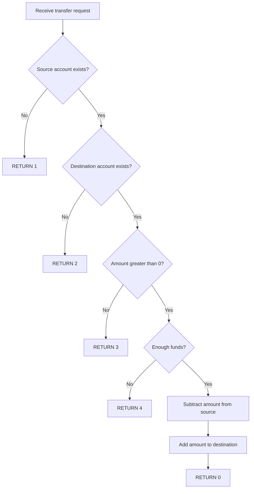

## Example data

For this example, create a small table that is independent of the rest of `AdventureWorksENG`:

```sql
CREATE TABLE BankAccount
(
    AccountNumber int PRIMARY KEY,
    Balance       decimal(10,2) NOT NULL
);
GO

INSERT INTO BankAccount (AccountNumber, Balance)
VALUES
    (100, 5000.00),
    (101, 2000.00);
GO
```

Check the initial balances:

```sql
SELECT *
FROM BankAccount;
```

Expected state:

| AccountNumber | Balance |
|---:|---:|
| 100 | 5000.00 |
| 101 | 2000.00 |

---

## The procedure

```sql
CREATE OR ALTER PROCEDURE dbo.usp_TransferMoney
    @FromAccount int,
    @ToAccount   int,
    @Amount      decimal(10,2)
AS
BEGIN
    -- Source account must exist
    IF NOT EXISTS
    (
        SELECT 1
        FROM BankAccount
        WHERE AccountNumber = @FromAccount
    )
        RETURN 1;

    -- Destination account must exist
    IF NOT EXISTS
    (
        SELECT 1
        FROM BankAccount
        WHERE AccountNumber = @ToAccount
    )
        RETURN 2;

    -- Transfer amount must be positive
    IF @Amount <= 0
        RETURN 3;

    -- Source account must have enough funds
    IF
    (
        SELECT Balance
        FROM BankAccount
        WHERE AccountNumber = @FromAccount
    ) < @Amount
        RETURN 4;

    UPDATE BankAccount
    SET Balance = Balance - @Amount
    WHERE AccountNumber = @FromAccount;

    UPDATE BankAccount
    SET Balance = Balance + @Amount
    WHERE AccountNumber = @ToAccount;

    RETURN 0;
END
GO
```

The return codes describe the outcome:

| Return code | Meaning |
|---:|---|
| `0` | transfer completed |
| `1` | source account does not exist |
| `2` | destination account does not exist |
| `3` | invalid amount |
| `4` | insufficient funds |

Notice the role of `RETURN`: it does not return account data. It reports the **status of the operation**.

---

## Execute the transfer

Capture the return value in a variable:

```sql
DECLARE @Result int;

EXEC @Result = dbo.usp_TransferMoney
    @FromAccount = 100,
    @ToAccount   = 101,
    @Amount      = 3000;

SELECT @Result AS ReturnCode;
```

If the transfer succeeds, the return code is `0`.

Check the balances:

```sql
SELECT *
FROM BankAccount;
```

Expected result:

| AccountNumber | Balance |
|---:|---:|
| 100 | 2000.00 |
| 101 | 5000.00 |

The application requested one operation, while the procedure performed validation and multiple SQL statements inside the database.

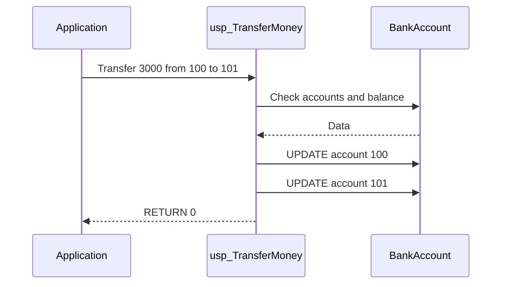

This example demonstrates several reasons for using a stored procedure:

- **encapsulation** — the application requests a transfer without implementing every SQL statement;
- **reusability** — the same procedure works for different accounts and amounts;
- **validation** — invalid requests can be rejected before data is modified;
- **fewer network round-trips** — the application sends one procedure call instead of coordinating each SQL statement separately;
- **one logical database operation** — the related statements are grouped behind one meaningful name.

---

## Test an unsuccessful transfer

Account `100` now contains `2000.00`.

Try to transfer more than the available balance:

```sql
DECLARE @Result int;

EXEC @Result = dbo.usp_TransferMoney
    @FromAccount = 100,
    @ToAccount   = 101,
    @Amount      = 5000;

SELECT @Result AS ReturnCode;
```

The expected return code is:

```text
4 -> insufficient funds
```

Because the procedure returns before either `UPDATE`, the balances remain unchanged.

---

## One important problem remains

Consider what could happen during a valid transfer:

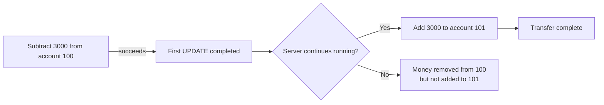

The two updates logically belong together.

What happens if the first `UPDATE` succeeds, but the server crashes or loses power before the second `UPDATE` is executed?

```text
Account 100: -3000  ✓

        ⚡ power failure

Account 101: +3000  ✗
```

Money has been removed from one account but has not been added to the other.

What we really want is:

```text
BOTH updates succeed
        OR
NEITHER update happens
```

This is exactly the problem that **transactions** solve.

Transactions are outside the scope of this lab, but this example shows why they are important when several data modifications form one logical operation.

> **Key idea:** A stored procedure can group several statements into one callable operation. A transaction guarantees that related changes succeed or fail together.


---
# Section 6 - Real-world example: Calculating a loyalty discount

Stored procedures are often used to implement **business rules**.

Consider a simple loyalty program.

When a customer is making a purchase, the application needs to determine whether the customer is eligible for a discount.

The discount depends on how much the customer spent during a specified period:

| Total spent | Discount |
|---:|---:|
| Less than €500 | 0% |
| €500 – €999.99 | 5% |
| €1,000 – €1,999.99 | 10% |
| €2,000 or more | 15% |

The application provides:

- the customer,
- the beginning of the period,
- the end of the period.

The stored procedure calculates the customer's total spending and returns the appropriate discount percentage.

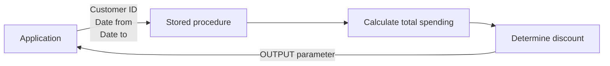

This example demonstrates three different ways of working with values inside a stored procedure:

| Value | Type | Purpose |
|---|---|---|
| `@CustomerID` | Input parameter | Customer to check |
| `@DateFrom` | Input parameter | Beginning of the period |
| `@DateTo` | Input parameter | End of the period |
| `@TotalSpent` | Local variable | Stores the calculated spending |
| `@DiscountPercent` | Output parameter | Returns the discount to the caller |

---

### Calculating the customer's spending

First, let's calculate how much customer `100` spent during 2003:

```sql
USE AdventureWorksENG;
GO
```

```sql
SELECT SUM(ii.TotalPrice)
FROM Invoice i
JOIN InvoiceItem ii
    ON ii.InvoiceID = i.IDInvoice
WHERE i.CustomerID = 100
  AND i.InvoiceDate >= '2003-01-01'
  AND i.InvoiceDate <= '2003-12-31';
```

The result is:

```text
1728.510000
```

According to our loyalty rules, this customer should receive a **10% discount**.

However, there is one small problem.

If the customer has no purchases during the selected period, `SUM()` returns `NULL`.

We want the total spending to be `0` instead:

```sql
SELECT COALESCE(SUM(ii.TotalPrice), 0)
FROM Invoice i
JOIN InvoiceItem ii
    ON ii.InvoiceID = i.IDInvoice
WHERE i.CustomerID = 100
  AND i.InvoiceDate >= '2003-01-01'
  AND i.InvoiceDate <= '2003-12-31';
```

Now we can use this calculation inside a stored procedure.

---

### Creating the procedure

```sql
CREATE OR ALTER PROCEDURE dbo.usp_GetLoyaltyDiscount
    @CustomerID int,
    @DateFrom date,
    @DateTo date,
    @DiscountPercent decimal(5,2) OUTPUT
AS
BEGIN
    SET NOCOUNT ON;

    DECLARE @TotalSpent decimal(10,2);

    SELECT @TotalSpent =
        COALESCE(SUM(ii.TotalPrice), 0)
    FROM Invoice i
    JOIN InvoiceItem ii
        ON ii.InvoiceID = i.IDInvoice
    WHERE i.CustomerID = @CustomerID
      AND i.InvoiceDate >= @DateFrom
      AND i.InvoiceDate <= @DateTo;

    IF @TotalSpent >= 2000
        SET @DiscountPercent = 15;
    ELSE IF @TotalSpent >= 1000
        SET @DiscountPercent = 10;
    ELSE IF @TotalSpent >= 500
        SET @DiscountPercent = 5;
    ELSE
        SET @DiscountPercent = 0;
END;
GO
```

The procedure receives three **input parameters**:

```sql
@CustomerID int,
@DateFrom date,
@DateTo date,
```

These values come from the caller.

The procedure also declares a **local variable**:

```sql
DECLARE @TotalSpent decimal(10,2);
```

This variable exists only while the procedure is executing.

The query calculates the customer's spending and stores the result in that variable:

```sql
SELECT @TotalSpent =
    COALESCE(SUM(ii.TotalPrice), 0)
FROM Invoice i
JOIN InvoiceItem ii
    ON ii.InvoiceID = i.IDInvoice
WHERE i.CustomerID = @CustomerID
  AND i.InvoiceDate >= @DateFrom
  AND i.InvoiceDate <= @DateTo;
```

The procedure then applies the loyalty rules:

```sql
IF @TotalSpent >= 2000
    SET @DiscountPercent = 15;
ELSE IF @TotalSpent >= 1000
    SET @DiscountPercent = 10;
ELSE IF @TotalSpent >= 500
    SET @DiscountPercent = 5;
ELSE
    SET @DiscountPercent = 0;
```

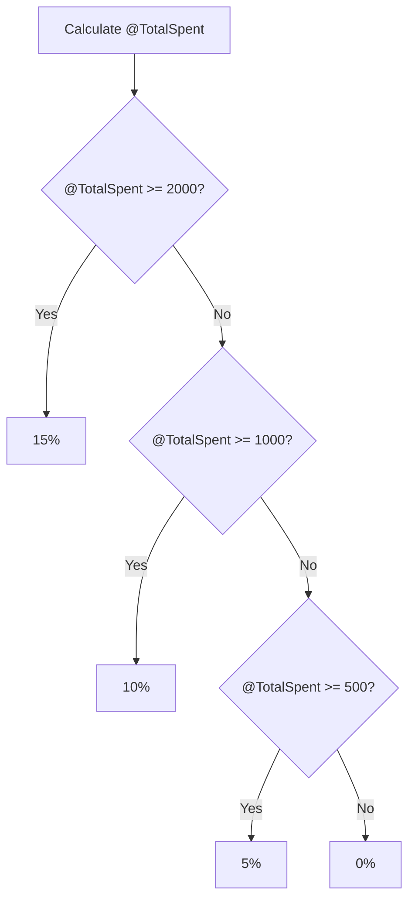

Finally, `@DiscountPercent` is an **OUTPUT parameter**:

```sql
@DiscountPercent decimal(5,2) OUTPUT
```

This allows the procedure to return the calculated discount to the caller.

---

### Calling the procedure

The caller first needs a variable that will receive the returned value:

```sql
DECLARE @Discount decimal(5,2);
```

We can then execute the procedure:

```sql
EXEC dbo.usp_GetLoyaltyDiscount
    @CustomerID = 100,
    @DateFrom = '2003-01-01',
    @DateTo = '2003-12-31',
    @DiscountPercent = @Discount OUTPUT;
```

Finally, we can inspect the returned value:

```sql
SELECT @Discount AS DiscountPercent;
```

The complete call is:

```sql
DECLARE @Discount decimal(5,2);

EXEC dbo.usp_GetLoyaltyDiscount
    @CustomerID = 100,
    @DateFrom = '2003-01-01',
    @DateTo = '2003-12-31',
    @DiscountPercent = @Discount OUTPUT;

SELECT @Discount AS DiscountPercent;
```

The result should be:

| DiscountPercent |
|---:|
| 10.00 |

The procedure calculated that customer `100` spent **€1,728.51** during the selected period and therefore returned a **10% discount**.

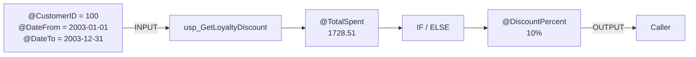

---

### Input, local, and output values

It is important to understand the different roles of the values used in this example.

**Input parameters** bring values into the procedure:

```sql
@CustomerID
@DateFrom
@DateTo
```

A **local variable** stores an intermediate result inside the procedure:

```sql
@TotalSpent
```

An **OUTPUT parameter** sends a value back to the caller:

```sql
@DiscountPercent
```

Conceptually:

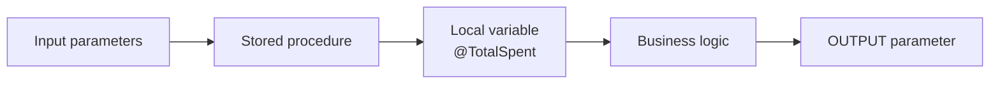

### Key takeaways

- Stored procedures can implement business rules.
- Input parameters allow the caller to provide values to the procedure.
- Local variables can store intermediate results inside the procedure.
- `IF` and `ELSE` can be used to make decisions based on calculated values.
- An `OUTPUT` parameter allows a stored procedure to return a value to the caller.
- The caller must specify `OUTPUT` when receiving the value.
- A procedure can combine queries, variables, control flow, and parameters into a reusable database operation.
---

# Exercises

Try each exercise before opening the solution.
---

## Exercise 1 – Your First Procedure

Create a procedure named `dbo.usp_ListCategories`.

The procedure should:

- return all rows from `Category`;
- sort the result by category name.

Execute the procedure.

Then modify it so that the categories are sorted in descending order and execute it again.

<details>
<summary>Show solution</summary>

```sql
CREATE OR ALTER PROCEDURE dbo.usp_ListCategories
AS
BEGIN
    SELECT *
    FROM Category
    ORDER BY Name;
END
GO

EXEC dbo.usp_ListCategories;
GO

CREATE OR ALTER PROCEDURE dbo.usp_ListCategories
AS
BEGIN
    SELECT *
    FROM Category
    ORDER BY Name DESC;
END
GO

EXEC dbo.usp_ListCategories;
```

</details>

---

## Exercise 2 – Input Parameters

Create a procedure named `dbo.usp_CustomersByLastName`.

The procedure should:

- accept one parameter named `@LastNamePattern`;
- return `IDCustomer`, `FirstName`, `LastName`, and `Email`;
- find customers whose last name matches the supplied `LIKE` pattern;
- sort the result by `LastName` and `FirstName`.

Test it with:

```sql
EXEC dbo.usp_CustomersByLastName
    @LastNamePattern = 'S%';
```

<details>
<summary>Show solution</summary>

```sql
CREATE OR ALTER PROCEDURE dbo.usp_CustomersByLastName
    @LastNamePattern nvarchar(50)
AS
BEGIN
    SELECT
        IDCustomer,
        FirstName,
        LastName,
        Email
    FROM Customer
    WHERE LastName LIKE @LastNamePattern
    ORDER BY LastName, FirstName;
END
GO

EXEC dbo.usp_CustomersByLastName
    @LastNamePattern = 'S%';
```

</details>

---

## Exercise 3 – A Complete Database Operation

Create a procedure named `dbo.usp_InsertCityInState`.

It should accept:

```text
@StateName
@CityName
```

The procedure must:

1. find the state by name;
2. store its ID in a variable;
3. insert the state if it does not exist;
4. use `SCOPE_IDENTITY()` to obtain the new state ID;
5. insert the city using the correct `StateID`.

Test the procedure with two calls:

```text
State: Canada, City: Toronto
State: Canada, City: Vancouver
```

Finally, verify that `Canada` exists only once in `State` and that both cities reference it.

<details>
<summary>Show solution</summary>

```sql
CREATE OR ALTER PROCEDURE dbo.usp_InsertCityInState
    @StateName nvarchar(50),
    @CityName  nvarchar(50)
AS
BEGIN
    DECLARE @StateID int;

    SELECT @StateID = IDState
    FROM State
    WHERE Name = @StateName;

    IF @StateID IS NULL
    BEGIN
        INSERT INTO State (Name)
        VALUES (@StateName);

        SET @StateID = SCOPE_IDENTITY();
    END

    INSERT INTO City (Name, StateID)
    VALUES (@CityName, @StateID);
END
GO

EXEC dbo.usp_InsertCityInState
    @StateName = 'Canada',
    @CityName  = 'Toronto';

EXEC dbo.usp_InsertCityInState
    @StateName = 'Canada',
    @CityName  = 'Vancouver';

SELECT
    s.Name AS State,
    c.Name AS City
FROM City AS c
JOIN State AS s
    ON s.IDState = c.StateID
WHERE s.Name = 'Canada';

SELECT COUNT(*) AS CanadaRowCount
FROM State
WHERE Name = 'Canada';
```

</details>

---

## Exercise 4 – Find the Bug

Assume the following procedure already exists:

```sql
CREATE OR ALTER PROCEDURE dbo.usp_GetProductColor
    @IDProduct int,
    @Color     nvarchar(15) OUTPUT
AS
BEGIN
    SELECT @Color = Color
    FROM Product
    WHERE IDProduct = @IDProduct;
END
GO
```

A developer calls it like this:

```sql
DECLARE @Color nvarchar(15);

EXEC dbo.usp_GetProductColor
    @IDProduct = 1,
    @Color     = @Color;

SELECT @Color AS ProductColor;
```

The procedure executes, but `@Color` does not contain the value returned by the procedure.

Questions:

1. What is wrong with the call?
2. Where must `OUTPUT` appear?
3. Correct the call.

<details>
<summary>Show solution</summary>

The caller forgot the `OUTPUT` keyword.

It must appear both in the procedure declaration and in the call when the caller wants to receive the modified value.

```sql
DECLARE @Color nvarchar(15);

EXEC dbo.usp_GetProductColor
    @IDProduct = 1,
    @Color     = @Color OUTPUT;

SELECT @Color AS ProductColor;
```

</details>

---

## Challenge – Choosing the Right Output

Create a procedure named `dbo.usp_GetProductInfo`.

It should:

- accept `@IDProduct`;
- return the product row as a result set;
- return the product price through an output parameter named `@Price`;
- return `0` if the product exists;
- return `1` if the product does not exist.

Before writing the procedure, decide why each output mechanism is appropriate for its purpose.

<details>
<summary>Show solution</summary>

```sql
CREATE OR ALTER PROCEDURE dbo.usp_GetProductInfo
    @IDProduct int,
    @Price     money OUTPUT
AS
BEGIN
    IF NOT EXISTS
    (
        SELECT 1
        FROM Product
        WHERE IDProduct = @IDProduct
    )
        RETURN 1;

    SELECT @Price = PriceWithoutVAT
    FROM Product
    WHERE IDProduct = @IDProduct;

    SELECT *
    FROM Product
    WHERE IDProduct = @IDProduct;

    RETURN 0;
END
GO

DECLARE @Price money;
DECLARE @Result int;

EXEC @Result = dbo.usp_GetProductInfo
    @IDProduct = 1,
    @Price     = @Price OUTPUT;

SELECT
    @Price AS Price,
    @Result AS ReturnCode;
```

The result set is appropriate for the product row, the output parameter returns an individual data value, and `RETURN` communicates the status of the operation.

</details>

---

# Cleanup

Remove the procedures and test data created during the lab.

```sql
DROP PROCEDURE IF EXISTS dbo.usp_ListStates;
DROP PROCEDURE IF EXISTS dbo.usp_GetProduct;
DROP PROCEDURE IF EXISTS dbo.usp_ProductsByPrice;
DROP PROCEDURE IF EXISTS dbo.usp_GetProductColor;
DROP PROCEDURE IF EXISTS dbo.usp_CheckCustomerExists;
DROP PROCEDURE IF EXISTS dbo.usp_ListCategories;
DROP PROCEDURE IF EXISTS dbo.usp_CustomersByLastName;
DROP PROCEDURE IF EXISTS dbo.usp_GetProductInfo;
DROP PROCEDURE IF EXISTS dbo.usp_InsertCityInState;
DROP PROCEDURE IF EXISTS dbo.usp_TransferMoney;
DROP PROCEDURE IF EXISTS dbo.usp_GetLoyaltyDiscount;
GO
```

Remove only the test rows created in this lab:

```sql
DELETE FROM City
WHERE Name IN ('Osaka', 'Tokyo', 'Toronto', 'Vancouver');

DELETE FROM State
WHERE Name IN ('Japan', 'Canada');
GO

DROP TABLE IF EXISTS BankAccount;
GO
```

> Keep cleanup targeted to objects and rows created during the lab.

---

# What You Should Know After This Lab

The most important ideas are:

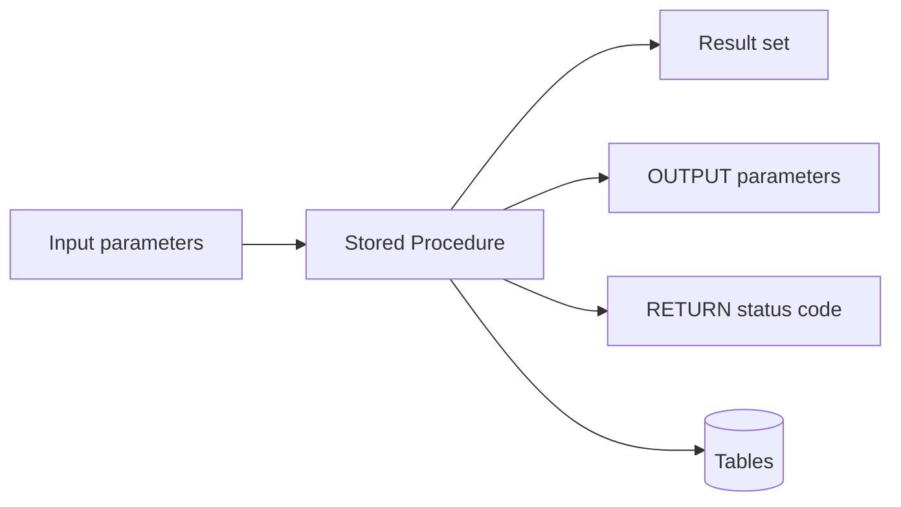

```text
Stored Procedure
    -> a named, callable database operation
```

```text
Input parameters
    -> send values into the procedure
```

```text
Result set
    -> returns rows
```

```text
OUTPUT parameter
    -> returns individual values
```

```text
RETURN
    -> returns an integer status code
```

And remember:

> **Views answer. Triggers react. Procedures do.**

A stored procedure is particularly useful when **one logical database operation requires several SQL statements**.

It can also reduce **network round-trips** by allowing those statements to execute on the database server after a single procedure call.

---

# Where to Go Next

In the next lab, **Functions**, we will look at another type of reusable code stored inside the database.

Unlike stored procedures, functions are designed to return a value and can be used as part of SQL expressions and queries.

You will learn about:

- scalar functions;
- table-valued functions;
- using user-defined functions inside SQL statements.
