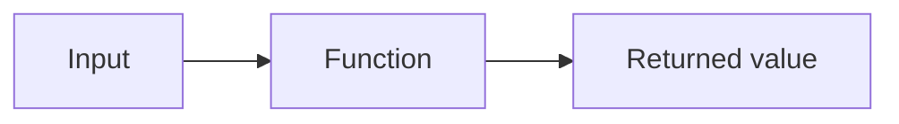
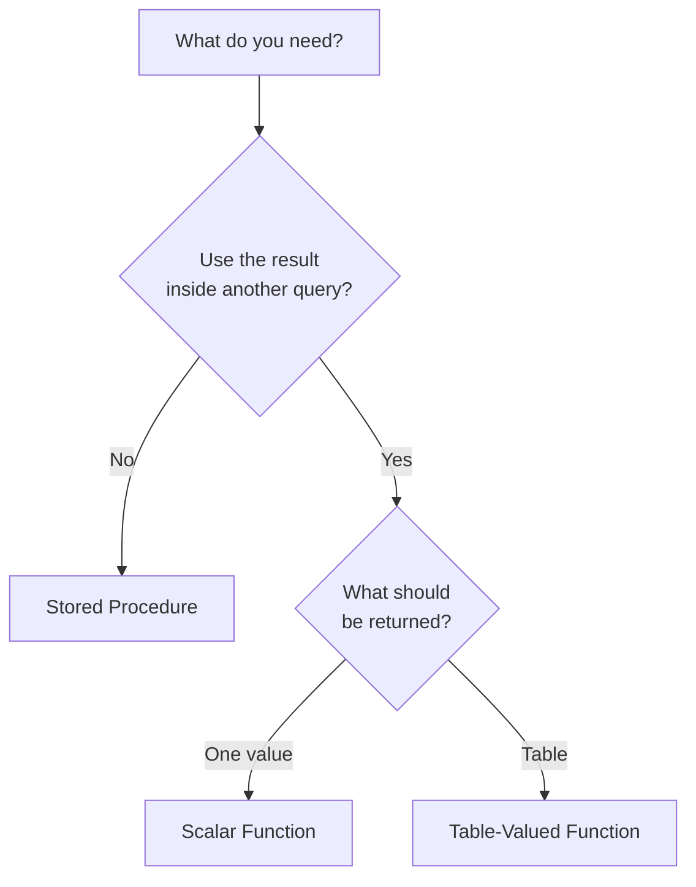
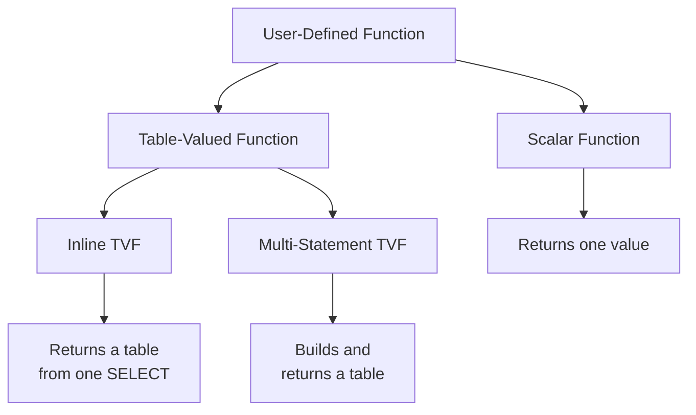
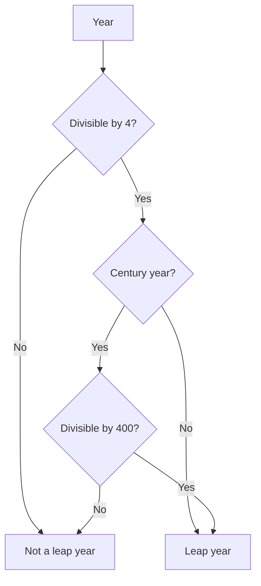
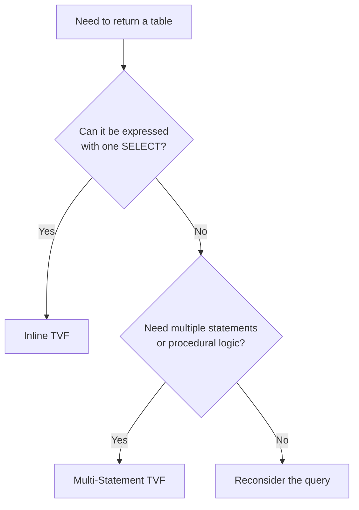
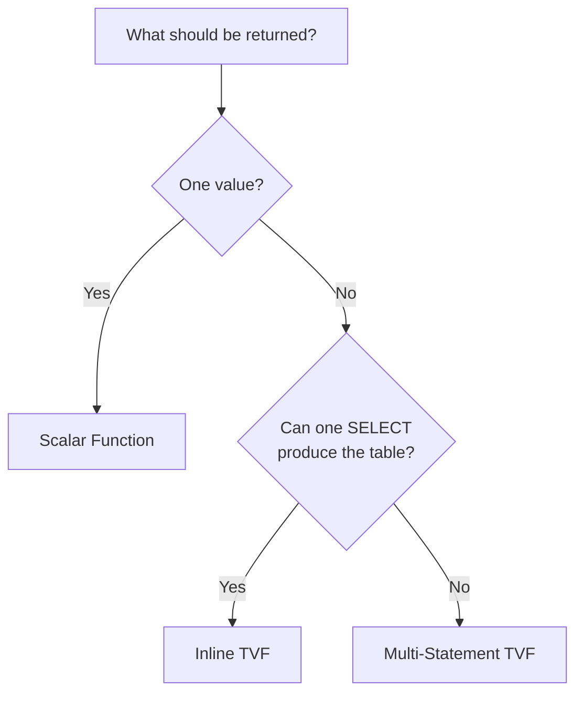

# Lab 04 – Functions

**Database:** `AdventureWorksENG`

Functions package reusable logic and return a result that can be used
inside another SQL statement. In this lab, you will create functions
that return either a single value or an entire table, and you will see
how functions differ from stored procedures.

> **Core idea:** A function returns a value. You use it where a value
> goes.

---

## Learning objectives

After completing this lab, you should be able to:

-   explain the difference between a function and a stored procedure;
-   create and call a scalar user-defined function;
-   create and use an inline table-valued function;
-   create and use a multi-statement table-valued function;
-   choose an appropriate function type for a given problem.

Start by selecting the training database:

```sql
USE AdventureWorksENG;
GO
```

---

# Section 1 – Functions and Stored Procedures

You have already used many SQL Server functions.

For example:

```sql
SELECT LEN('Database Design') AS TextLength;
SELECT GETDATE() AS CurrentDateTime;
SELECT UPPER('sql server') AS UppercaseText;
```

You have also used aggregate functions:

```sql
SELECT
    COUNT(*) AS ProductCount,
    AVG(PriceWithoutVAT) AS AveragePrice
FROM Product;
```

These are **built-in functions**.

SQL Server also allows you to create your own functions. These are
called **user-defined functions (UDFs)**.



Functions and stored procedures may look similar:

-   both have a name;
-   both can accept parameters;
-   both can contain reusable logic.

The important difference is how they are used.

A stored procedure is executed as a command:

```sql
EXEC dbo.usp_Something;
```

A function is used as part of another SQL statement:

```sql
SELECT dbo.fn_Something(...);
```

or, when the function returns a table:

```sql
SELECT *
FROM dbo.fn_Something(...);
```

## Comparison

| Feature | Stored Procedure | Function |
| --- | --- | --- |
| Invocation | `EXEC dbo.usp_Name` | Used inside a SQL statement |
| Parameters | Yes | Yes |
| Parentheses when called | No | Yes |
| Result | Result sets, `OUTPUT` parameters, return code | One value or one table |
| Modify database tables | Yes | No |
| Use as an expression | No | Yes, scalar functions |
| Use in `FROM` | No | Yes, table-valued functions |

> **Key idea:** Use a function when its result must become part of
> another query. Use a stored procedure when you need to perform an
> operation.

A useful decision rule is:



Functions are intended to calculate and return results. A T-SQL
user-defined function cannot modify application tables using operations
such as `INSERT`, `UPDATE`, or `DELETE`.

---

## Check your understanding

1. What is the main difference between calling a stored procedure and
    using a function?
2. Can a T-SQL function modify application tables?
3. Which object would you choose if the result must be used inside
    another query?

<details>
<summary>Show answers</summary>

1. A stored procedure is executed as a command with `EXEC`; a function
    is used as part of another SQL statement.
2. No. A T-SQL user-defined function cannot modify application tables.
3. A function.

</details>

---

# Section 2 – Types of User-Defined Functions

In this lab, we will use three types of user-defined functions.



| Type | Returns | Typical use |
| --- | --- | --- |
| Scalar function | One value | Expression in `SELECT`, `WHERE`, etc. |
| Inline TVF | Table | Parameterised query used in `FROM` |
| Multi-statement TVF | Table | Table built using multiple statements |

The first question to ask is therefore:

```text
What should the function return?
    -> one value
    -> or a table
```

> **Key idea:** Scalar functions return one value. Table-valued
> functions return a table.

---

## Check your understanding

1. Which function type returns exactly one value?
2. Which two function types return tables?
3. Which table-valued function is based on a single `SELECT`?

<details>
<summary>Show answers</summary>

1. A scalar function.
2. Inline TVF and multi-statement TVF.
3. An inline TVF.

</details>

---

# Section 3 – Scalar Functions

A **scalar function** returns exactly one value.

That value can use any scalar SQL Server data type, for example:

-   `int`;
-   `decimal`;
-   `nvarchar`;
-   `date`;
-   `bit`.

## Example 1 – A minimal scalar function

Create a function that adds two integers:

```sql
CREATE OR ALTER FUNCTION dbo.fn_AddNumbers
(
    @A int,
    @B int
)
RETURNS int
AS
BEGIN
    RETURN @A + @B;
END
GO
```

Call the function:

```sql
SELECT dbo.fn_AddNumbers(5, 10) AS Result;
```

Expected result:

```text
15
```

The general structure is:

```sql
CREATE OR ALTER FUNCTION schema.function_name
(
    parameters
)
RETURNS data_type
AS
BEGIN
    – logic

    RETURN value;
END
GO
```

Notice two important details:

1. `RETURNS` declares the data type returned by the function.
2. Function arguments are written inside parentheses.

We will consistently use schema-qualified names when calling our
functions:

```sql
dbo.fn_AddNumbers(5, 10)
```

Remove the example before continuing:

```sql
DROP FUNCTION dbo.fn_AddNumbers;
GO
```

> **Key idea:** A scalar function receives zero or more parameters and
> returns one scalar value.

---

## Example 2 – Leap Year

A scalar function can contain programming logic such as `IF`.

Before creating the function, let us look at the rule we want to implement.

### What is a leap year?

A **leap year** has 366 days instead of 365.

The Gregorian calendar was introduced by Pope Gregory XIII in 1582. According to its rules:

- every year divisible by **4** is normally a leap year;
- however, a **century year** (a year divisible by 100) is **not** a leap year unless it is also divisible by **400**.

For example:

- 1700, 1800 and 1900 were **not** leap years;
- 1600 and 2000 **were** leap years.

To implement these rules, we first need a way to check whether one number is divisible by another.

### The modulo operator

The `%` operator is the **modulo operator**. It returns the remainder after division.

For example:

```sql
SELECT 10 % 3 AS Remainder;
```

The result is:

```text
1
```

Why?

```text
10 / 3 = 3, remainder 1
```

Therefore:

```text
10 % 3 = 1
```

If the remainder is `0`, the number is divisible without a remainder.

For example:

```sql
SELECT
    2024 % 4 AS Remainder1,
    2025 % 4 AS Remainder2;
```

The result for `2024 % 4` is `0`, which means that 2024 is divisible by 4.

We can now translate the leap-year rules into a function.

```sql
CREATE OR ALTER FUNCTION dbo.fn_IsLeapYear
(
    @Year int
)
RETURNS bit
AS
BEGIN
    DECLARE @IsLeapYear bit = 0;

    -- Every fourth year is normally a leap year
    IF @Year % 4 = 0
        SET @IsLeapYear = 1;

    -- A century year is not a leap year
    -- unless it is also divisible by 400
    IF @Year % 100 = 0 AND @Year % 400 <> 0
        SET @IsLeapYear = 0;

    RETURN @IsLeapYear;
END
GO
```

The function starts with:

```sql
DECLARE @IsLeapYear bit = 0;
```

The `bit` data type can store `0` or `1`, so it is useful for a result that represents **false** or **true**.

By default, we assume that the year is **not** a leap year.

Then we apply the first rule:

```sql
IF @Year % 4 = 0
    SET @IsLeapYear = 1;
```

If the year is divisible by 4, we mark it as a leap year.

Finally, we handle the exception:

```sql
IF @Year % 100 = 0 AND @Year % 400 <> 0
    SET @IsLeapYear = 0;
```

A century year that is divisible by 100 but **not** by 400 is not a leap year.

The complete logic looks like this:



Notice that the second `IF` is evaluated after the first one.

This is important because it can **override** the result of the first rule.

For example, 1900 is divisible by 4, so the first `IF` sets the value to `1`. However, 1900 is also divisible by 100 and not by 400, so the second `IF` changes the value back to `0`.

Now test the function:

```sql
SELECT dbo.fn_IsLeapYear(2024) AS IsLeapYear; -- 1
SELECT dbo.fn_IsLeapYear(2025) AS IsLeapYear; -- 0
SELECT dbo.fn_IsLeapYear(1900) AS IsLeapYear; -- 0
SELECT dbo.fn_IsLeapYear(2000) AS IsLeapYear; -- 1
```

These four values test the important cases:

| Year | Divisible by 4 | Century year | Divisible by 400 | Result |
| ---: | :---: | :---: | :---: | :---: |
| 2024 | Yes | No | No | 1 |
| 2025 | No | No | No | 0 |
| 1900 | Yes | Yes | No | 0 |
| 2000 | Yes | Yes | Yes | 1 |

> **Key idea:** A function can combine parameters, local variables and conditional logic, and then return the calculated value.

Remove the example before continuing:

```sql
DROP FUNCTION dbo.fn_IsLeapYear;
GO
```

---

## Check your understanding

1. What does the `%` operator return?
2. Why is `2024 % 4 = 0` important?
3. Why is 1900 not a leap year even though it is divisible by 4?
4. Why is 2000 a leap year?
5. What is the purpose of `RETURN @IsLeapYear`?

<details>
<summary>Show answers</summary>

1. The `%` operator returns the remainder after division.
2. A remainder of `0` means that 2024 is divisible by 4, so it satisfies the basic leap-year rule.
3. 1900 is a century year. It is divisible by 100 but not by 400, so the second `IF` changes the result back to `0`.
4. 2000 is divisible by both 100 and 400, so the century-year exception does not exclude it.
5. `RETURN @IsLeapYear` ends the function and returns the calculated `bit` value to the caller.

</details>

---

# Section 4 – Scalar Functions That Read Data

A scalar function can also read data from database tables.

Suppose we frequently need the total quantity sold for a product.

First, solve the problem using a normal query:

```sql
SELECT SUM(Quantity) AS TotalSold
FROM InvoiceItem
WHERE ProductID = 1;
```

Now package the same calculation into a function:

```sql
CREATE OR ALTER FUNCTION dbo.fn_ProductSoldQuantity
(
    @IDProduct int
)
RETURNS int
AS
BEGIN
    DECLARE @Total int;

    SELECT @Total = SUM(Quantity)
    FROM InvoiceItem
    WHERE ProductID = @IDProduct;

    RETURN ISNULL(@Total, 0);
END
GO
```

Call it for one product:

```sql
SELECT dbo.fn_ProductSoldQuantity(1) AS TotalSold;
```

The returned value can also be assigned to a variable:

```sql
DECLARE @Sold int;

SET @Sold = dbo.fn_ProductSoldQuantity(1);

SELECT @Sold AS TotalSold;
```

The real advantage becomes visible when the function is used inside
another query:

```sql
SELECT
    IDProduct,
    Name,
    Color,
    dbo.fn_ProductSoldQuantity(IDProduct) AS TotalSold
FROM Product
ORDER BY TotalSold DESC;
```

For every product processed by the query, the function produces the
corresponding `TotalSold` value.


### Performance consideration

This syntax is convenient, but scalar functions can become expensive
when they are evaluated over many rows.

Conceptually:

```text
few rows
    -> few function evaluations

many rows
    -> potentially many function evaluations
```

Modern SQL Server versions can optimise some scalar UDFs using **scalar
UDF inlining**, but not every scalar function is eligible.

Therefore, do not automatically replace every expression or query with a
scalar function.

> **Key idea:** Scalar functions are convenient and reusable, but always
> consider how often the function may need to be evaluated.

Remove the example:

```sql
DROP FUNCTION dbo.fn_ProductSoldQuantity;
GO
```

---

## Check your understanding

1. Why does the function use `ISNULL(@Total, 0)`?
2. Can a scalar function read from a table?
3. Why can a scalar function become expensive when used over a large
    result set?

<details>
<summary>Show answers</summary>

1. `SUM()` returns `NULL` when no matching rows exist; `ISNULL`
    converts that result to `0`.
2. Yes. A function can read data even though it cannot modify
    application tables.
3. The function may need to be evaluated for many rows. Some scalar
    functions can be inlined by modern SQL Server versions, but this is
    not guaranteed.

</details>

---

# Section 5 – Inline Table-Valued Functions

Sometimes we want a function to return multiple rows and columns instead
of one scalar value.

For this, SQL Server provides **table-valued functions (TVFs)**.

The simplest type is an **inline table-valued function**.

An inline TVF:

-   returns a table;
-   contains one query;
-   can accept parameters;
-   is used in the `FROM` clause.

A useful mental model is:

> **Inline TVF = parameterised View**

Consider this query:

```sql
SELECT
    IDCustomer,
    FirstName,
    LastName
FROM Customer
WHERE LastName LIKE 'Z%';
```

A View could store the query, but the prefix `Z` would be fixed.

An inline TVF can make that value a parameter:

```sql
CREATE OR ALTER FUNCTION dbo.fn_CustomersByLastNamePrefix
(
    @Prefix nvarchar(50)
)
RETURNS TABLE
AS
RETURN
(
    SELECT
        IDCustomer,
        FirstName,
        LastName
    FROM Customer
    WHERE LastName LIKE @Prefix + '%'
);
GO
```

Notice the structure:

```text
RETURNS TABLE
    -> no returned column declaration

RETURN
    -> contains one SELECT

no BEGIN / END
```


Use the function in the `FROM` clause:

```sql
SELECT *
FROM dbo.fn_CustomersByLastNamePrefix('Zhu');
```

Try another parameter:

```sql
SELECT *
FROM dbo.fn_CustomersByLastNamePrefix('A');
```

Because the result is a table, it can also participate in a `JOIN`:

```sql
SELECT
    c.FirstName,
    c.LastName,
    i.IDInvoice,
    i.InvoiceDate,
    i.InvoiceNumber
FROM dbo.fn_CustomersByLastNamePrefix('Zhu') AS c
LEFT JOIN Invoice AS i
    ON i.CustomerID = c.IDCustomer
ORDER BY
    c.LastName,
    c.FirstName,
    i.InvoiceDate;
```

This is why an inline TVF is often described as a parameterised View:

```text
View
    -> reusable query
    -> no parameters

Inline TVF
    -> reusable query
    -> accepts parameters
```

Inline TVFs are also generally optimizer-friendly because SQL Server can
incorporate the function's query definition into the surrounding query.

> **Key idea:** If a table-valued function can naturally be expressed as
> one `SELECT`, prefer an inline TVF.

Remove the example:

```sql
DROP FUNCTION dbo.fn_CustomersByLastNamePrefix;
GO
```

---

## Check your understanding

1. What does an inline TVF return?
2. Where is an inline TVF normally used in a query?
3. Why can an inline TVF be described as a parameterised View?

<details>
<summary>Show answers</summary>

1. A table.
2. In the `FROM` clause, where it behaves as a table source.
3. Like a View, it encapsulates a query, but unlike a View it can
    accept parameters.

</details>

---

# Section 6 – Multi-Statement Table-Valued Functions

Sometimes returning a table requires more than one statement.

A **multi-statement table-valued function** allows you to:

-   declare the structure of the returned table;
-   use variables;
-   use `IF / ELSE`;
-   execute multiple statements;
-   insert rows into the returned table.

You have already seen **table variables** in Lab 00.

A multi-statement TVF uses the same idea: the function declares a table
variable that represents its result.


## Example

Create a function that returns products based on a minimum price.

If the parameter is `NULL`, return all products.

Otherwise, return only products above the requested price.

```sql
CREATE OR ALTER FUNCTION dbo.fn_ProductsFilter
(
    @MinPrice money
)
RETURNS @Result TABLE
(
    Name            nvarchar(50),
    PriceWithoutVAT money
)
AS
BEGIN
    IF @MinPrice IS NULL
    BEGIN
        INSERT INTO @Result
        (
            Name,
            PriceWithoutVAT
        )
        SELECT
            Name,
            PriceWithoutVAT
        FROM Product;
    END
    ELSE
    BEGIN
        INSERT INTO @Result
        (
            Name,
            PriceWithoutVAT
        )
        SELECT
            Name,
            PriceWithoutVAT
        FROM Product
        WHERE PriceWithoutVAT > @MinPrice;
    END

    RETURN;
END
GO
```

This example is intentionally written with `IF / ELSE` to demonstrate the structure of a multi-statement TVF. The same filtering requirement could be expressed with one `SELECT`, so in production code an inline TVF would normally be the better choice.

Test both branches:

```sql
-- All products
SELECT *
FROM dbo.fn_ProductsFilter(NULL);

-- Products above the specified price
SELECT *
FROM dbo.fn_ProductsFilter(3000);
```

For this particular requirement, the filtering itself could also be written as:

```sql
WHERE @MinPrice IS NULL
   OR PriceWithoutVAT > @MinPrice
```

That observation is important: **the example teaches the multi-statement syntax; it is not an argument for choosing a multi-statement TVF for this specific filter.**

Compare the syntax with an inline TVF.

### Inline TVF

```sql
RETURNS TABLE
AS
RETURN
(
    SELECT ...
);
```

### Multi-statement TVF

```sql
RETURNS @Result TABLE
(
    ...
)
AS
BEGIN
    INSERT INTO @Result ...
    ...

    RETURN;
END
```

### Which one should you choose?



Inline TVFs are generally preferable when the logic fits naturally into
one query. Multi-statement TVFs provide more procedural flexibility, but
their internal table variable can make optimization more difficult.

> **Key idea:** If one `SELECT` is enough, prefer an inline TVF.

Remove the example:

```sql
DROP FUNCTION dbo.fn_ProductsFilter;
GO
```

---

## Check your understanding

1. What is `@Result` in a multi-statement TVF?
2. What is the main syntactic difference between an inline TVF and a
    multi-statement TVF?
3. Which type should normally be preferred when one `SELECT` is enough?

<details>
<summary>Show answers</summary>

1. It is the table variable that holds the rows returned by the
    function.
2. An inline TVF directly returns one query; a multi-statement TVF
    declares a returned table variable and fills it using statements
    inside `BEGIN ... END`.
3. An inline TVF.

</details>

---

# Section 7 – Real-World Example

A common design problem is deciding **which database object should own
which responsibility**.

Suppose an application needs to classify products according to their
price and then use that classification in different queries.

The classification is a calculation: it receives a price and returns one
value.

That makes it a good candidate for a scalar function.

## Scenario

We want to classify products as:

-   `Budget` when the price is below 100;
-   `Standard` when the price is from 100 up to, but not including,
    1000;
-   `Premium` when the price is 1000 or more.

## Solution

```sql
CREATE OR ALTER FUNCTION dbo.fn_ProductPriceCategory
(
    @Price money
)
RETURNS nvarchar(20)
AS
BEGIN
    IF @Price < 100
        RETURN 'Budget';

    IF @Price < 1000
        RETURN 'Standard';

    RETURN 'Premium';
END
GO
```

The function can now be used as part of a query:

```sql
SELECT
    IDProduct,
    Name,
    PriceWithoutVAT,
    dbo.fn_ProductPriceCategory(PriceWithoutVAT) AS PriceCategory
FROM Product
ORDER BY PriceWithoutVAT;
```

It can also be used in a filter:

```sql
SELECT
    IDProduct,
    Name,
    PriceWithoutVAT
FROM Product
WHERE dbo.fn_ProductPriceCategory(PriceWithoutVAT) = 'Premium'
ORDER BY PriceWithoutVAT DESC;
```

> This example combines:
>
> -   function parameters;
> -   conditional logic;
> -   a scalar return value;
> -   using a function inside another query.

The function contains calculation logic only. It does not modify
`Product`.

Remove it before starting the exercises:

```sql
DROP FUNCTION dbo.fn_ProductPriceCategory;
GO
```

---

# Exercises

Try each exercise before opening the solution.

---

## Exercise 1 – Total Quantity Sold

Create a scalar function named:

```text
dbo.fn_ProductSoldQuantity
```

Requirements:

-   parameter: `@IDProduct int`;
-   return type: `int`;
-   calculate the total `Quantity` for that product from `InvoiceItem`;
-   if the product has never been sold, return `0`.

Then use the function in a query that displays:

-   product name;
-   color;
-   total quantity sold.

Sort the result from the highest quantity sold to the lowest.

<details>
<summary>Show solution</summary>

```sql
CREATE OR ALTER FUNCTION dbo.fn_ProductSoldQuantity
(
    @IDProduct int
)
RETURNS int
AS
BEGIN
    DECLARE @Total int;

    SELECT @Total = SUM(Quantity)
    FROM InvoiceItem
    WHERE ProductID = @IDProduct;

    RETURN ISNULL(@Total, 0);
END
GO

SELECT
    Name,
    Color,
    dbo.fn_ProductSoldQuantity(IDProduct) AS TotalSold
FROM Product
ORDER BY TotalSold DESC;
GO
```

</details>

---

## Exercise 2 – Customers by Last Name Prefix

Create an inline table-valued function named:

```text
dbo.fn_CustomersByLastNamePrefix
```

Requirements:

-   parameter: `@Prefix nvarchar(50)`;
-   return:
    -   `IDCustomer`;
    -   `FirstName`;
    -   `LastName`;
-   include customers whose last name begins with the supplied prefix.

Test the function using `'Zhu'`.

Then use the function together with `Invoice`.

Display:

-   customer first name;
-   customer last name;
-   invoice ID;
-   invoice date;
-   invoice number.

Use a `LEFT JOIN` so that customers returned by the function remain
visible even if they do not have an invoice.

<details>
<summary>Show solution</summary>

```sql
CREATE OR ALTER FUNCTION dbo.fn_CustomersByLastNamePrefix
(
    @Prefix nvarchar(50)
)
RETURNS TABLE
AS
RETURN
(
    SELECT
        IDCustomer,
        FirstName,
        LastName
    FROM Customer
    WHERE LastName LIKE @Prefix + '%'
);
GO

SELECT *
FROM dbo.fn_CustomersByLastNamePrefix('Zhu');
GO

SELECT
    c.FirstName,
    c.LastName,
    i.IDInvoice,
    i.InvoiceDate,
    i.InvoiceNumber
FROM dbo.fn_CustomersByLastNamePrefix('Zhu') AS c
LEFT JOIN Invoice AS i
    ON i.CustomerID = c.IDCustomer
ORDER BY
    c.LastName,
    c.FirstName,
    i.InvoiceDate;
GO
```

</details>

---

## Exercise 3 – Product Filter

Create a multi-statement table-valued function named:

```text
dbo.fn_ProductsFilter
```

Requirements:

-   parameter: `@MinPrice money`;
-   return columns:
    -   `Name nvarchar(50)`;
    -   `PriceWithoutVAT money`.

Behaviour:

-   if `@MinPrice` is `NULL`, return all products;
-   otherwise, return only products where `PriceWithoutVAT > @MinPrice`.

Test both cases:

```sql
SELECT *
FROM dbo.fn_ProductsFilter(NULL);

SELECT *
FROM dbo.fn_ProductsFilter(3000);
```

<details>
<summary>Show solution</summary>

```sql
CREATE OR ALTER FUNCTION dbo.fn_ProductsFilter
(
    @MinPrice money
)
RETURNS @Result TABLE
(
    Name            nvarchar(50),
    PriceWithoutVAT money
)
AS
BEGIN
    IF @MinPrice IS NULL
    BEGIN
        INSERT INTO @Result
        (
            Name,
            PriceWithoutVAT
        )
        SELECT
            Name,
            PriceWithoutVAT
        FROM Product;
    END
    ELSE
    BEGIN
        INSERT INTO @Result
        (
            Name,
            PriceWithoutVAT
        )
        SELECT
            Name,
            PriceWithoutVAT
        FROM Product
        WHERE PriceWithoutVAT > @MinPrice;
    END

    RETURN;
END
GO

SELECT *
FROM dbo.fn_ProductsFilter(NULL);
GO

SELECT *
FROM dbo.fn_ProductsFilter(3000);
GO
```

</details>

---

## Exercise 4 – Choose the Right Function Type

For each requirement, decide which function type is the best fit.

1. Given a customer ID, return the date of that customer's latest
    invoice.
2. Given two dates, return all invoices between those dates.
3. Build and return a table using several procedural steps.
4. Given a string, return the first seven characters followed by `...`
    when the string is longer than ten characters.

Then explain **why** you chose each function type.

<details>
<summary>Show solution</summary>

1. **Scalar function** – the requirement returns one date.
2. **Inline TVF** – the requirement returns a table and can naturally
    be expressed using one `SELECT`.
3. **Multi-statement TVF** – multiple procedural steps are explicitly
    required.
4. **Scalar function** – the requirement returns one string value.

The decision process is:

```text
One value?
    -> Scalar function

Table?
    -> One SELECT is enough?
        -> Inline TVF
    -> Multiple statements are genuinely required?
        -> Multi-statement TVF
```

</details>

---

# Additional Exercises

## Exercise A – Short Product Name

Create a scalar function:

```text
dbo.fn_ShortName
```

The function receives an `nvarchar` value.

Return:

-   the original string if its length is less than 10;
-   otherwise, the first 7 characters followed by `...`.

Use it to display shortened product names from `Product`.

<details>
<summary>Show solution</summary>

```sql
CREATE OR ALTER FUNCTION dbo.fn_ShortName
(
    @Input nvarchar(200)
)
RETURNS nvarchar(200)
AS
BEGIN
    IF LEN(@Input) < 10
        RETURN @Input;

    RETURN LEFT(@Input, 7) + '...';
END
GO

SELECT
    Name,
    dbo.fn_ShortName(Name) AS ShortName
FROM Product;
GO
```

</details>

---

## Exercise B – Latest Customer Purchase

Create a scalar function:

```text
dbo.fn_CustomerLatestPurchase
```

The function receives `@IDCustomer int` and returns the date of the
customer's most recent invoice.

If the customer has no invoices, return `NULL`.

Then use the function to list all customers together with their latest
purchase date.

Finally, consider what could happen if `Customer` contained 100,000
rows.

<details>
<summary>Show solution</summary>

```sql
CREATE OR ALTER FUNCTION dbo.fn_CustomerLatestPurchase
(
    @IDCustomer int
)
RETURNS date
AS
BEGIN
    DECLARE @LatestPurchase date;

    SELECT @LatestPurchase = MAX(InvoiceDate)
    FROM Invoice
    WHERE CustomerID = @IDCustomer;

    RETURN @LatestPurchase;
END
GO

SELECT
    IDCustomer,
    FirstName,
    LastName,
    dbo.fn_CustomerLatestPurchase(IDCustomer) AS LatestPurchase
FROM Customer;
GO
```

The function may need to be evaluated for many customer rows. On a large
table, this can become expensive, although modern SQL Server versions
may inline some scalar UDFs.

</details>

---

## Exercise C – Invoices Between Two Dates

Create an inline table-valued function:

```text
dbo.fn_InvoicesBetween
```

Parameters:

-   `@DateFrom date`;
-   `@DateTo date`.

Return:

-   invoice number;
-   invoice date;
-   customer first name;
-   customer last name.

Test it using a date range that exists in the database.

<details>
<summary>Show solution</summary>

```sql
CREATE OR ALTER FUNCTION dbo.fn_InvoicesBetween
(
    @DateFrom date,
    @DateTo date
)
RETURNS TABLE
AS
RETURN
(
    SELECT
        i.InvoiceNumber,
        i.InvoiceDate,
        c.FirstName,
        c.LastName
    FROM Invoice AS i
    INNER JOIN Customer AS c
        ON c.IDCustomer = i.CustomerID
    WHERE i.InvoiceDate >= @DateFrom
      AND i.InvoiceDate <= @DateTo
);
GO
```

Example call:

```sql
SELECT *
FROM dbo.fn_InvoicesBetween('2004-06-01', '2004-06-03');
GO
```

</details>

---

## Exercise D – Inline vs Multi-Statement

Rewrite `dbo.fn_InvoicesBetween` from Exercise C as a multi-statement
TVF.

Compare the two versions.

Questions:

1. Which version contains less code?
2. Which version is easier to read?
3. Does this problem actually require multiple statements?
4. Which version would you choose?

<details>
<summary>Show solution</summary>

A possible multi-statement version is:

```sql
CREATE OR ALTER FUNCTION dbo.fn_InvoicesBetween_Multi
(
    @DateFrom date,
    @DateTo date
)
RETURNS @Result TABLE
(
    InvoiceNumber nvarchar(50),
    InvoiceDate   date,
    FirstName     nvarchar(50),
    LastName      nvarchar(50)
)
AS
BEGIN
    INSERT INTO @Result
    (
        InvoiceNumber,
        InvoiceDate,
        FirstName,
        LastName
    )
    SELECT
        i.InvoiceNumber,
        i.InvoiceDate,
        c.FirstName,
        c.LastName
    FROM Invoice AS i
    INNER JOIN Customer AS c
        ON c.IDCustomer = i.CustomerID
    WHERE i.InvoiceDate >= @DateFrom
      AND i.InvoiceDate <= @DateTo;

    RETURN;
END
GO
```

The **inline TVF** is the better choice here. The result can already be
expressed using one `SELECT`, so the multi-statement version adds code
without adding useful behaviour.

</details>

---

# Function Options

Functions support options that you have already seen with other database
objects.

Two examples are:

-   `WITH SCHEMABINDING`;
-   `WITH ENCRYPTION`.

## WITH SCHEMABINDING

```sql
CREATE OR ALTER FUNCTION dbo.fn_ProductCount()
RETURNS int
WITH SCHEMABINDING
AS
BEGIN
    DECLARE @Count int;

    SELECT @Count = COUNT(*)
    FROM dbo.Product;

    RETURN @Count;
END
GO
```

With schema binding, referenced objects must use schema-qualified names
such as:

```sql
dbo.Product
```

SQL Server prevents changes to referenced objects that would invalidate
the schema-bound function.

## WITH ENCRYPTION

`WITH ENCRYPTION` obscures the stored module definition.

It should not be treated as a substitute for proper security or source
control.

Keep the original function definition in version control.

---

# Cleanup

Remove the functions created during the exercises:

```sql
DROP FUNCTION IF EXISTS dbo.fn_ProductSoldQuantity;
DROP FUNCTION IF EXISTS dbo.fn_CustomersByLastNamePrefix;
DROP FUNCTION IF EXISTS dbo.fn_ProductsFilter;
DROP FUNCTION IF EXISTS dbo.fn_ShortName;
DROP FUNCTION IF EXISTS dbo.fn_CustomerLatestPurchase;
DROP FUNCTION IF EXISTS dbo.fn_InvoicesBetween;
DROP FUNCTION IF EXISTS dbo.fn_InvoicesBetween_Multi;
DROP FUNCTION IF EXISTS dbo.fn_ProductCount;
GO
```

> Keep cleanup targeted to objects created in this lab.

---

# What you should know after this lab

The most important ideas are:

```text
Scalar Function
    -> returns one value
    -> used as an expression
```

```text
Inline Table-Valued Function
    -> returns a table from one SELECT
    -> used as a table source
    -> similar to a parameterised View
```

```text
Multi-Statement Table-Valued Function
    -> declares and fills a returned table variable
    -> supports multiple statements and procedural logic
```

A practical decision tree is:



And remember:

> **A function returns a value. You use it where a value goes.**

---

# Where to go next

In the next lab, we will move from database programming objects toward
how SQL Server stores and accesses data.

This prepares the ground for understanding:

-   how data is physically organised;
-   why some data access patterns are more expensive than others;
-   how indexes can improve query performance.
